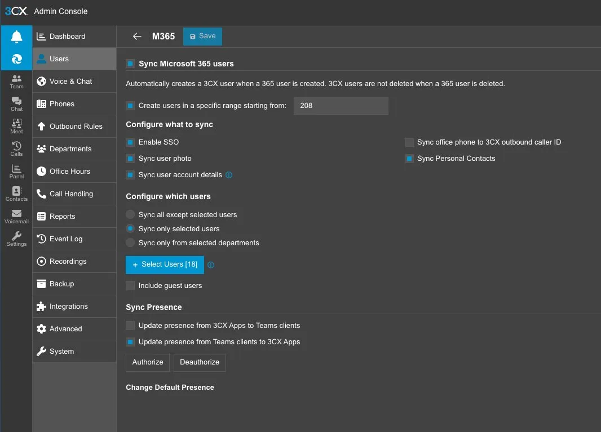

## Overview

This guide walks through provisioning a Microsoft 365 user into a 3CX PBX that has been configured with Entra ID SSO. It covers both net-new user onboarding and, more commonly in day-to-day MSP work, **replacing an outgoing user** while preserving their desk phone and extension.

Svetek IT Experts uses this workflow for clients across Vancouver WA, Portland OR, and Seattle WA whose 3CX instances are joined to Microsoft 365 through the built-in M365 integration.

> **Before you begin:** This guide assumes the 3CX tenant already has the Microsoft 365 integration authorized and Entra ID SSO enabled. If the integration has not been set up, stop here and complete that configuration first.

---

## Critical Pre-Work: Replacement Users

If you are provisioning a user to **replace an outgoing employee** (the most common scenario), the correct sequence is:

1. **Capture** the outgoing user's phone and extension details.
2. **Delete** the outgoing 3CX user to release the extension number back into the available pool.
3. **Provision** the new user with that same extension via the M365 sync.
4. **Bind** the existing physical phone to the new user by MAC address.

If you try to provision the new user before deleting the old one, 3CX will refuse to assign the extension because it is still in use and will auto-assign the next available number instead. That breaks the phone-to-extension binding you are trying to preserve.

### Capture before any deletion occurs

1. **Phone MAC address** — found in 3CX under **Phones** → select the user's device → MAC is listed in the device details pane. It is also printed on a sticker on the bottom or back of the physical phone.
2. **Phone model** — for example, Yealink T46U, Fanvil X4U, or Poly VVX250. Record the exact model string from the 3CX Phones page.
3. **Current extension number** — for example, 208 or 215. This is the number you will reassign to the replacement user.
4. **Voicemail PIN / greeting** — if the replacement user should inherit these, export or note them.
5. **Call forwarding / office hours rules** — note any non-default behavior that should carry over.

Document all of the above in the ticket before proceeding.

### Delete the outgoing 3CX user

Once capture is complete and documented:

1. In the 3CX Admin Console, navigate to **Users**.
2. Locate and delete the outgoing user.
3. The extension number (for example, 208) is now free to be reassigned by the M365 sync in Step 1.

> **Note:** Deleting the 3CX user does not delete the corresponding Microsoft 365 account. The M365 account should be handled separately per the client's offboarding policy, typically by blocking sign-in, converting the mailbox to shared, and removing the license. Confirm against the client's runbook before making M365 account changes.

---

## Step 1 — Set the Starting Extension (Critical)

If you already know which extension the new user should receive, which is always the case for a replacement user, set this **before** running the sync. For example, if you are reclaiming extension **208** from a departed employee, set the starting extension to `208`.

> **Important:** 3CX does **not** support renumbering an existing user's extension. If the sync assigns the wrong number, the only remedy is to **delete the user and re-sync** with the correct starting extension set. There is no edit-in-place fix. Get this right the first time.

In the 3CX Admin Console:

1. Navigate to **Settings** → **Integrations** → **Microsoft 365** → **Users**.
2. Check the box labeled **Create users in a specific range starting from**.
3. Enter the target extension number, such as `208`, in the field to the right.

This is especially critical when reclaiming an extension bound to a physical phone. Make sure the outgoing user has already been deleted per the pre-work. Otherwise the extension is still occupied and the sync will skip past it to the next available number.

---

## Step 2 — Configure What to Sync

In the same **Sync Microsoft 365 users** panel, confirm the following options are enabled. These settings are typically standard across Svetek-managed 3CX tenants:

- **Enable SSO** — required for Entra ID single sign-on. Users authenticate to 3CX using their Microsoft 365 credentials.
- **Sync user photo** — pulls the M365 profile photo into 3CX for caller ID and presence display.
- **Sync user account details** — keeps name, email, and title in sync with M365.
- **Sync Personal Contacts** — pulls each user's Outlook personal contacts into their 3CX contact list.

Leave **Sync office phone to 3CX outbound caller ID** unchecked unless the client has specifically requested that M365 office phone numbers override the 3CX caller ID logic.

---

## Step 3 — Select the User(s) to Sync

Under **Configure which users**, select **Sync only selected users**. This is the preferred Svetek default because it prevents accidental provisioning of every M365 user into the PBX, which would consume 3CX user licenses and create extensions for shared mailboxes, service accounts, and other non-phone users.

1. Click **+ Select Users**.
2. In the picker, check the box next to the new user's Microsoft 365 account.
3. Leave the selection state of other users as-is. Only the new user needs to be added here.
4. Click **OK** to confirm.
5. Leave **Include guest users** unchecked.

---

## Step 4 — Configure Presence Sync

Under **Sync Presence**, the Svetek default is:

- **Update presence from 3CX Apps to Teams clients** — unchecked. This prevents 3CX call status from overriding the user's Teams presence, which most users find disruptive.
- **Update presence from Teams clients to 3CX Apps** — checked. This lets Teams status, such as In a Meeting or Busy, reflect into 3CX so colleagues see accurate availability before placing a call.

If the tenant has not previously authorized presence sync, click **Authorize** and complete the consent flow as a Global Admin.

---

## Step 5 — Save and Verify the Sync

1. Click **Save** at the top of the page. 3CX will run the sync immediately.
2. Navigate to **Users** in the left sidebar and confirm the new user appears at the expected extension, such as 208.
3. If the extension is wrong, **do not attempt to edit the user's extension number. 3CX does not support renumbering.** Delete the newly-created user, confirm the outgoing user is also deleted so the target extension is free, verify the starting-extension value in Step 1, and re-run the sync.

---

## Step 6 — Assign the Physical Phone to the New User

Because you captured the MAC address and model in the pre-work, you can bind the existing phone to the new user directly from their user record in the 3CX Admin Console.

1. In the 3CX Admin Console, navigate to **Users** and open the newly-synced user.
2. Select the **IP Phone** tab within the user's profile.
3. Click **Add Phone** or the equivalent add-device action.
4. Choose **Add existing phone by MAC address** and enter the MAC you captured in the pre-work.
5. Select the phone **model** from the dropdown to match what was recorded, such as Yealink T46U, Fanvil X4U, or Poly VVX250.
6. Save the user record. 3CX will rebuild the provisioning configuration for that MAC against the new user's extension and credentials.
7. Reboot the phone by power cycling it, or use the **Reprovision** / **Reboot** action from the IP Phone tab if available. On restart, the phone will pull its new configuration and register to the new user.
8. Confirm the user's name displays on the phone screen and that inbound and outbound test calls complete successfully.

---

## Step 7 — User-Side Verification

Have the new user complete these checks, or verify on their behalf:

1. Sign in to the **3CX Web Client** at the tenant's web client URL using their Microsoft 365 credentials. SSO should redirect them through the Entra ID login and return them to 3CX without a separate password prompt.
2. Install the **3CX Desktop App** and/or **3CX Mobile App** and authenticate via SSO.
3. Confirm presence is flowing from Teams by changing their Teams status and watching it reflect in 3CX.
4. Confirm their profile photo has synced from M365.

---

## Common Pitfalls

- **Extension number collision.** If you forgot to set the starting extension, or the outgoing user was not deleted first, 3CX will auto-assign the next sequential number. Because 3CX does not support renumbering, the fix is to delete the newly-synced user, confirm the target extension is free, set the starting extension in the M365 sync config, and re-sync.
- **Outgoing user deleted before MAC captured.** If this happened, the phone can usually be re-provisioned by factory-resetting it and running it through 3CX's auto-provisioning flow, but you will need physical access to the phone or remote-hands support on-site.
- **SSO login loop.** This is usually caused by the user's M365 account not being included in the 3CX sync selection from Step 3, or by the Entra ID SSO app consent not being granted tenant-wide. Re-check both.
- **Missing Teams presence.** Confirm **Update presence from Teams clients to 3CX Apps** is enabled and that the **Authorize** button has been clicked by a Global Admin.

---

## Need Help?

Svetek IT Experts provides managed 3CX and Microsoft 365 administration for businesses in Vancouver WA, Portland OR, and Seattle WA. If you need assistance with 3CX provisioning, Entra ID SSO configuration, or phone system migrations, contact your Svetek account manager or open a ticket at [help.svetek.com](https://help.svetek.com).
