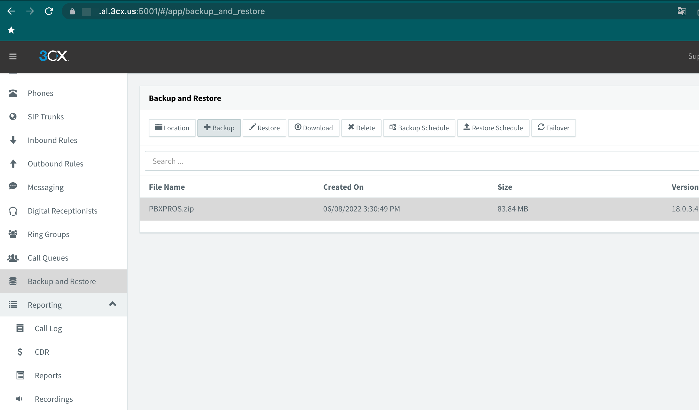
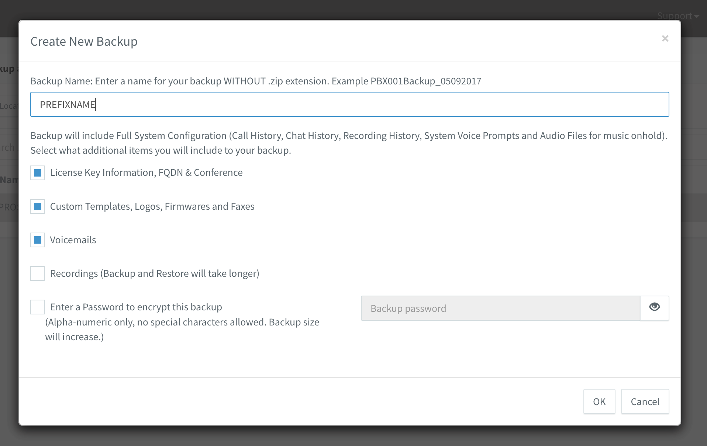
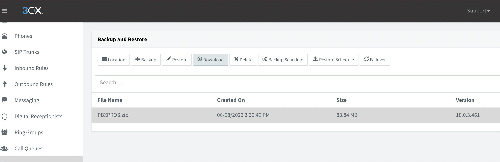
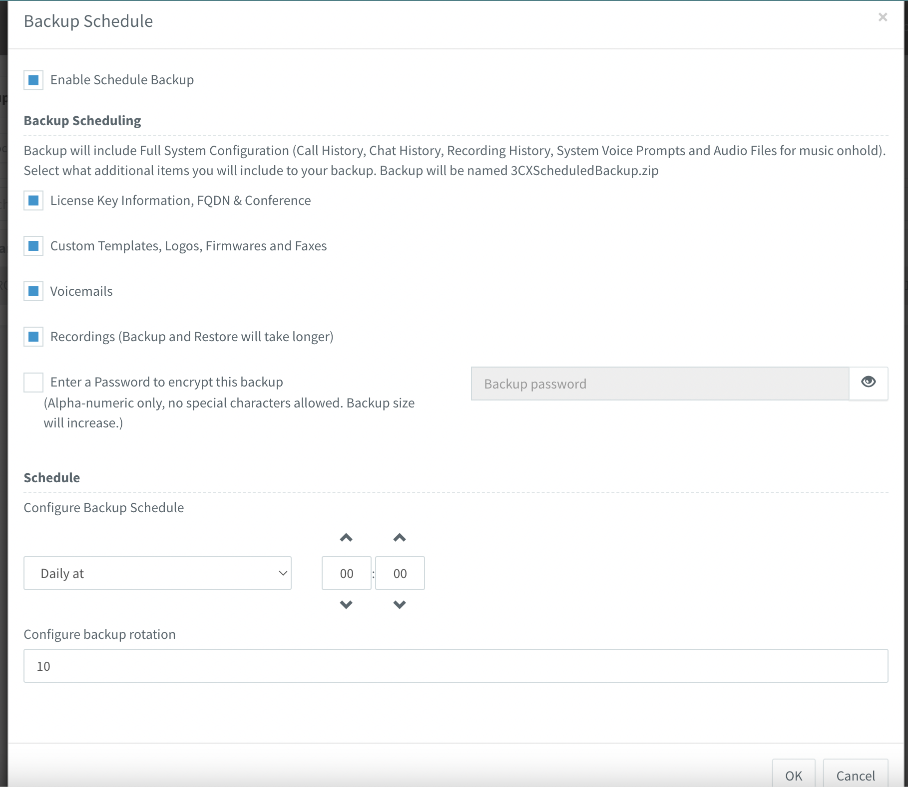
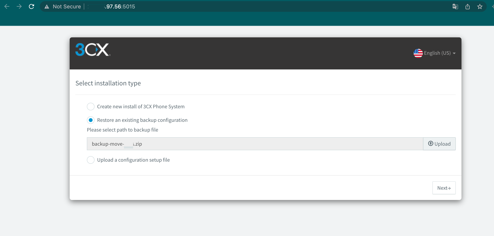

## Backup and Restore 

### Backup 3CX Configuration 

For take backup once you will go to "Backup and Restore" and press Backup button on top side window.  
  
  

Type backup prefix name and enable next option:
 - License Key Information, FQDN & Conference
 - Custom Templates, Logos, Firmwares and Faxes
 - Voicemails

and press Ok button for start backup process.  


  
When done you will see backup zip archive.  
When you need restore you can download backup archive at any time.


  
### Schedule backup

For set schedule backup you will go to "Backup and Restore" and press Backup Schedule button on top side window.  
Enable next option:  
- License Key Information, FQDN & Conference  
- Custom Templates, Logos, Firmwares and Faxes  
- Voicemails  

Set how often need run backup a job and time start. 
Configure backup rotation. 

For safe press Ok button. 
  


### Restore backup on new installation 
Need update 3CX to latest version cause after instalation need required updated. 
Log in to VM cli using ssh and run follow commands:

```
# Update 3CX system
apt update
apt upgrade -y
# Run 3CX configuration wizard on port 5015
sudo -u phonesystem /usr/lib/3cxpbx/PbxWebConfigTool -p /usr/share/3cxpbx/webconfig
```
Go to web page 3CX http://ip_adress_vm:5015  
Upload backup file to 3CX and press Next button.    



follow wizard steps for done recovery options like fqdn, ip address.   

When installation is done you will get info about username and passwords.   

### Video Backup and Restore 3CX
<!-- blank line -->
<figure class="video_container">
 <iframe width="900" height="600" src="https://www.youtube.com/embed/O1DLF2OO1Rk" title="YouTube video player" frameborder="0" allow="accelerometer; autoplay; clipboard-write; encrypted-media; gyroscope; picture-in-picture" allowfullscreen></iframe>
</figure>
<!-- blank line -->

### References

[3CX Backup & Restore Commands](https://www.3cx.com/docs/backup-restore-command-line/)
