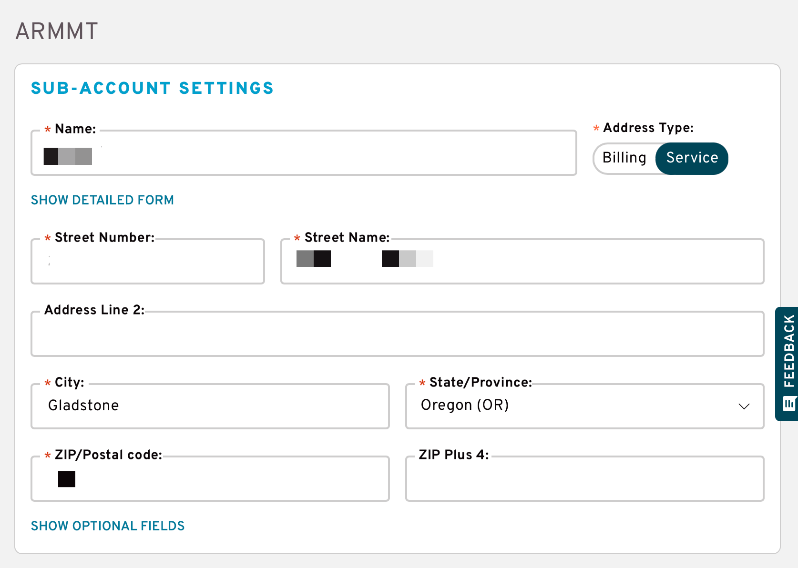
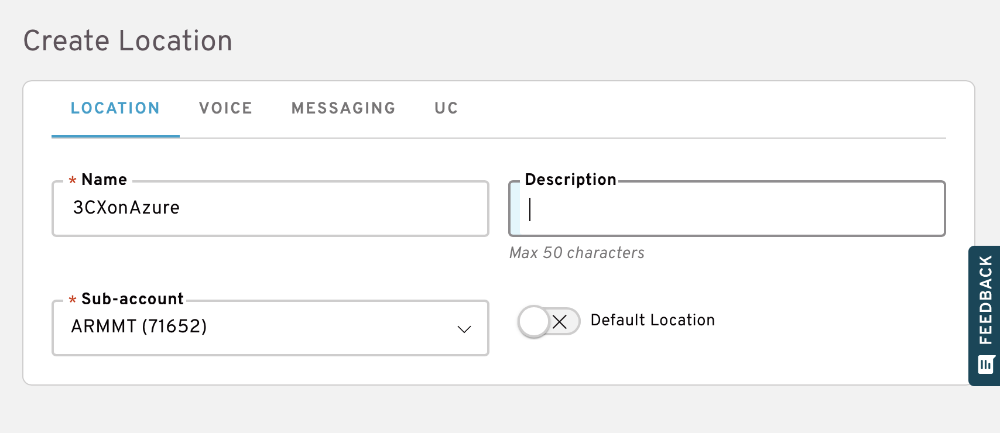
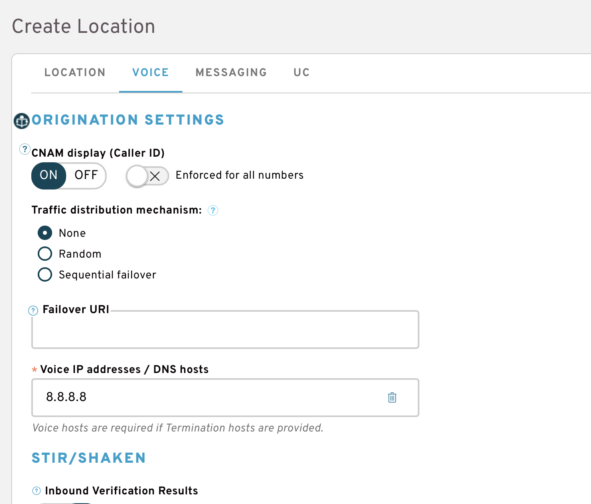
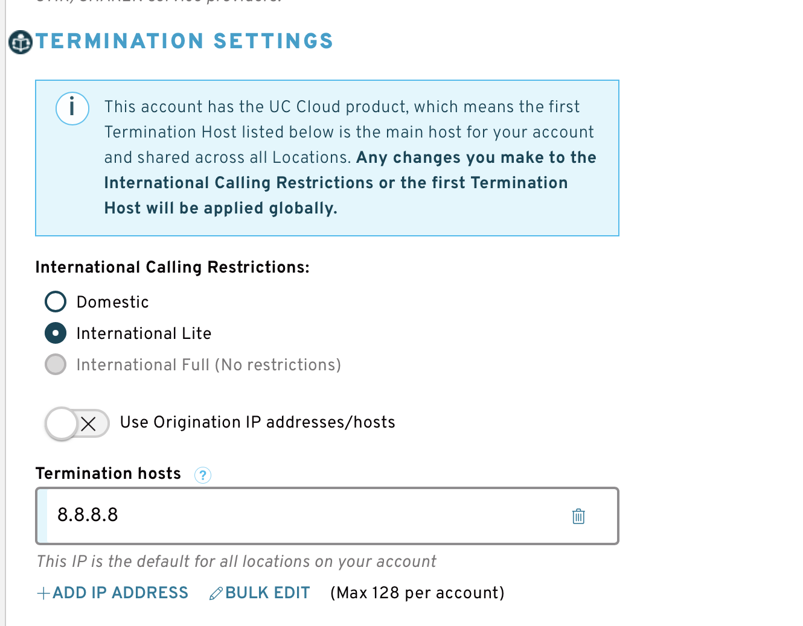
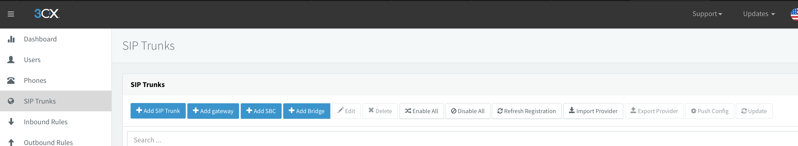
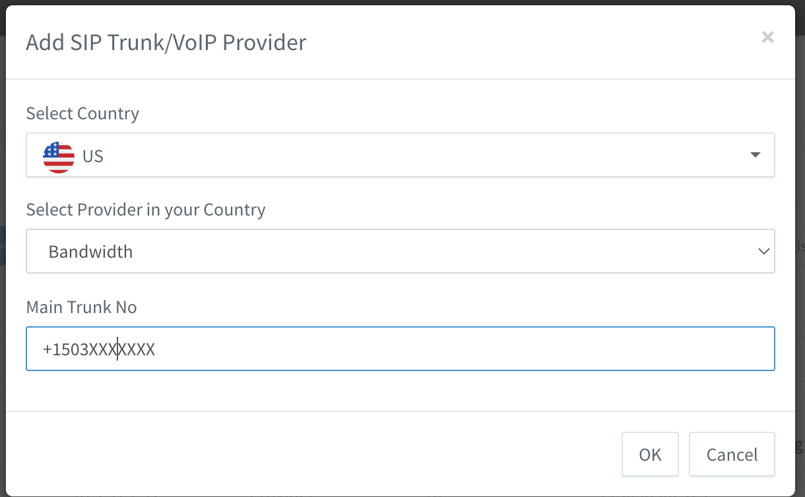
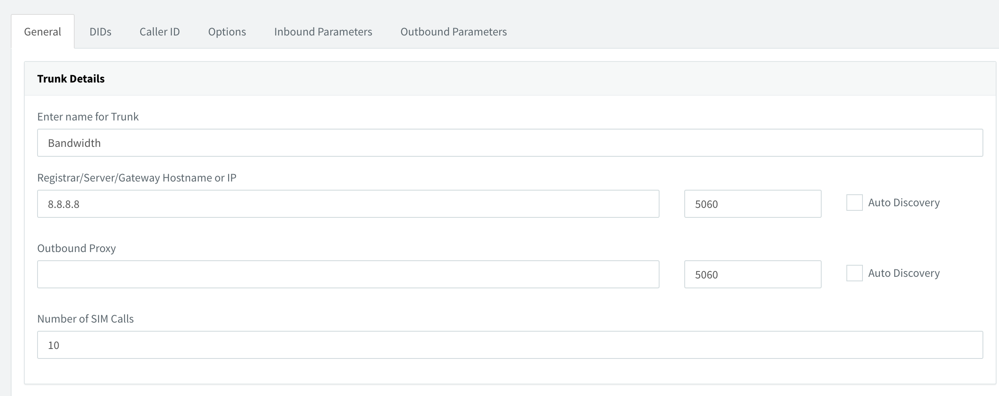
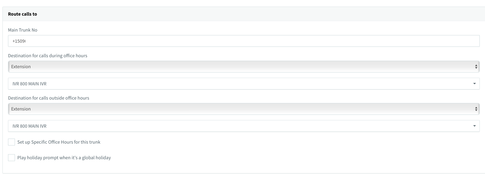
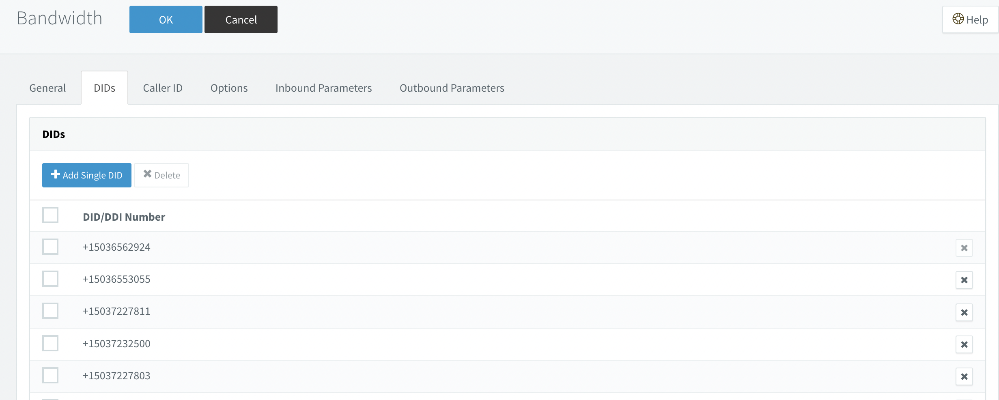

## Create SUB-ACCOUNT SETTINGS:

Go to: [Dashboard Bandwidth](https://dashboard.bandwidth.com/)

### Create Location for each PBX: 

### On Voice tab, setup 3CX IP address  

Need add IP address 3CX on Voice IP addresses / DNS host, Termination hosts

Next step you will buy or porting numbers and assign to the location.  

## Configuration BANDWIDTH SIP Connector on 3CX
Open 3CX web ui admin panel and go to SIP Trunks, press "Add SIP Trunk" need select country "US" and Provider "Bandwidth"  

Fill important fields:
> Name of Trunk;     
> Registat/Server/IP: Bandwidth support will be provide IP address server;  
> Type of Authentication: Do not require - IP Based;  
> Authentication ID: Empty;  
> Authentication Password: Empty;

> Main Trunk No: type PSTN phone number start from +1;  
> Set destination for calls during office hours;     
> Set destination for calls outside office hours;

   

On DIDs tab, add Single DID (your PSTN number)

On Options tab:
> Check: Alternative Proxy and type Bandwidth IP  
> Transport protocol set: UDP  
> Move up codec G729

Press Ok button for save changes.

