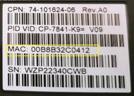
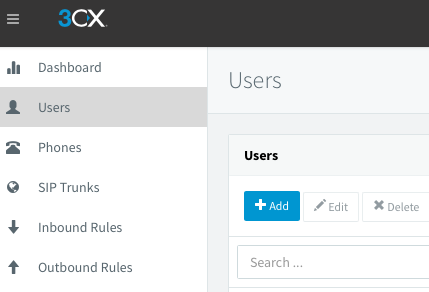
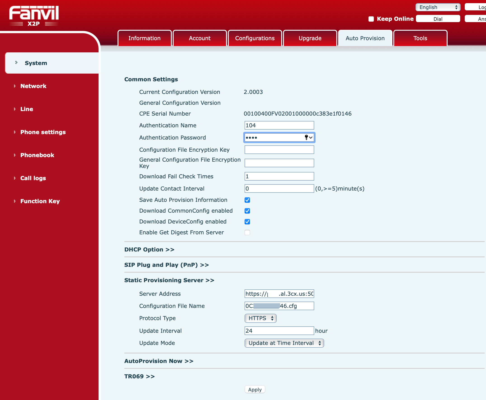

This guide walks through provisioning IP phones on a 3CX PBX system, including extension creation, firmware updates, and SIP auto-provisioning. The procedure applies to Fanvil hardware and other 3CX-supported SIP phones used in office VoIP deployments. Svetek IT Experts deploys and supports 3CX phone systems for businesses across Vancouver WA, Portland OR, and Seattle WA.

## Collect data about VoIP phones

Create an Excel file with the following columns. Example:

| Vendor       | Model    |      MAC     | 3CX Extension | FirstName | LastName |
|:-------------|:---------|:-------------|:--------------|:----------|:---------|
| FANVIL       | X7       | 00B8B32C0412 | 104           | Tom       | Sawyer   |

The MAC address for each IP phone can be found on the white label on the back of the device.



## Add extension on 3CX

Open the 3CX console: `https://(domain name or ip):5001/#/loading`

Navigate to **Users -> Add**.



Fill in **FirstName** and **LastName** from the Excel file.

**Go to Voicemail:** copy the PIN number into the Excel file.

**Go to Options:** uncheck *Disallow use of extension outside the LAN (Remote extensions using Direct SIP or STUN will be blocked)*.

**Go to Phone Provisioning:**
Press **Add** -> from the available models, select the IP phone model.
Type the MAC address and press the **OK** button.

**In the IP Phone section:** set Provisioning Method to **Direct SIP (STUN - remote)**.

**In Codecs:** move **G729** codec up the priority list.

To save all changes, press the **OK** button at the top of the page.

## Configure auto-provision on IP phones

Turn on the IP phone and connect it to the LAN. When boot is complete:

```
Menu -> Status, take IP
```

Open the phone web UI at `http://(ip address)`.
Default login / password: `admin` / `admin`.
Go to the **Auto Provision** tab.

**Firmware update procedure:**

1. Factory reset the phone.
2. Update to the original Fanvil firmware first.
3. Download the 3CX firmware from: https://www.3cx.com/support/phone-firmwares/
4. Apply the update following: https://www.3cx.com/sip-phones/firmware-update-fanvil/

**Authentication name:** `<extension number, e.g. 104>`
**Authentication password:** `<voicemail PIN>`

The server address will point to the URL of the 3CX server.



After reboot, the phone will register on its assigned extension.

## Testing

- Dial from the phone to a local extension.
- Dial from the phone to an outside number.
- Dial from another phone to the IP phone.

## Need help with 3CX deployments?

Svetek IT Experts provides 3CX deployment, provisioning, and ongoing VoIP support for businesses in Vancouver WA, Portland OR, and Seattle WA. Visit [help.svetek.com](https://help.svetek.com) or contact our team for assistance.
