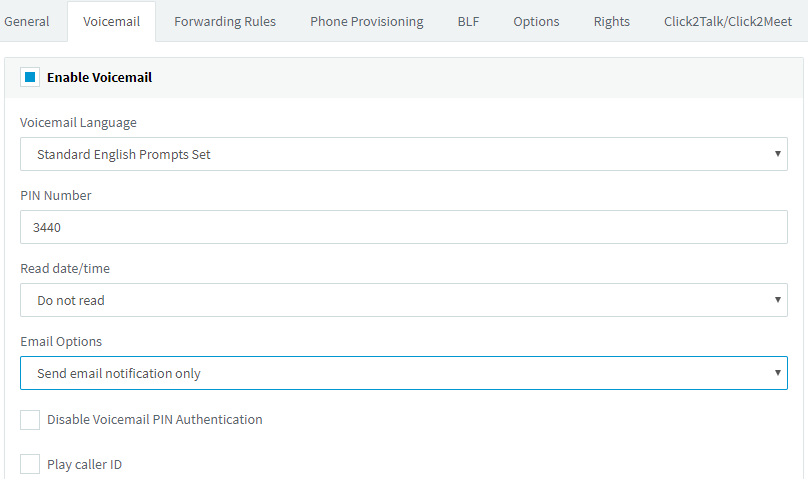
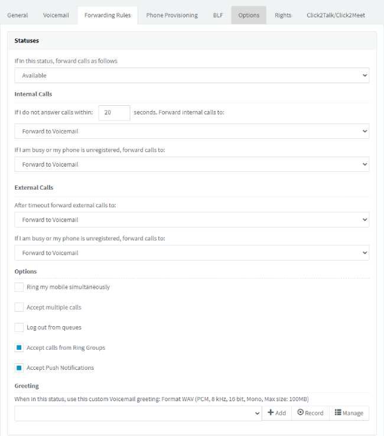
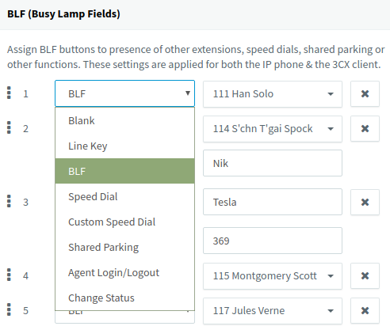

## Creating Users/Extensions

The “Users” function enables you to create, import and manage Extensions. To create a single extension, go to the “Users” function in the 3CX Management Console and click the “Add” button.  

### Importing from a CSV file

To import a batch of extensions, use a spreadsheet with the key information for each User / Extension:  
  
1. Download the [Extension Import Spreadsheet](http://downloads.3cx.com/downloads/misc/ImportExtensionTemplateV155.csv).  
2. Enter extension, name, DID, etc. to import, keeping the original column order. See more info in [Import Extensions via .csv](https://www.3cx.com/docs/bulk-extension-import/).  
3. In the 3CX Management Console, go to **“Users” > “Import” > “Import CSV”**, browse to select the CSV file and click “Open” to import the extensions to 3CX.  

**Note:** If using Microsoft Excel, ensure that the **MAC Address column is NOT formatted as a number**, by right-clicking on the MAC address column and selecting **“Format Cells…”** to format as text.  

### Importing from Microsoft 365

If you have Microsoft 365 in your organization, you can set extensions to be automatically synced when you add Microsoft 365 users. More info in the [Microsoft 365 integration guide](https://www.3cx.com/docs/microsoft-365-integration/).

## General

In the User Information section you can enter the first name, last name, email address, the mobile number, as well as the outbound caller ID for the user. The email address is used to send links to the apps, manual links, voicemail PIN as well as a configuration file to automatically provision the apps.

In the **“Web Authentication”** section, you can enable/ disable the Web Client and change the password.

In the **“Direct Inbound Dialing (DID)”** section, you can select a DID for the user and in the **“Enable SMS”** section select the pre-configured provider to be used.

## Voicemail

The **“Voicemail”** tab enables you to configure and manage the extension’s voicemail preferences including the voicemail authentication PIN number, enable/disable PIN Authentication, play Caller ID, and read out the Caller ID and Date / Time the message was received. You can also choose to send an email notification, configured to contain the voicemail message, and optionally delete the message from the server freeing up space.

## Forwarding Rules

Call forwarding rules define how 3CX routes incoming calls to an extension, based on:

* User’s status.
* Time of call.
* Caller ID.
* Call type - internal or external call.

Each status requires a call forwarding rule, e.g. if the user is unable to take a call whilst their status is **“Available”**, 3CX forwards the call to voicemail, whilst if their status is set to **“Do Not Disturb (DND)”**, 3CX forwards it to their mobile. These options are available for each status:

* **Ring my mobile simultaneously**
* **Accept multiple calls**
* **Logout from queues** – enable to automatically log the user out from queues. **IMPORTANT** - this automatically logs you in or out from a queue based on status, overriding the Queue Login / Logout button. Agents need to use status rather than the Queue Login / Logout button, if this option is enabled.
* **Accept calls from Ring Groups**
* **Accept Push Notifications**
* **Forward Internal and/or External calls to:**

  * Voicemail,
  * Extension’s Voicemail,
  * Mobile,
  * Extension,
  * Number,
  * End call.

Call forwarding and status profiles can be configured by the administrator using the 3CX Management Console or by the user through the 3CX Web Client.

**“Auto Switch Status”** - enable to automatically change a user’s status to **“Available”** based on global or specific office hours. To configure custom office hours and break times, click **“Configure”**. Outside of office hours the extension’s status is switched to **“Do Not Disturb”** and during Break Times is set to **“Away”**.

**“Exceptions”** - create exceptions by entering the **“Caller ID”**, selecting the time frame in **“Received During”** and then the action in **“Forward To”**.

## Phone Provisioning

The **“Phone Provisioning”** tab enables you to manage settings for phones linked to this extension. 

[//]: # (See more info on managing IP phone settings in [Configuring IP Phones using provisioning]&#40;&#41;.)

**Note:** The auto-generated authentication ID and password can be altered to sync the new credentials to auto-provisioned phone(s).

## BLF (Busy Lamp Fields)

Configure the BLF indicators on an IP phone, as well as the 3CX App for Windows from this tab by matching a BLF button with an extension to display the extension’s status. The number of available BLF buttons varies per deskphone, while the 3CX app has no such limit with up to 36 BLF indicators per page.

You can also link BLF buttons to a shared parking place or a speed dial to allow users to easily park or unpark calls by pressing the assigned BLF button. These options are available for BLFs:

* BLF - shows the presence of another extension.
* Speed Dial - link to a contact for easy calling.
* Line Keys - allows to create a new call/line from the phone.
* Custom Speed Dial - assigned to a custom phone number.
* Shared parking - link to a shared call parking number.
* Agent Login / Logout - assign to alternate between Login/Logout for queues.
* Change status - link to change to selected status.

The configured BLF settings can be easily re-ordered by clicking on the entry’s move handle to drag and drop to the desired position.

## Options

The **“Options”** tab allows you to set **“Restrictions”** and **“Advanced”** options for the extension and enable **“Call Recording”** and **“Integrations”**.

## Rights

The “Rights” tab allows you to configure an extension’s rights for each of the groups in the “Group Membership” dropdown the extension is a member of. To configure the rights of the extension:

1. Select the group for which to configure the extension’s rights.
2. Set the role (User/Manager) for the extension within that group.
3. Set the extension’s rights for that group by enabling:
  * Can see group members – allows the user to see all group members' presence.
  * Can see group calls – allows the user to see calls made by group members.
  * Show presence to group members – shows the user’s presence to group members.
  * Show calls to group members – shows user’s calls to group members.
  * Perform operations (divert, transfer, take) on any active call to group members.
  * Can Barge in, listen or whisper (Pro+) – can barge in to calls made by group members.
  * Can Intercom – allows the user to intercom with other extensions.
  * Can park calls – allows the user to park calls for other users to pick up.
  * Can control IVR – allows users to control the IVR.
  * Can manage the company phonebook – allows the user to add/ edit/ delete Company contact entries via the 3CX apps.
  * Perform receptionist operations - enables the user to set status, reminders (wake-up call) and queue log in/out.
  * Can see group recordings (Pro+) - can download and listen to group recordings.
4. Click “OK” to apply the rights and restart the 3CX app for the changes to take effect.

### Delegating Extension Management

To delegate extension management tasks from the ”Users” function in the Management Console:

1. Click to edit the extension.
2. Go to the “Rights” tab and enable the option “Allow access to 3CX Management Console”.
3. In “Extensions Management” select the level of management to grant:
  a. Manage your own extension.
  b. Manage extensions in groups the user’s extension is a member of.
  c. Manage all extensions.

4. In “System Management” you can grant these rights:
  a. SIP Trunks Administration - manage configured SIP trunks.
  b. System Administration – change the settings of the PBX including messaging, backup and restore, reporting.
  c. Phone System Administration - can manage what is necessary for the phone center to work properly such as IVR, call queues, codecs, music on hold etc.  
  d. Monitor  (Pro+) – access reports, chat logs, call logs and recordings. To download the recordings, enable “Can download recordings”.

### Extension Groups

Extension groups are used to determine what information is shown to whom. An extension has to be a member of at least one group.

**Default Group**
Extensions are initially assigned to the “Default” group with these privileges:

* Managers can see the call details of ALL extensions and queues.
* Managers can perform operations on ANY call, i.e. Pickup, Transfer, Divert, Reject, Barge-in, and Park.
* Users have no rights to view calls of other users.

**Creating Groups**
To create an extension group from the management console:

1. Click on the “Users > Groups” function and then the “Add” button.
2. Specify a name for the group.
3. In the members section, click on the “Add” button to add members to the group.
4. In the “Group Rights” tab set the rights for group managers and users in the respective sections.
5. Click “OK” to create the group.

Select one or more managers for a group, e.g. a department supervisor, from the “Extensions” function:

1. Edit the extension to set as Manager and click on the “Rights” tab.
2. Select the group to configure in “Group Membership” and set the “Role” to Manager.
3. Click “OK” to apply the role to the extension.

You can configure one or more members of a group with the Manager role, able to view the call details of the group members.

## Click2Talk/Click2Meet

Set up your personal Click2Talk and Click2Meet URLs. Contacts can use these URLs from any WebRTC-capable open-standards browser (Chrome, Firefox) to call your extension or queue directly, or join an ad hoc web meeting.
