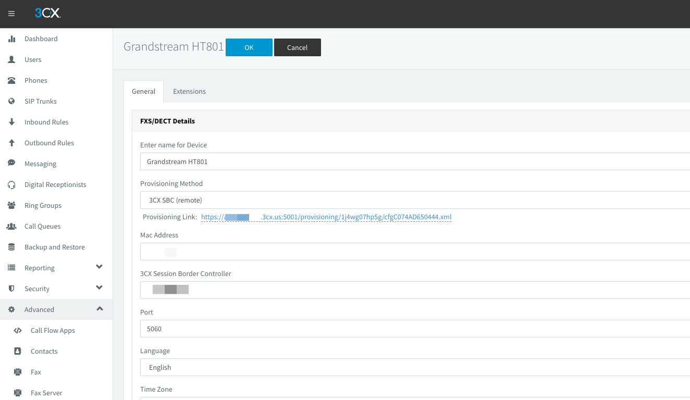

## Inbound faxes
For turn on fax server, go to 3CX WEB UI -> Advanced -> Fax Server  

Type Default Email Address for reciving faxes, Enable G.711 to T.38 Fallback, to save press OK button     

Go to SIP Trunks, open AWS sip trunk, on DIDs tab add additional DID  

Go to Inbound Routes, Add new DID rule, type Name: Fax Rule, select DID for assign.  
Set Route calls to Send fax to -> users who will recived fax to PDF

## Outbound fax
For outboud faxes, you need use ATA devices with fax machine.  
Or use software for SipToFax, like:  
http://www.t38faxvoip.com/  

## FAX Devices 

To configure SIP ATA Grandstream HT801 go to 3CX Web UI -> Advanced -> FXS/DCT and press Add FXS/DCT button and enter information (Name, Mac addr, etc).  
  
  
  
You also need download config file from provisioning Link    
  
  
  
Goto Web managment page Grandstream HT801  
  
  
  
And open ADVANCED SETTINGS tab, press Upload configuration.  
  

Upload from local directory and chose saved xml configuration file. After 30 sec ATA device will be configured successfully.  

Password from Grandstream Web UI will be updated from 3CX and you can find in 3CX Web UI -> Advanced -> FXS/DCT -> ATA Settings page.  

To test outbound fax delivery, use this test fax phone number from HP: 1-888-473-2963

### References 
https://www.3cx.com/voip-gateways/grandstream-ht-fxs/
