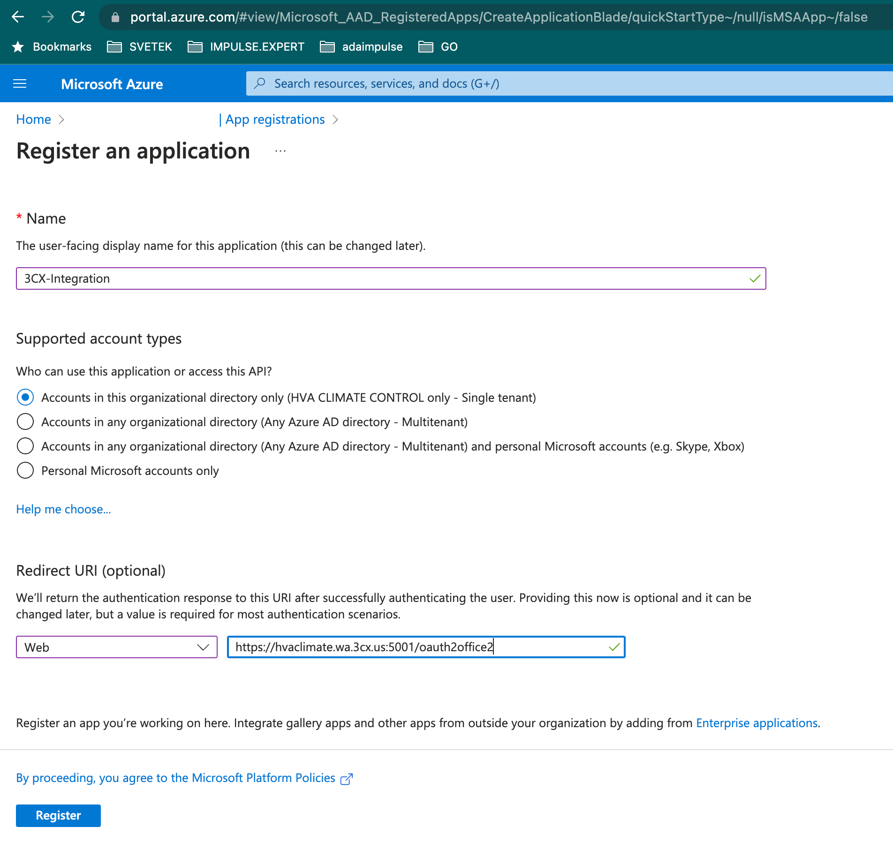
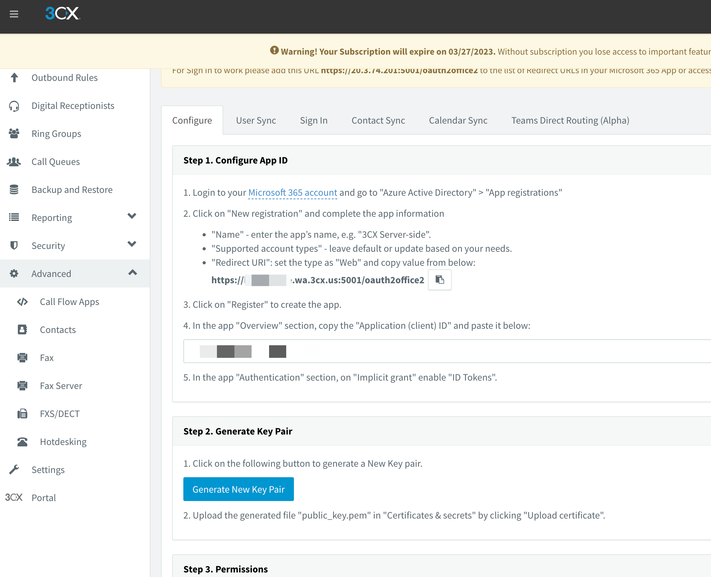
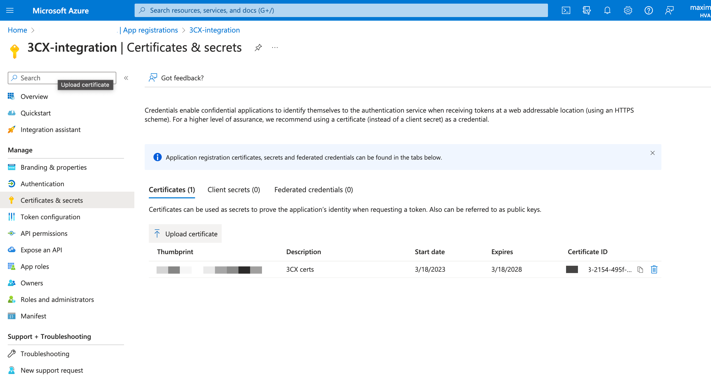

## Introduction
Setup Microsoft integration to sync users, enable SSO and contact/calendar sync depending on Microsoft subscription and 3CX Edition

### Standard Edition integration
Sync user accounts from Microsoft 365 or Azure Active Directory (Local Active Directory synced to the cloud).
Enable SSO so users can use their Microsoft Account to log in to the 3CX Web Client and Management Console.
Requires Microsoft 365 Accounts, Azure Active Directory, or a local Active Directory synced to the cloud using Azure Connect.
3CX’s Management Console needs to be accessible from the internet to receive immediate changes of users, contacts, or profiles.

### PRO Edition integration
In addition to standard integration

* Users' personal contacts are synced with the 3CX personal phonebook so they can easily trigger calls from 3CX to any 365 contact.
* Shared mailbox contacts are synced with the 3CX Company directory.
* 3CX Profile status is changed based on the Microsoft Calendar, i.e. if you are in a meeting your status will be set to busy. This allows seamless call routing adjustments when on the road or in a meeting.
* Requires Microsoft Microsoft 365 Accounts with Exchange subscription plan:
  * Microsoft 365 Business Basic, Standard or Premium
  * Microsoft 365 F3, E3 or E5

## Step 1: Register an Azure Application

  

1. Log in to your 3CX Management Console and go to “Settings > Integrations > Microsoft 365”. Under the ‘Configure’ tab > ‘Step 1. Configure App ID’, copy the “Redirect URI”.
2. Log in to the Microsoft Azure App Registrations page using a Microsoft Global Administrator account.
3. Click on the “New registration” button and:
   * Enter a name for your application, e.g. 3CX PBX Integration.
   * Under the ‘Supported account types’ choose “Accounts in this organizational directory only”.
   * In the ‘Redirect URI’ section, set the type as “Web” and paste the ‘Redirect URL’ copied earlier. e.g. https://my.pbx.example.3cx.eu/oauth2office2
   * Click “Register” to create your app.
      
   * In the app ‘Overview’ page copy the “Application (client) ID”.
   * Paste this Application ID in 3CX “Settings > Integrations > Microsoft 365” > ‘Configure’ tab.

## Step 2: Upload Key Pair

  
1. Goto admin UI 3cx Settings -> Microsoft 365 
2. Copy AppID from previous step and paste in form  
     
3. Press Generate new key pair and save the generated public_key.pem file on your PC
4. Switch back to the Azure Portal to the app's ‘Overview’ page and click on “Certificates & secrets” 
   
5. Click on “Upload certificate,” browse to select and upload the public_key.pem file. Click “Add” to upload the certificate

The Microsoft integration is now configured but needs to be set up.  

## Step 3: Add Permissions

In the final step, grant the APP permissions on the “API permissions” page.

1. Click on “+ Add a permission” > select “Microsoft Graph” > “Application permissions”.
2. In the list of "Application Permissions" section, click to expand and select these permissions:
   * “Calendars” > “Calendars.Read”
   * “Contacts” > “Contacts.Read”
   * “Directory” > “Directory.Read.All”
   * Mail Server” > “Mail.Send”
   * “User Photos” > “User.Read.All”
3. Click on “Grant admin consent for 3CX” to set the app permissions.
4. Wait for ~1 minute for the app and Microsoft 365 changes to become available.
5. Switch to your 3CX Management Console and click on the “Sign in to Microsoft 365” button. Accept the requested permissions for the app you created to connect your 3CX Phone System to your Microsoft 365 account.

The Microsoft integration is now configured but needs to be set up.

## Step 4: Configure Sync
Now you need to synchronize the users from Microsoft to 3CX.

1. In the 3CX Management console, go to “Settings > Integrations > Microsoft 365”.
2. Set the extension number range to be assigned to Microsoft users. You can configure a starting extension, otherwise, it will use the first available extension.
3. You can select Microsoft “Office phone” to be the “Outbound Caller ID” for the extension in 3CX.
4. Sync Microsoft 365 user photo. Gets user photos from MS365 and configures them on the Web Client.
5. Select which users to sync. 3CX extensions synced from Microsoft 365 are grouped in the 3CX Extension Group called “Azure AD”.

Notes:

* If a user who is created in Microsoft 365 does not appear in 3CX: Ensure Microsoft 365 users have the “UserType” attribute set as “Member” in the Azure Directory. Some older accounts of Microsoft 365 miss this attribute for some users.
* The synchronization is one-way (MS365 to 3CX) and happens every night (once per day). If you have not deleted the user in MS 365 it will reappear in 3CX the next day.
* In case changes in MS365 aren’t immediately synced in 3CX, the HTTPS port used by the "Redirect URL" on Step 1 point 2 may be closed.

## Step 5: Configure SSO

You can select to allow users to log in to the 3CX Web Client or Management Console using their Microsoft credentials.

You can configure this for both the management console and the Web Client and enable this for all or for a select set of users.

## Step 6: Configure Contact Sync (PRO)

1. You can configure that personal contacts are synced to the 3CX personal phonebook. This is a one-way synchronization: Contacts need to be managed and updated from Microsoft 365.
2. You can have Microsoft 365 shared mailbox(es) contacts synced to the 3CX Company phonebook. All contacts in “Well Known Folders” (Default) folders are synced.

## Step 7: Configure Calendar Sync

Lastly, you can automatically update 3CX users’ status based on the "Show As" status in their Microsoft 365 calendar entries. So if you are in a scheduled meeting, your phone will not ring. At the end of the Microsoft 365 calendar entry, 3CX switches the profile back to the previous status. If a 3CX “Business Trip/Holiday” profile is selected, changes from calendar information are ignored.

The mapping of “Show As” to 3CX Profiles is as follows:

“Busy” or “Working Elsewhere”        → “Do Not Disturb”
“Out of office” or “Away”                 → “Away”

### References 
https://www.3cx.com/docs/manual/microsoft-365/