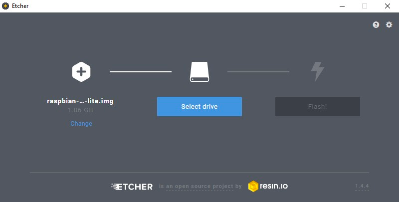

## Introduction

### What is the 3CX SBC?

The 3CX Session Border Controller (SBC) is a software service that installs in your local network to allow easy connection of IP Phones to a 3CX instance in the cloud, hosted either in your private cloud or by 3CX. The 3CX SBC combines all SIP (signaling) and RTP (media) VoIP Packets from one location and delivers them to the cloud PBX, thereby overcoming common firewall and networking issues that affect reliability.  

### When do you need to install an SBC?

The most important usage scenario of an SBC is to connect a number of IP phones located in an office to a PBX located in the cloud. Another scenario is to connect to 3CX installations via a bridge.

## Step 1: Decide where/on what you will install your 3CX SBC

You can install it on any of the following OS / Devices:  
  
* Raspberry PI 4
* Windows 10 / Server 2016 and up
* Debian Linux using the 3CX ISO

## Step 2: Add the SBC in 3CX


1. In the 3CX “Management Console” go to “SIP Trunks”.  
2. Click “Add SBC” and provide a name for it, e.g. “Denver Office”.  
3. Now the SBC link will be created. Take note of the “Authentication KEY ID” and the “Provisioning URL”. These will be required when you install your SBC.  

## Step 3: Install the SBC on Raspberry PI 4

Step 1: Get the correct Raspberry Pi

* A Raspberry PI 4 B4 or B8
* 32+GB Class 10 Micro SDHC
* Raspberry Pi-compatible 2.5 Amp Micro USB power supply
* Ensure the device has a good casing that allows for maximum cooling

The following Raspberry Pi Shops have “3CX Ready” Raspberry Pis with Raspbian pre installed on the SD card:

## Step 2: Prepare the SD card with Raspbian



1. Download the Raspbian image.
2. Extract the image (.img) file from the downloaded archive.
3. Burn the Raspbian image file via Etcher.

## Step 3: Install Raspbian and set Hostname


1. Insert the SD card in the Raspberry Pi memory card slot and power the device to boot.
2. Wait for the boot process to complete and login with the default user “pi” and password “raspberry”.
3. Run the Raspbian configuration utility with the command: sudo raspi-config
4. Select “1. System Options” and press the <Enter> key.
5. Select “S4 Hostname”, press the <Enter> key and then “OK” on the warning dialog.
6. Enter the Pi's hostname using only alphanumeric characters and dashes (“-”).
7. Select <Finish> and then <Yes> to reboot and apply the hostname configuration.

## Step 4: Set a Static IP


1. Edit the “/etc/dhcpcd.conf” file to configure the ethernet interface “eth0” with the nano editor: sudo nano /etc/dhcpcd.conf
2. Scroll to the end of the file and add the following lines, making sure to replace the values for “interface”, “ip_address”, “routers” (gateway) and “domain_name_servers” based on your LAN settings:

```
#Ethernet static IP configuration
interface eth0
static ip_address=192.168.1.111/24
static routers=192.168.1.1
static domain_name_servers=192.168.1.1 8.8.8.8
```

Note: LAN installs are supported on properly configured RFC 1918 private networks, i.e. 172.16.0.0 /10.0.0.0/192.168.0.0 IP range.

3. Press the “Ctrl” + “x” key combination, then “y” and <Enter> to confirm writing changes to the file.
4. Reboot the Pi using:

```
sudo reboot
```

5. When the Pi boots again, login with “pi” user and verify “eth0” IP address with the command:

```
ip a
```

## Step 5: Install 3CX

``` 
wget https://downloads-global.3cx.com/downloads/sbc/3cxsbc.zip -O- | sudo bash
```


