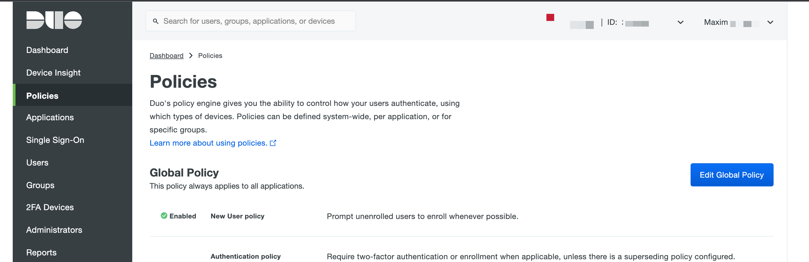
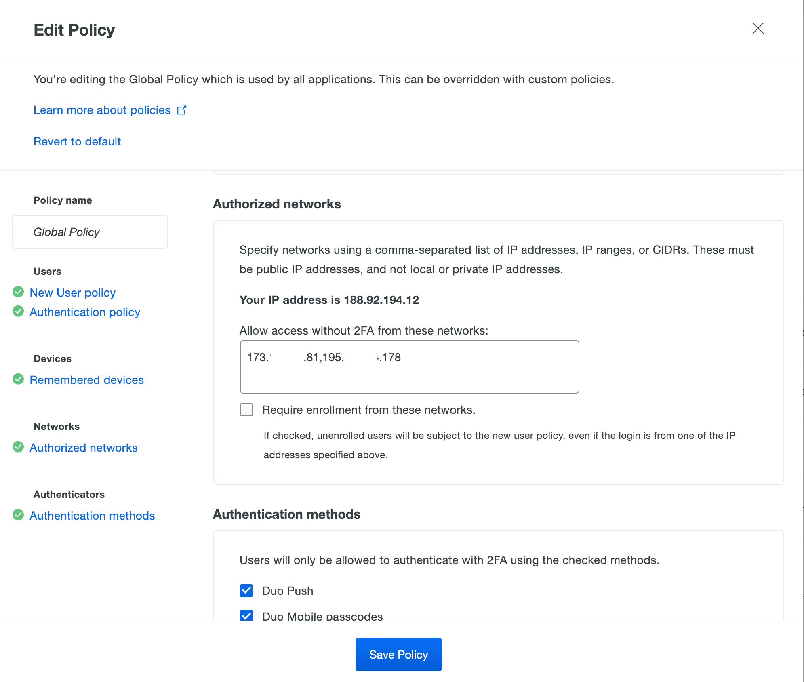

Go to DUO dashboard -> Policies 
Press "Edit Global Policy"  
  
  
Scroll down to "Authorized networks", and type IP for exclude DUO MFA.  
  

Press "Safe Policy" button for save changes. Done.   
