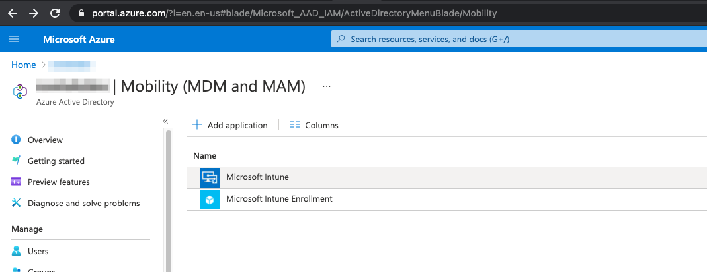
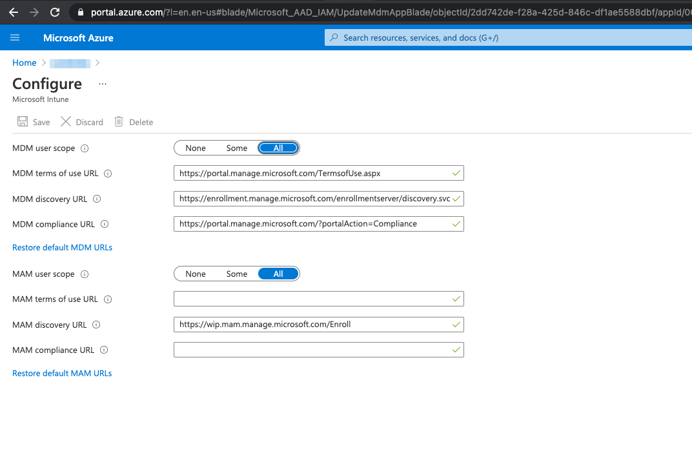
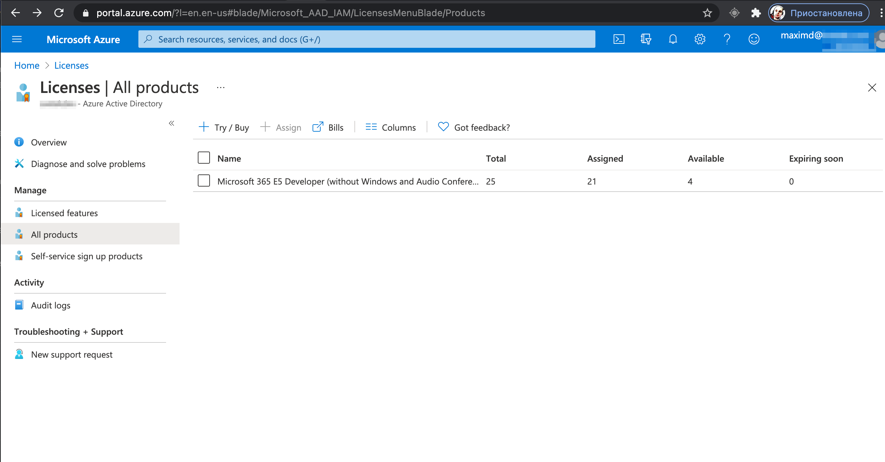
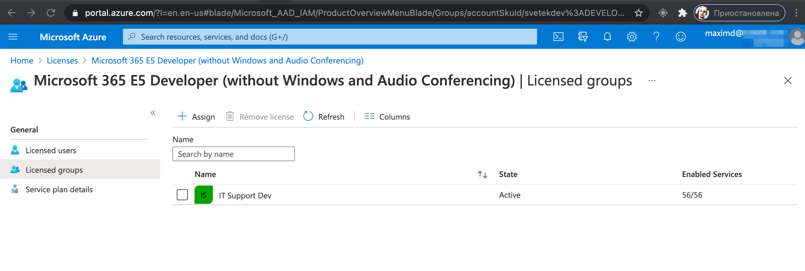
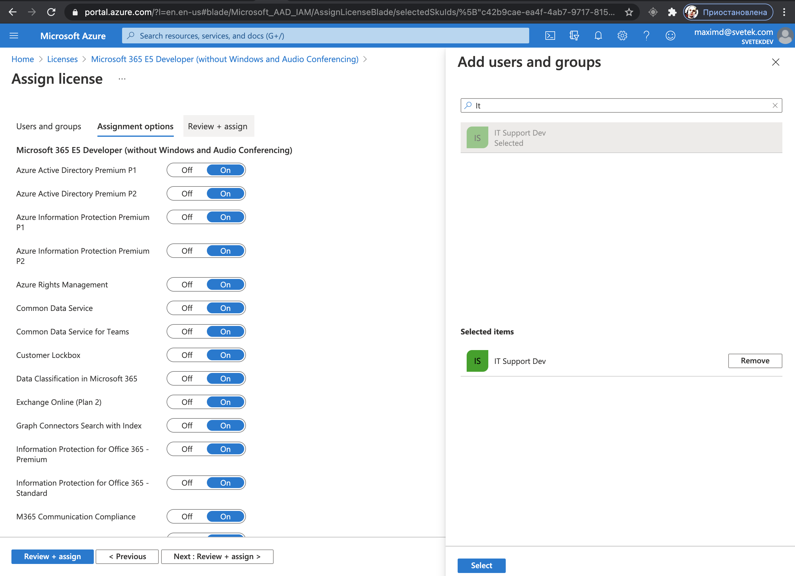
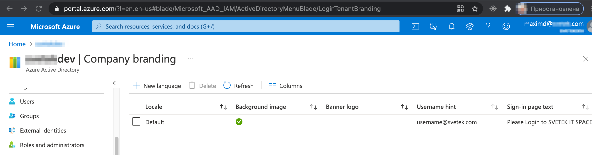
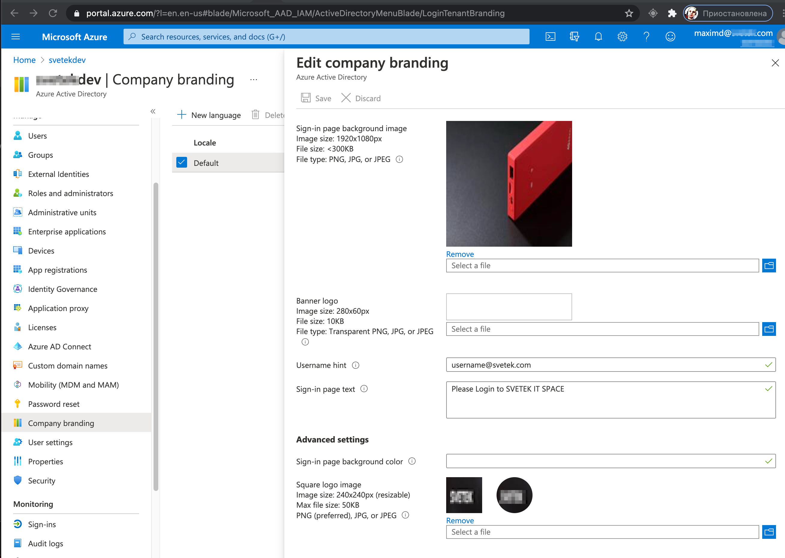

## Azure Intune configuration

### Need Setup MDM and MAM
Go to Azure Active Directory | Mobility (MDM and MAM)  
https://portal.azure.com/?l=en.en-us#blade/Microsoft_AAD_IAM/ActiveDirectoryMenuBlade/Mobility

Select Item Microsoft "Microsoft Intune"

Switch MDM user scope to ALL  
Switch MAM user scope to ALL

### Assign Licence Microsot Intune for user security group
Go to Azure Active Directory | Licenses | All Products  
https://portal.azure.com/?l=en.en-us#blade/Microsoft_AAD_IAM/LicensesMenuBlade/Products  

Select License "Microsoft 365 E5 Developer (without Windows and Audio Confere", go to Licensed groups and press + Assign

Need to be sure Microsoft Intune License is on. Save.

### Company Branding
Need setup company branding for setup Logos, background pictures  
Go to Azure Active Directory | Company branding  | Press + New language  
https://portal.azure.com/?l=en.en-us#blade/Microsoft_AAD_IAM/ActiveDirectoryMenuBlade/LoginTenantBranding  

Fill in all the fields and attach Background pictures (mage size: 1920x1080px) and logo  
Banner logo | Image size: 280x60px | File size: 10KB | File type: Transparent PNG, JPG, or JPEG  
Square logo image | Image size: 240x240px (resizable) | Max file size: 50KB | PNG (preferred), JPG, or JPEG
Square logo image, dark theme | Image size: 240x240px (resizable) | Max file size: 50KB | PNG (preferred), JPG, or JPEG

## Android Enterprise configuration

Android Enterprise setup has moved to dedicated rollout guides. Use the guides below instead of the older Android notes that previously lived on this page.

| Scenario | Guide |
| --- | --- |
| Personal Android phones (BYOD) | [Roll Out Android Enterprise Work Profiles in Intune](/docs/Configuration/Azure/android-enterprise-work-profile-rollout/) |
| Corporate-owned Android devices | [Roll Out Corporate-Owned Android Enterprise Devices in Intune](/docs/Configuration/Azure/android-enterprise-corporate-owned-rollout/) |
| End-user Android enrollment | [Enroll an Android Phone with a Work Profile](/docs/Guides/Intune/enroll-android-work-profile/) |

Use the BYOD guide for personally owned devices with a work profile. Use the corporate-owned guide for fully managed devices, dedicated devices, shared/kiosk devices, and corporate-owned devices with a work profile.

Do not use Android device administrator enrollment for modern Android devices with Google Mobile Services. Use Android Enterprise enrollment methods instead.
