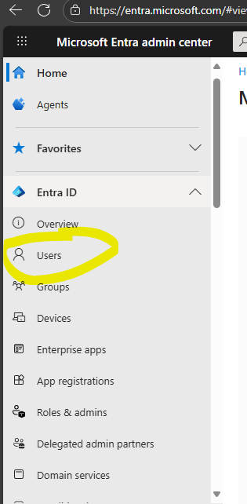
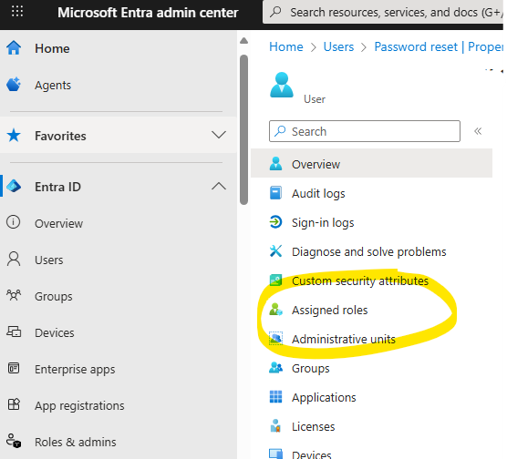
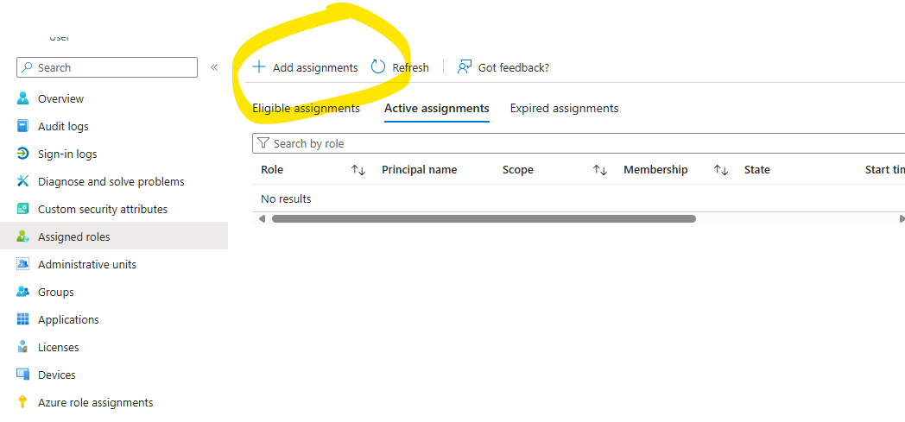
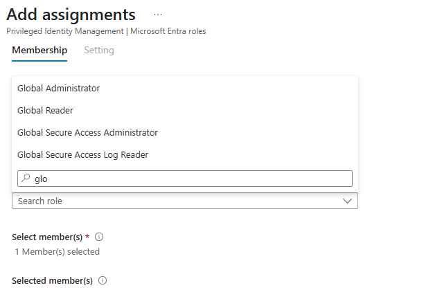

Use this guide when a client tenant needs another Microsoft Entra **Global Administrator** account, or when an administrator sees a message telling them to contact an administrator even though they already have an admin role.

Global Administrator is the highest Microsoft Entra tenant role. Assign it only when the account genuinely needs tenant-wide control. For routine helpdesk, billing, user, application, or security tasks, use a narrower Microsoft Entra role whenever possible.

Source reviewed: Microsoft Learn Q&A discussion and Microsoft Learn role assignment documentation, checked **July 15, 2026**.

## Prerequisites

Before assigning the role, confirm:

- You are signed in to the correct tenant at [https://entra.microsoft.com](https://entra.microsoft.com).
- Your account is already a **Global Administrator** or **Privileged Role Administrator**.
- If your role is PIM-eligible, you activated it before starting.
- The target user account already exists in the tenant.
- The target account has strong authentication configured or ready to configure immediately.
- At least one privileged recovery account uses the tenant's internal `*.onmicrosoft.com` domain, such as `admin@tenant.onmicrosoft.com`.
- The request is approved and documented.

Do not assign Global Administrator to a shared account unless it is an approved emergency access account. For normal administration, assign the role to a named admin account.

For tenant recovery and break-glass access, prefer an account on the internal `*.onmicrosoft.com` domain instead of relying only on a custom-domain account. A custom domain, DNS outage, federation issue, or identity-provider problem can block sign-in during an incident; the internal tenant domain gives you a cleaner recovery path.

## Add the Role from the User Profile

1. Sign in to the [Microsoft Entra admin center](https://entra.microsoft.com).
2. Go to **Identity** > **Users** > **All users**.
3. Search for and select the user who needs the role.

4. In the user profile, select **Assigned roles**.

5. Select **Add assignment**.

6. Search for and select **Global Administrator**.
7. Select **Add** to complete the assignment.

After assignment, have the user sign out and sign back in. If the tenant uses Privileged Identity Management, the user may still need to activate the role before Global Administrator permissions become active.

## Alternate Path from Roles and Administrators

Microsoft's current role assignment documentation also supports assigning roles from the role page:

1. Sign in to [https://entra.microsoft.com](https://entra.microsoft.com).
2. Go to **Identity** > **Roles & admins**.
3. Open **Global Administrator**.
4. Select **Add assignments**.
5. Choose the user or role-assignable group.
6. Select **Add**.

This path is useful when you are reviewing all users assigned to a role instead of starting from one user profile.

## If You See “Contact Your Administrator”

If an admin sees a message telling them to contact an administrator, it usually means one of these is true:

- The account has a limited admin role, not Global Administrator.
- The account has a role scoped to an administrative unit or specific resource, not the whole tenant.
- The account is eligible for Global Administrator through PIM but has not activated the role.
- The browser session is signed in to the wrong tenant.
- The action requires a more privileged role than the current admin role provides.

Common limited roles include User Administrator, Authentication Administrator, Billing Administrator, Groups Administrator, and Helpdesk Administrator. These roles are valid, but they do not grant full tenant-wide control.

## Activate an Eligible PIM Role

If the account is PIM-eligible for Global Administrator, activate it before retrying the blocked task.

1. Go to [https://entra.microsoft.com](https://entra.microsoft.com).
2. Open **Identity** > **Roles & admins**.
3. Open **Privileged Identity Management**.
4. Select **My roles**.
5. Find **Global Administrator**.
6. Select **Activate**.
7. Complete MFA, justification, approval, or ticket fields required by the tenant policy.

After activation, refresh the admin center or sign out and back in before retrying the original task.

## Verify the Assignment

From the target user's profile:

1. Go to **Identity** > **Users** > **All users**.
2. Open the target user.
3. Select **Assigned roles**.
4. Confirm **Global Administrator** appears.

From the role page:

1. Go to **Identity** > **Roles & admins**.
2. Open **Global Administrator**.
3. Confirm the target user is listed.

Then test with a low-risk admin action, such as opening tenant-wide settings that previously showed the contact-your-administrator message.

## Security Checklist

After adding another Global Administrator:

- Confirm MFA is enforced for the account.
- Confirm the account is excluded from risky legacy authentication workflows.
- Confirm the account is included in privileged access monitoring.
- Record the approval and reason in the ticket.
- Record whether the assignment is permanent, temporary, or PIM-eligible.
- Remove the role when it is no longer required.
- Keep at least two emergency access accounts for tenant recovery, but do not use them for routine work.
- Confirm at least one emergency access or recovery administrator uses the tenant's internal `*.onmicrosoft.com` domain.

For production tenants, prefer PIM-eligible Global Administrator assignments over permanent standing access when licensing and policy allow it.

## When to Escalate

Escalate if:

- No current admin can assign Microsoft Entra roles.
- PIM activation fails or requires approval that no approver can complete.
- The tenant has only one known Global Administrator.
- The tenant has no known Global Administrator or recovery administrator on the internal `*.onmicrosoft.com` domain.
- The only Global Administrator account is blocked by MFA, Conditional Access, password loss, or account compromise.
- The request is for a shared daily-use Global Administrator account.
- The tenant appears to be the wrong directory or has conflicting Microsoft 365 admin center state.

## References

- [Microsoft Q&A: Adding another Global Administrator](https://learn.microsoft.com/en-us/answers/questions/5565557/adding-another-global-administrator)
- [Microsoft Learn: Assign Microsoft Entra roles](https://learn.microsoft.com/en-us/entra/identity/role-based-access-control/manage-roles-portal)
- [Microsoft Learn: Activate Microsoft Entra roles in PIM](https://learn.microsoft.com/en-us/entra/id-governance/privileged-identity-management/pim-how-to-activate-role)
- [Microsoft Learn: Microsoft Entra built-in roles](https://learn.microsoft.com/en-us/entra/identity/role-based-access-control/permissions-reference#global-administrator)

## Need Help

For Microsoft 365 tenant administration in Vancouver WA, Portland OR, Seattle WA, and remote client environments, Svetek can help review privileged admin access, configure PIM, validate emergency access, and document Global Administrator assignments safely.
