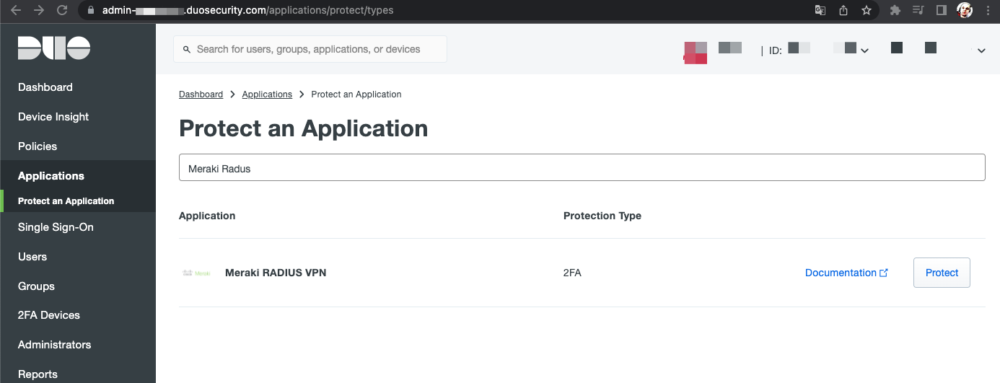
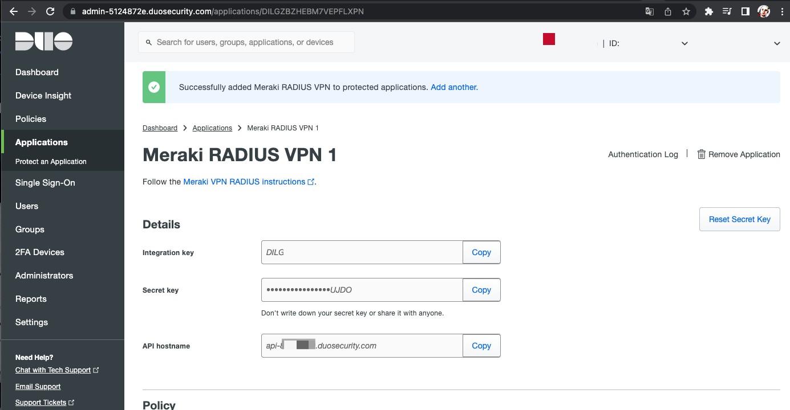
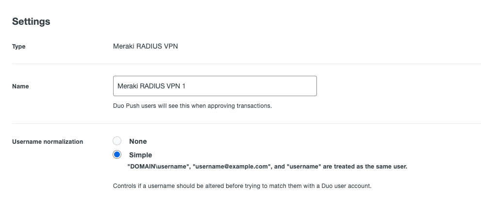
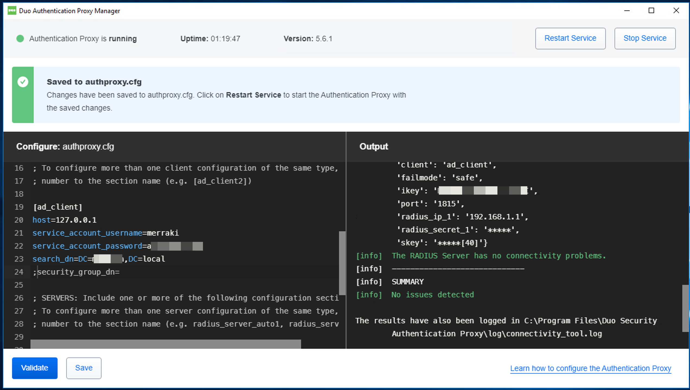
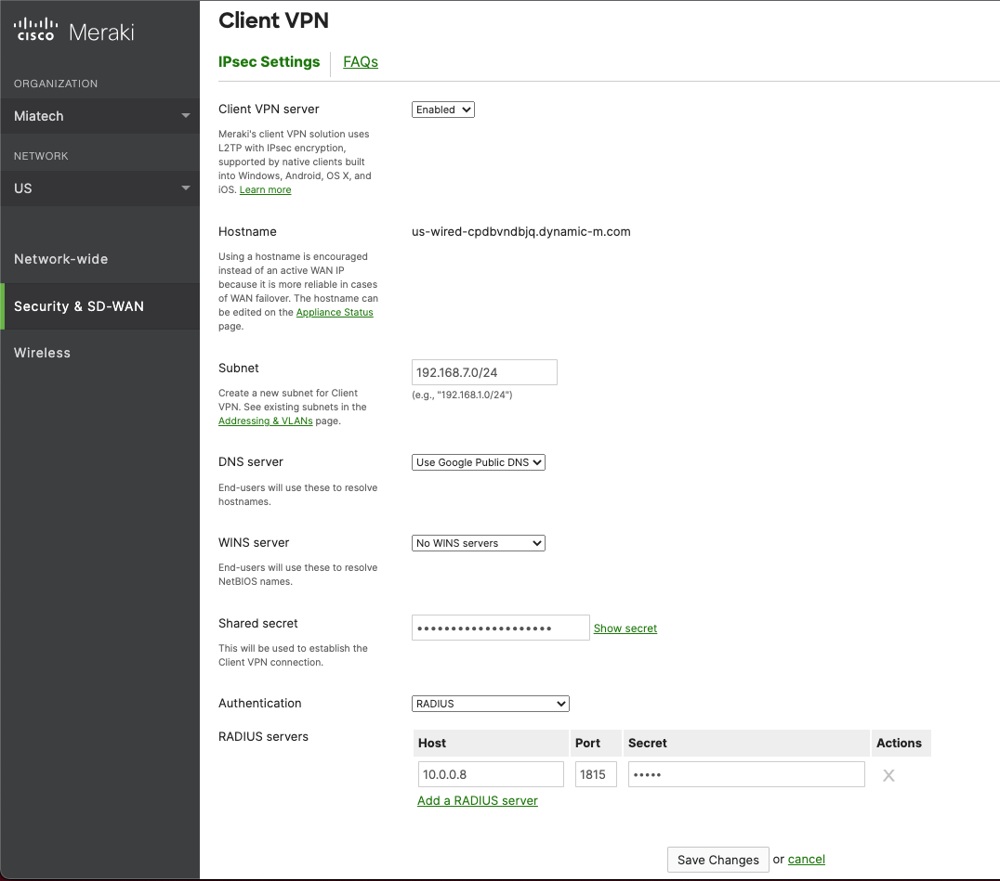

## Create New Appication DUO Meraki RADIUS VPN

Log in to the Duo Admin Panel and navigate to Applications.

Click Protect an Application and locate Meraki RADIUS VPN in the applications list. 

  

Click Protect to get your integration key, secret key, and API hostname. You'll need this information to complete your setup. See Protecting Applications for more information about protecting applications in Duo and additional application options.

  

switch Username normalization to Simple mode  

  

and press save button

## Install Duo Radius Proxy Service
To integrate Duo with your Meraki MX, you will need to install a local Duo proxy service on a machine within your network. This Duo proxy server will receive incoming RADIUS requests from your Meraki MX, contact your existing local LDAP/AD or RADIUS server to perform primary authentication, and then contact Duo's cloud service for secondary authentication.

Locate (or set up) a system on which you will install the Duo Authentication Proxy. The proxy supports these operating systems:

 - Windows Server 2012 or later (Server 2016+ recommended)
 - CentOS 7 or later (CentOS 8+ recommended)
 - Red Hat Enterprise Linux 7 or later (RHEL 8+ recommended)
 - Ubuntu 16.04 or later (Ubuntu 18.04+ recommended)
 - Debian 7 or later (Debian 9+ recommended)

On our example we will install on Windows Domain Controller.

> **Installation requirements**
>
> The Duo Authentication Proxy can be installed on a physical or virtual host. 
> We recommend a system with at least 1 CPU, 200 MB disk space, and 4 GB RAM (although 1 GB RAM is usually sufficient).
{: .important}

0. Create Admin account on DC AD with Admin Enterprise group, example: merakiuser. 
1. Download the most recent Authentication Proxy for Windows from [https://dl.duosecurity.com/duoauthproxy-latest.exe](https://dl.duosecurity.com/duoauthproxy-latest.exe). Note that the actual filename will reflect the version e.g. duoauthproxy-5.6.1.exe.
2. When installing, you can choose you want to install the Proxy Manager. The Proxy Manager is a Windows utility that helps you edit the Duo Authentication Proxy configuration, determine the proxy's status, and start or stop the proxy service. Learn more about using the Proxy Manager. Installing the Proxy Manager adds about 100 MB to the installed size.
3. After installation, run ProxyManager for next configuration step.

  

1. edit authproxy.cfg like example bellow, on left side ProxyManaged windows. 
2. Press Validate, if or then press Save button.  
3. For apply configuration also press Restart services.  

```
[ad_client]
host=127.0.0.1                          #Domain Controller Address 
service_account_username=merakiuser     #Domain Admin user
service_account_password=*********      #Domain Admin password
search_dn=DC=consto,DC=local            #Search DN patch 
;security_group_dn=                     #Security group DN

[radius_server_auto]
ikey=DIWW*********                      #Integration key from DUO Admin Aplication. see up that docs
skey=brPMb***********                   #Secret key from DUO Admin Aplication. see up that docs
api_host=api-*******.duosecurity.com    #API hostname from DUO Admin Aplication. see up that docss
radius_ip_1=192.168.1.1                 #IP adress Router Meraki MX, recived from auth query 
radius_secret_1=cisco                   #Radius secret, generate any secret key, will be used on MX VPN
failmode=safe
client=ad_client
port=1815                               #Bind port, will be used on MX VPN
```
## Create VPN on Meraki MX 

1. Navigate to Security & SD-WAN then to Client VPN.
2. Click the drop down for Authentication and select RADIUS as your option.
3. Click Add a RADIUS server and fill out the form with the following information:

| Host	| The hostname or IP address of your Duo Authentication Proxy   |
|:------|:-------------------------------------------------------------|
| Port  | 1815 (or whichever port specified in your authproxy.cfg file) |
| Server | Secret Key	Shared Secret used in Authentication Proxy configuration |




## Reference
[DUO Meraki Radius](https://duo.com/docs/meraki-radius)  
[DUO Authproxy reference](https://duo.com/docs/authproxy-reference#main-section)  

## Video guide 
<!-- blank line -->
<figure class="video_container">
    <iframe width="900" height="600" src="https://www.youtube.com/embed/0kmNsun48Wc" title="YouTube video player" frameborder="0" allow="accelerometer; autoplay; clipboard-write; encrypted-media; gyroscope; picture-in-picture" allowfullscreen></iframe>
</figure>
<!-- blank line -->