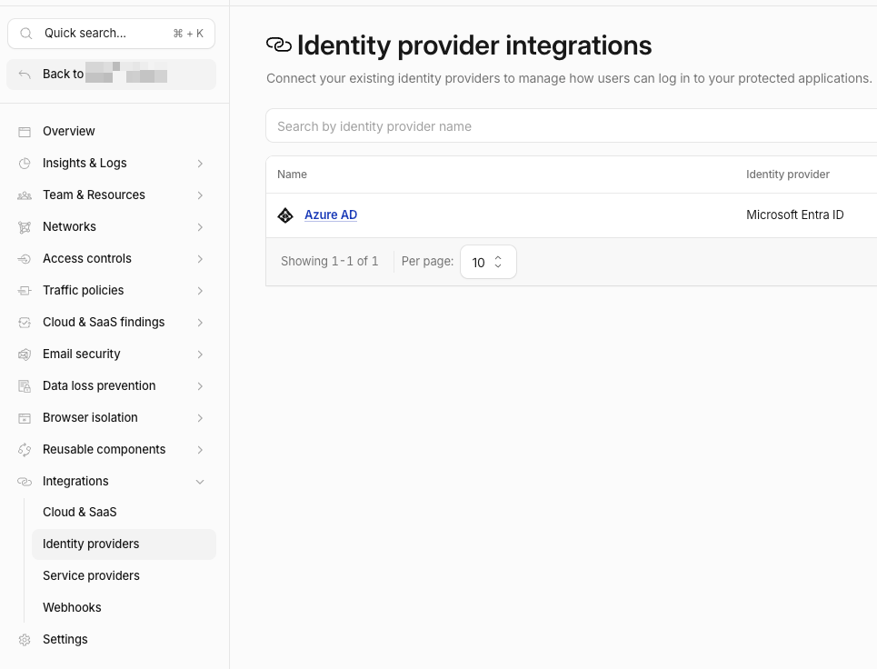
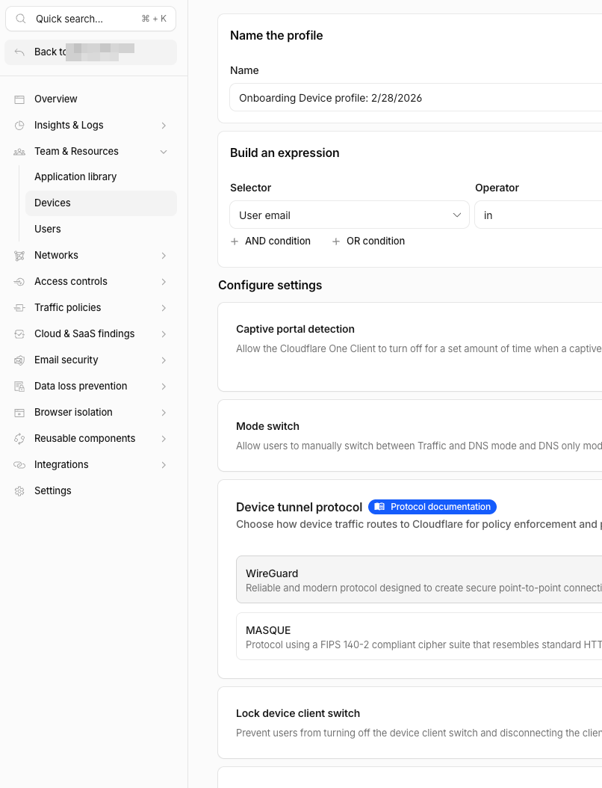

Use this technician procedure to let selected users enroll the Cloudflare One Client (formerly WARP) into a client's Cloudflare Zero Trust organization by email. This procedure uses Cloudflare Access **One-time PIN** authentication and an **Allow** policy assigned to the WARP enrollment application. If Microsoft Entra ID (Azure AD) is configured as the WARP application's login method, use that sign-in method instead; users do not need a Cloudflare email one-time PIN.

This is an administrator procedure. Send users the separate [Connect a Device to Cloudflare Zero Trust](/docs/Guides/Cloudflare/connect-cloudflare-zero-trust-warp/) guide after configuration is complete.

## Answer: Is adding the email enough?

Adding the user's email address to the Allow policy does **not** send an invitation and does not create a Cloudflare user account. The user receives a one-time PIN only when they attempt their first WARP login.

Adding the email is sufficient **only when all of the following are already true**:

- The intended login method is configured: **One-time PIN** for email-code sign-in, or Microsoft Entra ID (Azure AD) for Microsoft sign-in.
- The Allow policy is attached to the **WARP Login App** (a WARP Access application) used for device enrollment.
- The WARP Login App/policy is active in **Device enrollment permissions**.
- The user's email gateway can receive Cloudflare OTP messages.

If those prerequisites are in place, no other per-user administrator action is required. Give the user the Zero Trust **team name** and the end-user guide. They complete authentication and device enrollment themselves. A Cloudflare email PIN is required only when the user chooses or is directed to use **One-time PIN**; it is not required for Microsoft Entra ID sign-in.

## Before you begin

Record these values in the customer configuration record:

| Item | Where to find it |
| --- | --- |
| Zero Trust team name | Cloudflare dashboard > **Zero Trust** > **Settings** > **Team name**. The team name is the value before `.cloudflareaccess.com`. |
| WARP enrollment application | Zero Trust > **Access controls** > **Applications**. Use the existing WARP application, commonly named **WARP Login App**. |
| Intended users | Individual email addresses that should be allowed to enroll. Use a domain rule only when the client approves every address in that domain. |
| Support path | The user guide link, team name, and the client support contact. |

Do not use an Allow policy that includes **Everyone** or **Login Methods: One-time PIN** by itself. Either setting would allow any address that can use OTP to attempt enrollment. Pair OTP with the intended individual email addresses or an approved email domain.

## 1. Configure the user login method

Use the identity provider already approved for the client. If the WARP Login App uses Microsoft Entra ID (Azure AD), users authenticate with their Microsoft work account and any MFA required by that tenant. They do **not** receive or enter a Cloudflare email one-time PIN.

### Microsoft Entra ID (Azure AD)

1. Go to **Zero Trust** > **Integrations** > **Identity providers**.
2. Confirm the client's Entra integration is listed. In the current interface, an integration commonly named **Azure AD** shows **Microsoft Entra ID** as its identity-provider type.
3. Open the integration and confirm it is the approved client identity provider before allowing users to authenticate through the WARP Login App.

*This screen confirms that Microsoft Entra ID (previously Azure AD) is available as a Cloudflare identity provider. Users who sign in with this provider use their Microsoft work account instead of a Cloudflare email one-time PIN.*

If Microsoft Entra ID is not listed, complete the client's approved Entra-to-Cloudflare identity-provider integration before deploying WARP. Do not substitute One-time PIN merely because the Entra integration is incomplete.

### One-time PIN (email)

Use the following steps only when email-code authentication is the intended method, such as for a client without Entra ID sign-in or for an approved external user.

New Cloudflare Zero Trust organizations do not automatically include One-time PIN. Enable it before assigning email-based Access policies.

1. Sign in to the [Cloudflare dashboard](https://dash.cloudflare.com/) and open **Zero Trust**.
2. Go to **Integrations** > **Identity providers**.
3. Under **Your identity providers**, select **Add new identity provider**.
4. Select **One-time PIN** and save it.
5. If the client uses an email-security gateway, allowlist the OTP sender before deployment:
   - domain: `notify.cloudflare.com`
   - sender: `noreply@notify.cloudflare.com`

Cloudflare sends a code only after the email address matches an Allow policy. A blocked address receives no code even though the login page may say that a code was sent.

## 2. Create or update the email Allow policy

Use a reusable policy when the same group of users will enroll WARP and access other approved resources. Otherwise, use a purpose-specific enrollment policy.

1. Go to **Zero Trust** > **Access controls** > **Policies**.
2. Create a policy or select the existing WARP enrollment policy and choose **Configure**.
3. Give it an explicit name, for example `Allow - WARP enrollment - Client users`.
4. Set **Action** to **Allow**.
5. Under **Include**, select **Emails** and add each authorized user email address.
6. Under **Require**, select **Login methods** and choose **One-time PIN**.
7. Set the approved session duration and save.

For an approved organization-wide deployment, use **Emails ending in** with the client's owned domain instead of individual addresses. Do not use an email-domain policy for a shared or external domain without written approval.

## 3. Attach the policy to the WARP Login App

The Access policy must be attached to the WARP application used to authenticate Cloudflare One Client enrollment. Existing tenants might call this application **WARP Login App**, **WARP device enrollment**, or a similar documented name.

1. Go to **Zero Trust** > **Access controls** > **Applications**.
2. Open the existing WARP application and select **Configure**.
3. Open the **Policies** tab.
4. Add the email Allow policy from the previous section, or confirm that the existing policy is attached and enabled.
5. In **Login methods**, ensure the intended sign-in method is available: **Microsoft Entra ID** for Microsoft work-account authentication, or **One-time PIN** for email-code authentication.
6. Save the application.

Do not create a second WARP enrollment application merely because the existing one has a different display name. Confirm the active WARP application and update its policy assignment instead.

## 4. Create a user-specific device profile when needed

An Access Allow policy decides who can sign in and enroll. A **device profile** controls the Cloudflare One Client settings applied after that device enrolls. Do not use a device profile as a substitute for the WARP Login App policy or Device enrollment permissions.

Create a user-specific profile only when the user needs settings that differ from the Default profile or from a broader device profile. For example, use it to apply an approved client-lock, connection-mode, or tunnel-protocol setting to one user's devices.

1. Go to **Zero Trust** > **Team & Resources** > **Devices** > **Device profiles** > **General profiles**.
2. Select **Create new profile**. Cloudflare creates the new profile as a copy of the Default profile.
3. Enter a descriptive name, for example `Onboarding Device Profile - user@client.com`.
4. Under **Build an expression**, select **User email**, set the operator to **in**, and enter the approved user email address.
5. Configure only the settings required for this user or client standard. Examples visible on the profile page include captive-portal behavior, mode switching, device tunnel protocol, and locking the client connection switch.
6. Select **Create profile**.
7. Review profile order and move the profile as needed so it takes precedence over broader matching profiles. Allow up to 10 minutes for a profile change to reach enrolled devices.

*Use the **User email** selector to target the profile to the enrolled user's address. The profile applies Cloudflare One Client settings; the WARP Login App policy still controls whether the user can authenticate and enroll.*

## 5. Verify device enrollment permissions

The Access application controls identity authorization; device enrollment permissions control who can register a device with the Zero Trust organization. Both must be configured.

1. Go to **Zero Trust** > **Team & Resources** > **Devices**.
2. Open the **Management** tab.
3. Under **Device enrollment permissions**, select **Manage**.
4. Confirm the WARP Login App/email Allow policy is present and enabled for device enrollment. If it is missing, add the existing policy or create it from this page, then save.
5. Review any device profile settings that affect the client, such as auto-connect and whether users may leave the organization. Use the client's approved device-management standard.

## 6. Give the user the connection instructions

Send the user:

- the [Cloudflare One Client (WARP) end-user guide](/docs/Guides/Cloudflare/connect-cloudflare-zero-trust-warp/);
- the exact Zero Trust **team name**; and
- the support contact for a missing OTP, access-denied message, or installation issue.

Do not send a generic Cloudflare dashboard invitation unless the user also needs administrator access. End users enrolling WARP do not need Cloudflare dashboard access.

## 7. Test and document

1. Use a test user that is listed in the Allow policy.
2. Have the user complete WARP enrollment using the documented team name and OTP process.
3. Confirm the device appears in **Zero Trust** > **Team & Resources** > **Devices** with the correct user email.
4. Confirm the client reports **Connected** and, where applicable, test access to one approved private resource.
5. Review the Access policy tester or logs if the result is not as expected.
6. Document the team name, WARP application name, policy name, allowed users or groups, session duration, and test result.

## Troubleshooting

| Symptom | Likely cause | Corrective action |
| --- | --- | --- |
| User receives no OTP | Email is not in the Allow policy, OTP is disabled, or the gateway blocks the message | Confirm the policy, enable One-time PIN, and check the allowlist for `noreply@notify.cloudflare.com`. |
| User sees an access-denied message | Policy is not attached to the WARP app or device enrollment permissions | Confirm both the WARP application policy assignment and Device enrollment permissions. |
| User can authenticate but the client does not enroll | Wrong team name or WARP enrollment not active | Verify the exact team name and active WARP Login App configuration. |
| OTP is already used | An email security tool consumed the link/code or the user reused it | Request a new code. The most recent code invalidates earlier codes. |
| User can enroll but cannot reach a private resource | Enrollment works, but private routing or the resource Access policy is not configured | Troubleshoot the private network route and resource-specific Access policy separately. |

## Cloudflare references

- [One-time PIN login](https://developers.cloudflare.com/cloudflare-one/integrations/identity-providers/one-time-pin/)
- [Define device enrollment permissions](https://developers.cloudflare.com/learning-paths/secure-internet-traffic/configure-device-agent/device-enrollment-permissions/)
- [Cloudflare One Client device profiles](https://developers.cloudflare.com/cloudflare-one/team-and-resources/devices/cloudflare-one-client/configure/device-profiles/)
- [Manual Cloudflare One Client deployment](https://developers.cloudflare.com/cloudflare-one/team-and-resources/devices/cloudflare-one-client/deployment/manual-deployment/)
- [Manage Access policies](https://developers.cloudflare.com/cloudflare-one/access-controls/policies/policy-management/)
