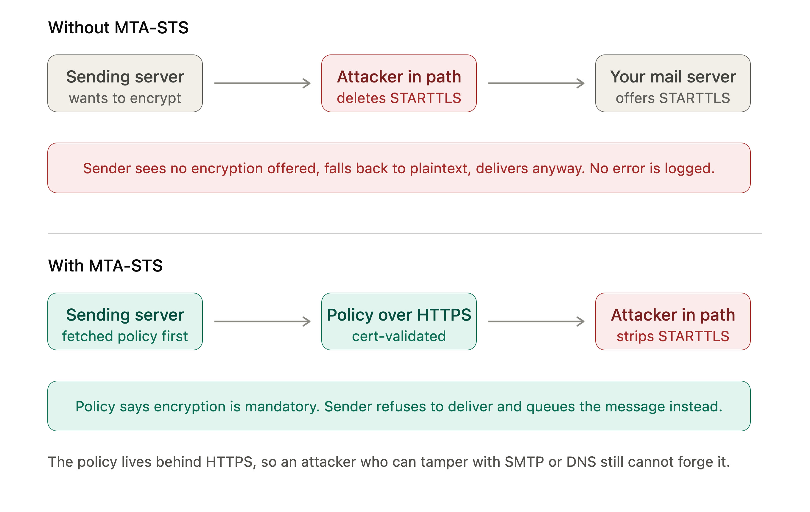

Use this guide to verify approved DNS and mail-flow changes for DMARC, SPF, DKIM, TLS-RPT, and MTA-STS. Replace `example.com`, selectors, nameservers, and MX hosts with the values approved for the domain being changed.

Do not publish reporting addresses, tenant IDs, API tokens, DNS exports, or other client-specific data in public documentation.

## Before You Start

- Confirm the domain owner has approved the DNS or mail-platform change.
- Record the expected value for every DNS record and policy file.
- Keep the previous record or policy content available for rollback.
- Use native DNS tools such as `dig` when available. PowerShell is not required for this procedure.

## Verify DNS Records

```sh
# DMARC: exactly one approved TXT record or the approved hosted-DMARC CNAME path.
dig +short TXT _dmarc.example.com
dig +short CNAME _dmarc.example.com

# SPF: confirm the published policy at the organizational domain.
dig +short TXT example.com

# DKIM: query the selector CNAME and its final TXT key record.
dig +short CNAME selector1._domainkey.example.com
dig +short TXT selector1-example-com._domainkey.tenant.onmicrosoft.com
dig +short CNAME selector2._domainkey.example.com
dig +short TXT selector2-example-com._domainkey.tenant.onmicrosoft.com

# TLS-RPT and MTA-STS DNS.
dig +short TXT _smtp._tls.example.com
dig +short TXT _mta-sts.example.com
```

Repeat critical DMARC and DKIM queries against the authoritative nameservers and at least two independent public resolvers. Treat a resolver failure separately from an authoritative no-answer.

## Verify the MTA-STS Policy

```sh
curl --fail --silent --show-error \
  https://mta-sts.example.com/.well-known/mta-sts.txt
```

Confirm that the policy version, mode, MX pattern or patterns, `max_age`, and DNS `id` match the approved change. A reachable page alone is insufficient.

## Verify Mail Flow

- Confirm the DMARC reporting service ingests aggregate reports after the expected reporting interval. DNS resolution alone does not confirm delivery to `rua`.
- Send approved test mail through each retained authorized sender and inspect the receiving system's authentication results. Confirm SPF or DKIM alignment before advancing a DMARC enforcement stage.
- Confirm Microsoft 365 DKIM signing after selector repair or rotation. A missing probe of an unknown third-party DKIM selector does not prove DKIM is absent.

## Understand DMARC Policy Scope

`p=` sets policy for the organizational domain. `sp=` sets policy for subdomains.

When a receiver evaluates mail from a subdomain, it first looks for a DMARC record at that exact subdomain. If none exists, it falls back to the organizational-domain record and applies `sp=` when present; otherwise it applies `p=`. Subdomains are therefore covered through inheritance even without `sp=`.

Use `sp=` deliberately when either of these is true:

- The organization wants explicit, durable subdomain protection, such as `p=reject; sp=reject`, even if a later apex-policy change is made without considering subdomains.
- A legitimate subdomain sender needs a separate rollout path, such as `p=reject; sp=none`, while its SPF or DKIM alignment is repaired.

Before adding `sp=reject`, inventory known and potential subdomain senders. A non-existent or unused subdomain can still be impersonated, while an active but unknown subdomain sender can experience delivery failures under enforcement.

## TLS-RPT and MTA-STS

TLS-RPT is reporting only; it does not enforce TLS. A typical record is:

```text
_smtp._tls.example.com  TXT  "v=TLSRPTv1; rua=mailto:REPORTING-ADDRESS"
```

Supporting senders use TLS-RPT to provide periodic reports about TLS negotiation, certificate validation, MTA-STS policy retrieval, and related delivery failures. Deploy and validate TLS-RPT before enforcing MTA-STS so mail-flow failures are observable.

SMTP TLS is opportunistic by default. An attacker in the network path can remove `STARTTLS` from a server response, causing a sender to fall back to plaintext delivery without a visible error. MTA-STS gives sending systems a certificate-validated policy that requires TLS and a valid MX host before delivery.



MTA-STS has three required parts:

1. A DNS TXT record at `_mta-sts.example.com`, such as `v=STSv1; id=POLICY-VERSION`.
2. A policy file at `https://mta-sts.example.com/.well-known/mta-sts.txt` served with a valid certificate.
3. A policy listing the approved MX hostname patterns and a mode, for example:

   ```text
   version: STSv1
   mode: testing
   mx: mail.example-provider.net
   max_age: 604800
   ```

The DNS `id` is a policy-version signal. Increment it whenever policy content changes so senders refresh their cached policy. Start in `mode: testing`; move to `mode: enforce` only after TLS-RPT confirms that the complete MX set and certificate chain work for normal senders.

Keep MTA-STS policy updates coordinated with any future MX-platform migration: update and validate the policy before changing the MX records.

## Document and Roll Back

Record the query time, resolver, expected value, observed value, mail-flow result, and change reference. On failure, restore the last known-good DNS or policy state, preserve DMARC monitoring, and document the affected sender before retrying.
