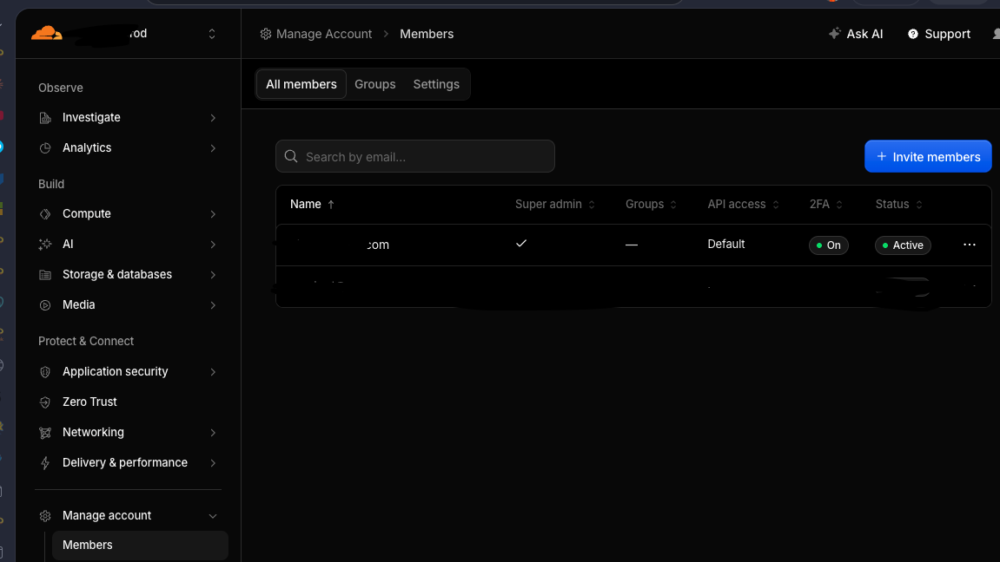
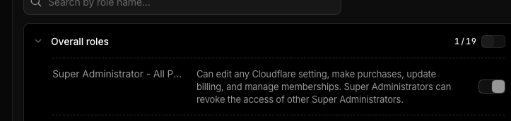

Use this guide to invite another user to a Cloudflare account and assign administrator access during the invitation workflow.

Cloudflare access is account-based. Members receive access through policies made from a role and a scope. For member management work, Cloudflare's current documentation says the acting user must be a **Super Administrator** with a verified email address.

Checked: **July 15, 2026**. Cloudflare dashboard labels change over time, so match the intent of the role and scope if the screen wording differs slightly.

## When to Use This

Use this process when:

- A technician or client admin needs access to the Cloudflare account.
- The user should be invited directly from the Cloudflare dashboard.
- Administrator access should be assigned during the invite.
- The request is approved and documented.

Do not assign broad administrator access when a narrower role is enough. Cloudflare supports scoped roles, so use least privilege for routine DNS, analytics, billing, or read-only needs.

## Prerequisites

Before sending the invite, confirm:

- You are signed in to the correct Cloudflare account.
- Your Cloudflare email address is verified.
- Your current Cloudflare user has permission to manage account members.
- The invitee email address is correct.
- The requested access level is approved.
- The invite is documented in the ticket or PSA.

If the goal is for the new user to manage other Cloudflare members, use **Super Administrator - All Privileges**. Cloudflare's standard **Administrator** role can access the full account and edit subscriptions, but Cloudflare's role documentation states it does not manage members or the billing profile.

## Open the Members Page

1. Sign in to the [Cloudflare dashboard](https://dash.cloudflare.com/).
2. Select the correct account.
3. In the left navigation, expand **Manage account**.
4. Select **Members**.
5. Confirm you are on the **All members** tab.



## Invite the User

1. On the **Members** page, select **Invite members**.
2. Enter the user's email address.
3. If inviting more than one user, separate email addresses with commas.
4. Choose the account scope or domain scope required for the request.
5. Select the role to assign.

For full account administration and member management, select:

```text
Super Administrator - All Privileges
```



Cloudflare may show roles under **Overall roles**, **Account roles**, or another role grouping depending on the dashboard version and account type. Select the role that matches the required access, not just the first role containing the word administrator.

## Complete the Invitation

1. After selecting the role and scope, continue to the summary screen.
2. Review the invitee email address.
3. Review the assigned role.
4. Review the scope.
5. Select **Invite**.

The user receives a Cloudflare invitation by email. They must accept the invitation and complete any required account setup before they appear as an active member.

## Verify Access

After the invite is accepted:

1. Return to **Manage account** > **Members**.
2. Search for the user's email address.
3. Confirm the status is active.
4. Confirm 2FA is enabled when required by policy.
5. Confirm the assigned role and scope match the approved request.

If the user has not accepted the invite, their status may show as pending. If the invite expires or the user cannot find it, open the member record and resend the invite.

## Administrator Role Guidance

Use these guidelines when selecting a role:

| Need | Recommended access |
| --- | --- |
| Manage users, roles, billing, account settings, and all zones | `Super Administrator - All Privileges` |
| Full account access without managing members or billing profile | `Administrator` |
| DNS-only changes | DNS-specific role scoped to the required domain |
| Read-only support or audit review | Read-only role scoped to the required account or domain |

Be careful with Super Administrator. That role can make broad account changes, manage memberships, update billing, and revoke other Super Administrators. Use it only when the request truly requires it.

## Troubleshooting

If the **Invite members** button is missing or disabled:

- Confirm you are in the correct Cloudflare account.
- Confirm your email address is verified.
- Confirm your current account role can manage members.
- Confirm the account is not governed by SSO or SCIM rules that require user provisioning elsewhere.

If the user cannot accept the invite:

- Confirm the email address was typed correctly.
- Ask the user to check spam or quarantine.
- Resend the invite from the member record.
- Confirm the user is signing in with the same email address that was invited.

If the user can sign in but cannot perform the expected action:

- Confirm the role is assigned at the correct account, domain, or resource scope.
- Confirm the requested action is included in the assigned role.
- Assign a narrower additional role if only one missing function is needed.
- Avoid jumping straight to Super Administrator unless member management or full account control is required.

## Security Checklist

After inviting an administrator:

- Confirm the request and approval are documented.
- Confirm the account member uses MFA or 2FA.
- Confirm the user is still needed during periodic access review.
- Remove or reduce access when the work is complete.
- Keep at least two trusted Super Administrators for account recovery.
- Avoid shared daily-use Cloudflare admin accounts.

## References

- [Cloudflare: Members and permissions](https://developers.cloudflare.com/fundamentals/manage-members/)
- [Cloudflare: Manage account members](https://developers.cloudflare.com/fundamentals/manage-members/manage/)
- [Cloudflare: Account roles](https://developers.cloudflare.com/fundamentals/manage-members/roles/)

## Need Help

For Cloudflare administration in Vancouver WA, Portland OR, Seattle WA, and remote client environments, Svetek can help review account memberships, right-size administrator access, and document Cloudflare roles safely.
