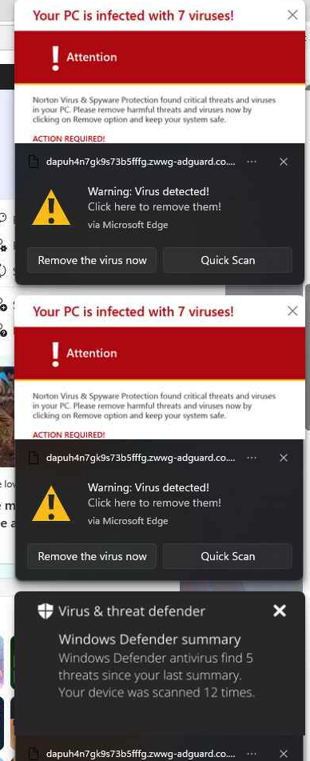

Use this technician procedure when a Windows user receives fake virus warnings, fake security alerts, or similar pop-ups delivered through Microsoft Edge notifications.

These messages are commonly a **browser notification permission abuse**, not proof that the device is infected. Treat the report as a security event: contain the notifications, determine whether the user clicked or entered information, and run the organization's normal endpoint review.



## Immediate response

1. Tell the user not to click the notification, call a number in it, install software, or enter credentials.
2. Ask whether the user clicked a link, downloaded or installed anything, entered credentials, approved remote access, or contacted a supposed support representative.
3. If any of those actions occurred, follow the organization's incident-response process. Consider isolating the device and resetting credentials where the investigation indicates. Do not treat notification blocking as complete remediation.
4. Capture the full notification origin, approximate time, and a screenshot if available. A shortened domain in a toast is not sufficient evidence for a targeted block.
5. Block the source immediately with the stopgap procedure below, then deploy the managed Intune policy as the durable fix.

## Recommended permanent control: block by default

Microsoft Edge's mandatory `DefaultNotificationsSetting` policy supports these values:

| Value | Behavior |
| --- | --- |
| `1` | Allow sites to show notifications by default. |
| `2` | Block sites from showing notifications by default. |
| `3` | Ask the user each time a site requests notifications. |

Set the policy to `2` and add only business-approved notification origins to **NotificationsAllowedForUrls**. The explicit allow list overrides the default for those listed origins; all other sites remain blocked.

### Configure the policy in Intune

1. In the [Microsoft Intune admin center](https://intune.microsoft.com/), go to **Devices** > **Windows** > **Configuration**.
2. Select **Create** > **New policy**.
3. Select **Windows 10 and later** and **Settings catalog**, then select **Create**.
4. Use a clear, tenant-appropriate name and description. Do not include internal naming conventions, client names, credentials, or group names in the policy name.
5. Select **Add settings**, search for the following Microsoft Edge policies, and add them:
   - **Default notification setting**
   - **Allow notifications on specific sites**
6. Set **Default notification setting** to **Don't allow any site to show desktop notifications**.
7. Under **Allow notifications on specific sites**, add only the approved origins required by the organization. Common examples, when actually required, include:

   ```text
   https://teams.microsoft.com
   https://outlook.office.com
   https://outlook.office365.com
   ```

8. Assign the profile to a pilot group of Windows devices, validate it, and then deploy it to the intended device population.
9. Monitor **Device status** and **Per-setting status** for deployment failures or conflicts.

Do not add broad wildcards or an allowed site only because a user requests notification access. Confirm the site is legitimate, business-required, and controlled by the expected provider.

## Temporary containment with remote command execution

Use this only as a stopgap for an affected device while the managed policy is being deployed. Most RMM tools run remote commands as `SYSTEM`, which is appropriate for the `HKLM` policy path; verify the execution context in the RMM before proceeding.

First, check for an existing managed policy. If values already exist, document them and resolve the configuration through the authoritative Intune or domain policy rather than overwriting it locally.

```bat
reg query "HKLM\SOFTWARE\Policies\Microsoft\Edge" /v DefaultNotificationsSetting
reg query "HKLM\SOFTWARE\Policies\Microsoft\Edge\NotificationsAllowedForUrls"
```

For a device with no existing conflicting policy, run the following in a **CMD** remote command session. This blocks notifications by default and preserves notifications only for the listed approved origins.

```bat
reg add "HKLM\SOFTWARE\Policies\Microsoft\Edge" /v DefaultNotificationsSetting /t REG_DWORD /d 2 /f
reg add "HKLM\SOFTWARE\Policies\Microsoft\Edge\NotificationsAllowedForUrls" /v 1 /t REG_SZ /d "https://teams.microsoft.com" /f
reg add "HKLM\SOFTWARE\Policies\Microsoft\Edge\NotificationsAllowedForUrls" /v 2 /t REG_SZ /d "https://outlook.office.com" /f
reg add "HKLM\SOFTWARE\Policies\Microsoft\Edge\NotificationsAllowedForUrls" /v 3 /t REG_SZ /d "https://outlook.office365.com" /f
```

Edge supports dynamic policy refresh. Ask the user to close and reopen Edge, or have them open `edge://policy` and select **Reload policies**.

> **Warning:** `taskkill /f /im msedge.exe` closes all Edge windows without warning. Do not use it unless the user has approved the interruption or the incident requires it.

## Alternative: block one confirmed origin

Use a specific block only when the business decision is to keep the normal notification default for that device or group. It is less effective against rotating scam domains.

1. In Edge, open `edge://settings/content/notifications` and record the exact suspicious origin from the **Allow** list. Do not edit the browser's `Preferences` JSON file.
2. Replace `<suspicious-origin>` below with the confirmed URL pattern. Use a wildcard pattern only when it is appropriate for the verified domain.

   ```bat
   reg add "HKLM\SOFTWARE\Policies\Microsoft\Edge\NotificationsBlockedForUrls" /v 1 /t REG_SZ /d "<suspicious-origin>" /f
   ```

3. Reload Edge policies or restart Edge.
4. Add the same exact origin to the managed **Block notifications on specific sites** policy if the block should persist.

Microsoft Edge accepts URL patterns such as `https://example.com` and `[*.]example.com` for notification allow and block lists. Never create a wildcard from a truncated notification title; validate the full origin first.

## Verify the result

On the affected device:

1. Open `edge://policy` and select **Reload policies**.
2. Confirm **DefaultNotificationsSetting** shows a value of `2` and a source of **Platform** or **Cloud**.
3. Open `edge://settings/content/notifications` and confirm Edge indicates the setting is managed by the organization.
4. Confirm the fake notification toasts no longer appear.
5. Verify any approved business site on the allow list still works as expected.

You can also confirm the local registry values:

```bat
reg query "HKLM\SOFTWARE\Policies\Microsoft\Edge" /v DefaultNotificationsSetting
reg query "HKLM\SOFTWARE\Policies\Microsoft\Edge\NotificationsAllowedForUrls"
reg query "HKLM\SOFTWARE\Policies\Microsoft\Edge\NotificationsBlockedForUrls"
```

## Endpoint review

Notification blocking stops the pop-ups; it does not establish whether a user clicked through or whether the device is clean.

Use the endpoint-security platform and RMM inventory as the primary evidence sources. At minimum:

1. Review recent downloads and browser history relevant to the reported time.
2. Review endpoint detections, remote-access software, new local accounts, persistence indicators, and any remote-support session records.
3. Update Microsoft Defender security intelligence and run a quick scan when Microsoft Defender Antivirus is the active antivirus product:

   ```powershell
   Update-MpSignature
   Start-MpScan -ScanType QuickScan
   Get-MpThreatDetection
   ```

4. Escalate findings that indicate credential entry, unauthorized software, remote access, or malware execution.

Do not rely on `wmic` for software inventory; it is deprecated on current Windows versions. Use the endpoint-security console, RMM software inventory, or supported PowerShell and registry inventory methods.

## References

- [Microsoft Edge policy: DefaultNotificationsSetting](https://learn.microsoft.com/en-us/deployedge/microsoft-edge-policies/defaultnotificationssetting)
- [Microsoft Edge policy: NotificationsAllowedForUrls](https://learn.microsoft.com/en-us/deployedge/microsoft-edge-policies/notificationsallowedforurls)
- [Microsoft Edge policy: NotificationsBlockedForUrls](https://learn.microsoft.com/en-us/deployedge/microsoft-edge-policies/notificationsblockedforurls)
- [Microsoft: Configure Edge policy using Intune Settings catalog](https://learn.microsoft.com/en-us/intune/device-configuration/settings-catalog/configure-edge)
- [Microsoft: Run on-demand scans in Defender Antivirus](https://learn.microsoft.com/en-us/defender-endpoint/run-scan-microsoft-defender-antivirus)
