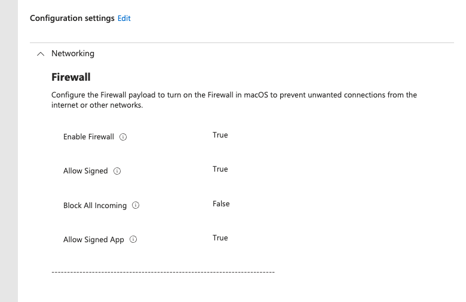

Use this procedure to enable the native macOS Application Firewall through a Microsoft Intune **Settings catalog** profile. This design allows incoming connections only for trusted signed software and services, without requiring end users to respond to firewall prompts or creating a bundle-ID allow list for every support tool.

The policy is intended for organization-owned, Intune-managed Macs. Test it with the organization's remote-support, endpoint-security, printing, and any other inbound-connection workflows before broad deployment.

## What this policy does

The macOS Application Firewall controls **incoming** connections on a per-application basis. It is not a port-based network firewall and it does not control outbound connections.

This configuration:

- turns on the Application Firewall;
- leaves the restrictive **Block All Incoming** mode off;
- allows Apple-signed built-in software to receive incoming connections; and
- allows downloaded software that is validly signed by a trusted developer to receive incoming connections.

With the firewall enabled and **Block All Incoming** set to `False`, macOS remains in its standard application-firewall mode (`globalstate = 1`). It is not in the essential-services-only mode, which blocks sharing services and ignores normal application allow rules.

## Why use Settings catalog

Use a macOS **Settings catalog** profile for new Intune deployments. Intune exposes the native **Networking** > **Firewall** payload settings in Settings catalog, so a custom `.mobileconfig` profile is unnecessary for this configuration.

Settings catalog also makes the configured values visible in the Intune admin center and easier to review alongside other device configuration policies.

## Firewall settings

In the Settings catalog, add **Networking** > **Firewall** and configure these values:

| Setting | Value | Purpose |
| --- | --- | --- |
| **Enable Firewall** | `True` | Enables the macOS Application Firewall. |
| **Block All Incoming** | `False` | Keeps normal signed-application and sharing-service behavior available. Do not enable it when printing, screen sharing, file sharing, or other inbound services are required. |
| **Allow Signed** | `True` | Automatically allows eligible Apple-signed built-in software and services to receive incoming connections. |
| **Allow Signed App** | `True` | Automatically allows eligible downloaded, developer-signed software to receive incoming connections. |



### Why there is no application allow list

The **Applications** list in the Firewall payload uses app bundle IDs. It can be useful when a specific `.app` bundle must be allowed or blocked.

Do not add a per-application list merely to accommodate signed management, security, or support components. These components can include daemons or command-line binaries that do not have an app bundle ID. With **Allow Signed** and **Allow Signed App** enabled, macOS automatically allows eligible signed software without a user prompt.

This is not a guarantee that every third-party component is eligible. Verify the actual installed product and its code-signing state during pilot testing. Add a specific rule only when a documented application requires it and the broad signed-software behavior is insufficient.

## Create and assign the policy

1. In the [Microsoft Intune admin center](https://intune.microsoft.com/), go to **Devices** > **macOS** > **Configuration**.
2. Select **Create** > **New policy**.
3. Select **macOS** as the platform and **Settings catalog** as the profile type, then select **Create**.
4. Enter a descriptive, tenant-appropriate name and description. Do not embed customer, tool, credential, or group details in the profile name.
5. Select **Add settings**, search for **Firewall**, then select **Networking** > **Firewall**.
6. Configure the four settings in the table above. Do not configure an **Applications** list unless a documented exception requires one.
7. Assign the profile to the intended macOS device group. Start with a pilot group that includes representative devices and workflows.
8. Select **Review + create** > **Create**.
9. Monitor **Device status** and **Per-setting status** until the pilot devices report success.

## Validate the pilot deployment

On a pilot Mac after the profile reports successful deployment, use Terminal to confirm the expected firewall state:

```bash
sudo defaults read /Library/Preferences/com.apple.alf globalstate
sudo defaults read /Library/Preferences/com.apple.alf allowsignedenabled
sudo defaults read /Library/Preferences/com.apple.alf allowdownloadsignedenabled
```

Each command should return `1`.

Then test the organization's supported workflows:

1. Confirm the approved remote-management or support agent remains checked in and reachable through its normal console.
2. Confirm endpoint-security software remains healthy and reports normally.
3. If Printer Sharing or another local print workflow is used, print a test page from another device on the network.
4. Test any approved inbound services, such as screen sharing or file sharing, before expanding the assignment.
5. Review the Intune profile's **Device status** and **Per-setting status** for failures or conflicts.

## Rollout and troubleshooting

Deploy to a small pilot group before assigning the policy broadly. If a required service stops accepting incoming connections, first determine whether it is an Apple-signed service, a valid developer-signed application, or an unsigned/custom component.

| Symptom | Likely cause | Corrective action |
| --- | --- | --- |
| Firewall shows as off | The profile did not apply or a conflicting profile is present | Review Intune device and per-setting status, then identify and resolve the conflicting firewall payload. |
| Printing, screen sharing, or file sharing fails | **Block All Incoming** is enabled, or the sharing service is disabled locally | Confirm **Block All Incoming** is `False`, then review the applicable Sharing setting. |
| Support or security component cannot receive a connection | The component is unsigned, incorrectly signed, or needs a specific application rule | Confirm the vendor's signing and support requirements; add a narrowly scoped bundle-ID rule only when supported and necessary. |
| User receives a firewall prompt | The requested software is not covered by the signed-software settings or a rule | Verify the application's signing status and add a documented, specific rule if appropriate. |

## Security and credential handling

Do not include enrollment tokens, installation commands containing tokens, credentials, device identifiers, or internal group names in this policy or its documentation. Enrollment credentials belong in the approved deployment process and should be treated as sensitive, short-lived secrets.

## References

- [Microsoft: Apple configuration list for Intune Settings catalog](https://learn.microsoft.com/en-us/intune/intune-service/configuration/apple-settings-catalog-configurations)
- [Microsoft: Configure endpoint protection on macOS devices with Intune](https://learn.microsoft.com/en-us/intune/device-configuration/endpoint-security/ref-endpoint-protection-macos)
- [Apple: Firewall device management payload settings](https://support.apple.com/guide/deployment/firewall-payload-settings-dep8d306275f/web)
- [Apple: Change Firewall settings on Mac](https://support.apple.com/guide/mac-help/change-firewall-settings-mh11783/mac)
