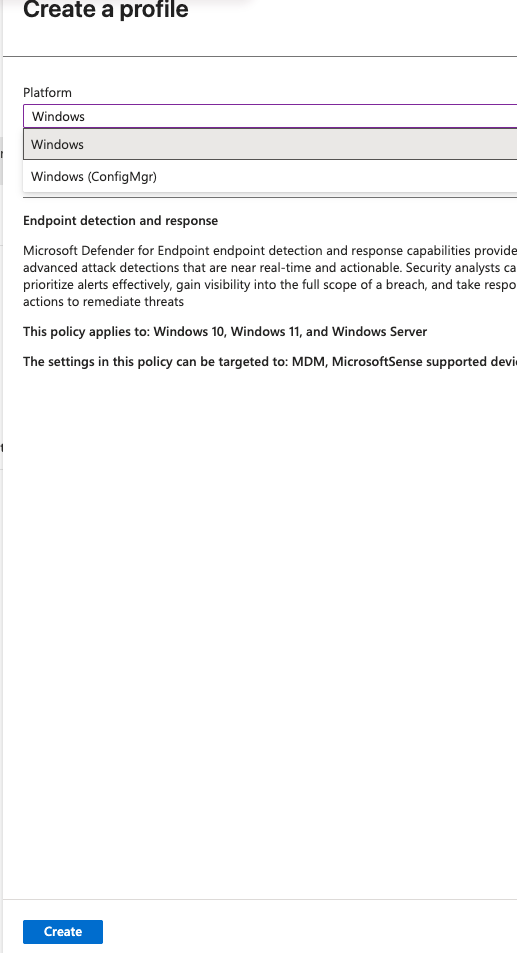

Use this technician procedure to configure automatic Microsoft Intune enrollment for Windows 10 and Windows 11 devices in a Microsoft 365 Business Premium tenant. It also covers Microsoft Defender for Business onboarding and the checks that confirm devices are both managed and protected.

Microsoft 365 Business Premium includes Microsoft Intune Plan 1, Microsoft Entra ID P1, and Microsoft Defender for Business. No separate add-on is required for this baseline.

## Prerequisites

Confirm these items before changing the tenant. A successful Microsoft Entra join alone does not prove Intune enrollment or Defender onboarding.

| Requirement | Verify |
| --- | --- |
| Administrative access | Use a Global Administrator to configure automatic enrollment. An Intune Administrator or Endpoint Security Manager can manage the related Intune policies; connecting Intune to Defender also requires appropriate Defender permissions. |
| User licensing | Assign Microsoft 365 Business Premium, including the Intune service plan, to every user who will enroll a device. Owning tenant licenses without assigning one to the user is not sufficient. |
| Windows edition | For corporate Microsoft Entra join, use Windows Pro, Enterprise, or Education. Windows Home cannot join Microsoft Entra ID. |
| Intune authority | In Intune admin center, go to **Tenant administration** > **Tenant status** and confirm Intune is the MDM authority. |
| Tenant provisioning | Open `https://security.microsoft.com` > **Assets** > **Devices** once to provision Defender for Business if the tenant has not used it before. |

Use a test user and test device when enabling a new tenant. The user must be in the selected MDM scope and licensed before the device joins or registers.

## Enable automatic Intune enrollment

1. Sign in to the [Microsoft Intune admin center](https://intune.microsoft.com).
2. Go to **Devices** > **Device onboarding** > **Enrollment**.
3. Open the **Windows** tab and select **Automatic Enrollment**.
4. For **MDM user scope**, choose:
   - **Some** and select a pilot group for a phased deployment; or
   - **All** for an approved tenant-wide deployment.
5. Set **WIP user scope** to **None**. If WIP must remain in use, do not put the same users in both scopes.
6. Leave the MDM terms of use, discovery, and compliance URLs at their Microsoft defaults unless the tenant has an approved exception.
7. Select **Save**.

| MDM user scope | Result |
| --- | --- |
| **None** | Automatic enrollment is disabled. Users can still manually enroll eligible devices. |
| **Some** | Only the selected users automatically enroll devices. Use this for testing or staged rollout. |
| **All** | All eligible licensed users automatically enroll devices when they join or register with Microsoft Entra ID. |

The same setting is available in the Microsoft Entra admin center under **Entra ID** > **Mobility (MDM and MAM)** > **Microsoft Intune**. Use one portal path; both update the same tenant setting.

> **Important:** For personally owned devices, the WIP scope takes precedence when a user is in both scopes. This can prevent automatic device management enrollment. Keep WIP at **None** unless there is an intentional, documented WIP deployment.

## Enroll Windows devices

With the MDM scope enabled, the following actions trigger automatic enrollment for an in-scope, licensed user:

| Scenario | Technician or user action |
| --- | --- |
| New corporate device | During Windows Out-of-Box Experience, sign in with the work account and choose the organization setup path. The device joins Microsoft Entra ID and enrolls in Intune. |
| Existing corporate device | Go to **Settings** > **Accounts** > **Access work or school** > **Connect** > **Join this device to Microsoft Entra ID**. |
| Autopilot device | Assign the user and complete the approved Autopilot deployment. Intune enrollment occurs during setup. |
| Personal device | Adding a work or school account can register and enroll the device, but it is not the same as a corporate Entra join. Follow the tenant's BYOD policy. |

For company-owned hardware, use **Join this device to Microsoft Entra ID**, not merely **Connect** to add a work account. A device that was joined before automatic enrollment was enabled does not necessarily enroll retroactively; enroll it deliberately through the approved Windows enrollment flow or rejoin it under change control.

## Hybrid-joined devices only

Skip this section for cloud-only Business Premium tenants.

Hybrid Microsoft Entra joined devices need the MDM scope above and a Group Policy that enables automatic MDM enrollment:

```
Computer Configuration
  > Policies
    > Administrative Templates
      > Windows Components
        > MDM
          > Enable automatic MDM enrollment using default Microsoft Entra credentials
```

Set the policy to **Enabled** and select **User Credential**. Also confirm the hybrid join prerequisites are already functional: Microsoft Entra Connect device synchronization and the Service Connection Point configuration. A hybrid device showing `MDM: None` is commonly outside MDM scope or missing this policy.

## Onboard Microsoft Defender for Business

Do this only after Intune enrollment works. Defender for Business includes baseline next-generation protection and firewall policies; do not create overlapping security policies without reviewing the policies already assigned to the device group.

### Connect Intune and Defender

1. In Intune, go to **Tenant administration** > **Connectors and tokens** > **Microsoft Defender for Endpoint**.
2. Select **Connect Microsoft Defender for Endpoint to Intune**.
3. Enable the connection, configure the approved data-sharing choices, and save.
4. Wait for the connector status to show **Connected** before creating an EDR policy.

### Deploy one Windows EDR onboarding policy

1. Go to **Endpoint security** > **Endpoint detection and response**.
2. Open **EDR Onboarding Status** and select **Refresh**. The deployment control can remain unavailable until the report loads.
3. Select **Deploy preconfigured policy**.
4. Set **Platform** to **Windows**, not **Windows (ConfigMgr)**, then select **Create**.
5. Name the policy using the tenant naming standard, for example `MSP-WIN-EDR-CORP-Preconfigured`.
6. Configure **Sample sharing** to **All**, unless an approved data-handling exception requires a different setting.
7. Assign the policy to the intended corporate Windows device group. Assigning **All devices** is appropriate only when all managed Windows endpoints are in scope.
8. Review and create the policy.



*Select **Windows** for Microsoft Entra-joined Intune-managed clients. **Windows (ConfigMgr)** is for Configuration Manager tenant-attach scenarios, not standard Business Premium endpoint enrollment.*

Use only one EDR onboarding policy per device. If an EDR policy reports successful deployment but devices do not appear in Defender, first verify the Intune-Defender connector and the device's policy assignment. If required, use a current onboarding package from the Defender portal in a manual **Onboard** EDR policy; do not leave both the old and replacement policies assigned.

## Verify enrollment and protection

### Check the tenant

1. In Intune, go to **Devices** > **All devices** and confirm the test device appears and checks in.
2. In the Defender portal, go to **Assets** > **Devices** and confirm the same device appears after it sends telemetry. Allow 15 to 30 minutes after a successful Intune check-in.
3. Compare the expected Windows device counts in Intune and Defender. Intune management alone does not verify EDR onboarding.

### Check a sample device

Run the following commands from an elevated PowerShell session:

```powershell
dsregcmd /status
```

For a cloud-only corporate device, expect `AzureAdJoined : YES`, `DomainJoined : NO`, and a populated `MdmUrl` in **Tenant Details**. For hybrid, `DomainJoined : YES` is expected.

```powershell
Get-ScheduledTask -TaskPath "\Microsoft\Windows\EnterpriseMgmt\*" |
  Select-Object TaskName, State
```

An `EnterpriseMgmt` task path indicates the device has an MDM enrollment.

```powershell
Get-ItemProperty "HKLM:\SOFTWARE\Microsoft\Windows Advanced Threat Protection\Status" |
  Select-Object OnboardingState, OrgId, LastConnected

Get-Service Sense | Select-Object Status, StartType
```

An `OnboardingState` of `1`, a populated `OrgId`, and the **Sense** service running with an automatic start type confirm Defender onboarding.

To request a device check-in, go to **Settings** > **Accounts** > **Access work or school** > select the connected account > **Info** > **Sync**, or select **Sync** from the device record in Intune.

## Troubleshooting

| Symptom | Likely cause | Corrective action |
| --- | --- | --- |
| Device is Microsoft Entra joined but missing from Intune | The enrolling user lacks a Business Premium/Intune license, or MDM user scope is **None** | Assign the license to the user and set MDM scope to **Some** or **All**. Re-enroll using the approved flow. |
| Automatic enrollment settings are unavailable | Entra ID Premium is not provisioned or the admin lacks access | Verify the tenant's Business Premium subscription and administrative role. |
| Enrollment is blocked | Windows platform or device-limit restriction | Review **Devices** > **Enrollment** > **Enrollment device platform restrictions** and **Enrollment device limit restrictions**. |
| Hybrid device shows `MDM: None` | Automatic MDM Group Policy is missing or not applied | Confirm the policy in the hybrid section, then run `gpresult /h` to validate it applies. |
| Device is in Intune but not Defender | EDR policy/connector is missing, conflicting, or not assigned | Confirm connector status, EDR assignment, one-policy-per-device rule, then inspect the local onboarding status. |
| Windows Home device cannot complete corporate join | Home does not support Microsoft Entra join | Upgrade to an eligible Windows edition or use the approved personal-device enrollment approach. |

## Deployment completion checklist

- [ ] MDM user scope is **All** or the intended pilot group.
- [ ] Every enrolling user has Microsoft 365 Business Premium with Intune enabled.
- [ ] Test device appears in Intune and has a populated `MdmUrl`.
- [ ] Test device appears in Defender portal **Assets** > **Devices**.
- [ ] `OnboardingState` is `1` and **Sense** is running on the test device.
- [ ] Intune and Defender device counts are reviewed for expected coverage.
- [ ] No device has multiple EDR onboarding policies assigned.

## Microsoft references

- [Enable automatic MDM enrollment for Windows](https://learn.microsoft.com/en-us/intune/device-enrollment/windows/enable-automatic-mdm)
- [Deploy endpoint detection and response policy with Intune](https://learn.microsoft.com/en-us/intune/device-configuration/endpoint-security/deploy-edr)
- [Set up and configure Microsoft Defender for Business](https://learn.microsoft.com/en-us/defender-business/mdb-setup-configuration)
