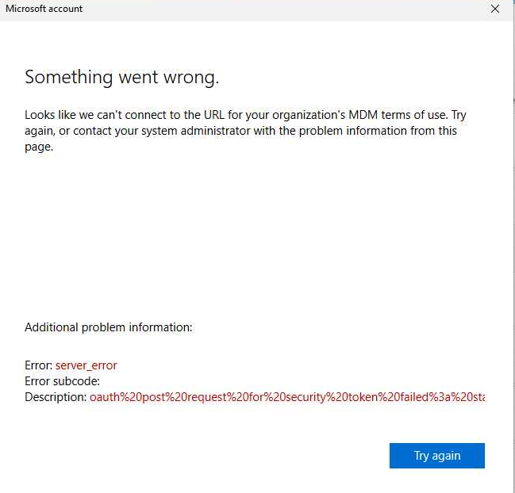

Use this procedure when a Windows PC fails while joining Microsoft Entra ID and shows:

> **Something went wrong.**
>
> **Looks like we can't connect to the URL for your organization's MDM terms of use.**

This can occur during Windows out-of-box experience (OOBE) or when using **Settings > Accounts > Access work or school > Connect > Join this device to Microsoft Entra ID**. It can occur whether the user signs in with a password or a Temporary Access Pass (TAP).



## What This Error Means

During Microsoft Entra join, Windows redirects to the tenant's MDM Terms of Use endpoint and then starts automatic MDM enrollment. The screen is generic: it does **not** prove that the URL itself is unavailable.

Microsoft documents the same message for a missing or invalid Intune/Microsoft 365 license and for an incorrect MDM Terms of Use URL. In the screenshot above, the additional `server_error` and OAuth security-token failure make an MFA, authentication-method, or Conditional Access issue a likely cause, but not a confirmed diagnosis.

Do not assume that using a TAP bypasses all MFA or Conditional Access requirements. TAP is an MFA-capable method and can bootstrap device join and authentication-method registration, but it must be allowed by the tenant's authentication-method and Conditional Access policies.

## Most Likely Cause for the Shown OAuth Error

If the user has no usable MFA method, has not completed required security-information registration, or is blocked by a Conditional Access policy during enrollment, the MDM Terms of Use flow can fail when it tries to use the Microsoft Entra security token.

This is common when:

- The user is subject to MFA but has not registered an allowed authentication method.
- The user is subject to an authentication strength that does not allow TAP.
- A TAP is expired, already consumed, or the user is not included in the TAP authentication-method policy.
- A Conditional Access policy blocks the sign-in because of location, device state, user risk, or another grant control.
- A policy requires an already compliant or registered device before the new device can finish enrollment.

Use Microsoft Entra sign-in logs to confirm the actual policy result before changing Conditional Access.

## Technician Checklist

Complete these checks in order. Do not factory reset the PC until tenant-side configuration is verified.

### 1. Confirm the User Can Enroll

1. Confirm the user has a valid license that includes Intune, EMS, or the applicable Microsoft 365 Intune entitlement.
2. In the Microsoft Intune admin center, verify the user's account is included in the **MDM user scope** for automatic enrollment.
3. Confirm the user is allowed to join devices in Microsoft Entra ID and has not exceeded the tenant's device limit.
4. Confirm enrollment restrictions do not block the Windows platform or the user's device ownership scenario.

### 2. Confirm the Intune MDM URLs

1. In the Microsoft Entra admin center, go to **Entra ID > Mobility (MDM and MAM) > Microsoft Intune**.
2. Review the MDM Terms of Use URL, Discovery URL, and Compliance URL.
3. If the tenant uses Intune and the values are blank or incorrect, select **Restore default MDM URLs**.
4. Confirm the MDM Terms of Use URL is:

   ```text
   https://portal.manage.microsoft.com/TermsofUse.aspx
   ```

5. Save the settings and allow the change to apply before retrying the join.

Do not restore default URLs if the client intentionally uses another supported MDM service. Confirm the configured MDM provider before changing tenant-wide enrollment settings.

### 3. Confirm MFA and Authentication Methods

1. Check whether the user has a registered, allowed MFA method in **Entra ID > Authentication methods** or **Security info**.
2. If the user has no method, have the user register an approved method through the organization’s security-information registration process.
3. If using a TAP, confirm:
   - The user is included in the **Temporary Access Pass** authentication-method policy.
   - The TAP is still valid and has the correct one-time or multiuse setting.
   - The TAP meets the authentication strength required by applicable Conditional Access policies.
   - A fresh TAP is used when a one-time pass was already consumed or expired.
4. For a single-use TAP, complete follow-on passwordless method registration promptly. Microsoft documents a 10-minute MFA requirement for that registration flow.
5. Do not use an administrator's TAP or MFA method to join a device for another user.

### 4. Review Conditional Access

1. In the Microsoft Entra admin center, open **Monitoring & health > Sign-in logs**.
2. Filter by the affected user and the time of the failed join.
3. Open the relevant interactive sign-in and review **Conditional Access** and **Authentication Details**.
4. Record the policy name, result, failure reason, correlation ID, and request ID.
5. Check for policies that require MFA, a specific authentication strength, compliant device state, a trusted location, low user risk, or accepted Terms of Use.
6. If a policy blocks the enrollment bootstrap flow, use a documented pilot or enrollment exception while correcting the policy design. Do not permanently exclude all users or disable broad security policies to enroll one PC.
7. Return any temporary exception to its approved state after the device joins and Intune enrollment is verified.

## Retry the Entra Join

After correcting the confirmed cause:

1. Restart the PC and confirm it has unrestricted internet access to Microsoft sign-in and Intune services.
2. Use the intended join path:
   - **OOBE**: Sign in with the organization account when prompted.
   - **Existing Windows installation**: Go to **Settings > Accounts > Access work or school > Connect > Join this device to Microsoft Entra ID**.
3. Sign in with the affected user's password or a new, valid TAP.
4. Complete MFA or security-information registration prompts using an allowed method.
5. Wait for automatic Intune enrollment to finish.

## Verify Success

Confirm all of the following:

- **Settings > Accounts > Access work or school** shows the device connected to Microsoft Entra ID.
- The device appears as **Microsoft Entra joined** in the Microsoft Entra admin center.
- The device appears in the Intune admin center and begins receiving assigned policies.
- The user can sign in to Microsoft 365 resources without an unexpected Conditional Access failure.
- The final Entra sign-in logs show the expected MFA and Conditional Access results.

## Escalate When

Escalate to the tenant identity or Intune administrator when:

- The user has a valid license, correct MDM URLs, an allowed MFA method, and no blocking Conditional Access result, but the error continues.
- The sign-in log shows a non-obvious Entra, Intune, or third-party MDM failure.
- The tenant uses a custom or third-party MDM Terms of Use endpoint.
- The user cannot register security information because an authentication-method or authentication-strength policy prevents bootstrapping.

Include the screenshot, user UPN, device name, join method, Windows version, time in UTC, correlation ID, request ID, sign-in-log details, MDM URL values, license assignment, and the relevant Conditional Access policy result.

## References

- [Microsoft: Troubleshoot Windows device enrollment errors in Intune](https://learn.microsoft.com/en-us/troubleshoot/mem/intune/device-enrollment/troubleshoot-windows-enrollment-errors)
- [Microsoft: Entra integration with MDM](https://learn.microsoft.com/en-us/windows/client-management/azure-active-directory-integration-with-mdm)
- [Microsoft: Configure a Temporary Access Pass](https://learn.microsoft.com/en-us/entra/identity/authentication/howto-authentication-temporary-access-pass)
- [Microsoft: Microsoft Entra MFA overview](https://learn.microsoft.com/en-us/entra/identity/authentication/concept-mfa-howitworks)
- [Microsoft: Windows device enrollment guide](https://learn.microsoft.com/en-us/intune/device-enrollment/windows/guide)

## Need Help

Svetek can help organizations in Vancouver WA, Portland OR, and Seattle WA diagnose Windows Entra join and Intune enrollment failures, including MFA, Temporary Access Pass, Conditional Access, licensing, and MDM configuration issues.
