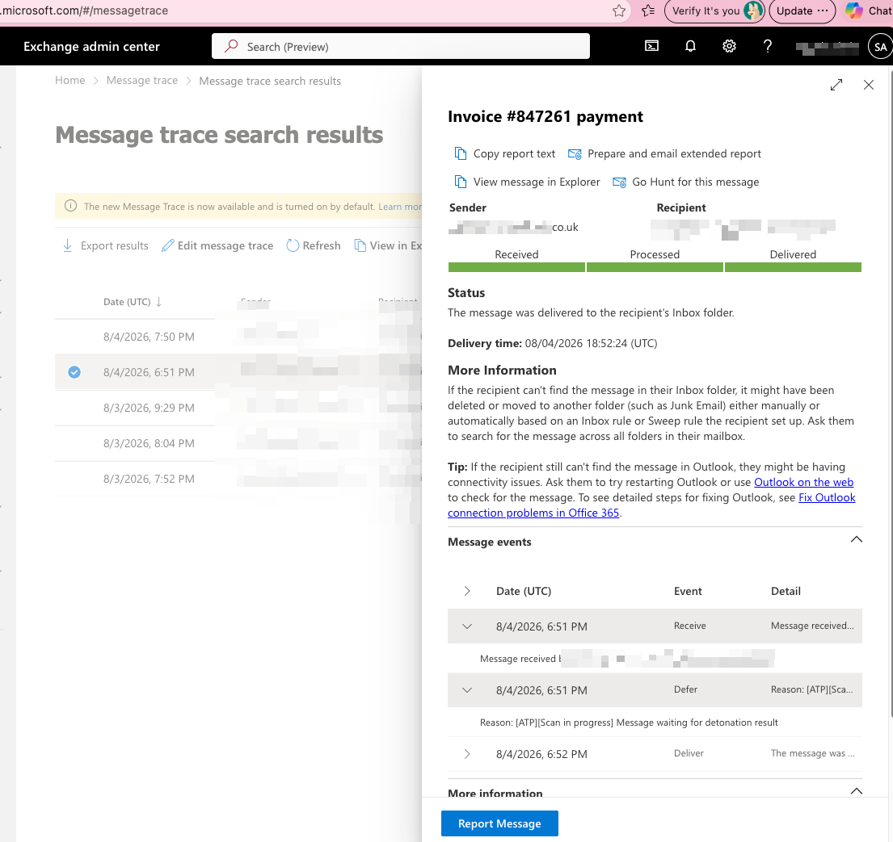

Use this procedure when a user reports a suspicious message but did not use Outlook's **Report** button themselves. As an administrator, find the delivered message in Exchange Message Trace and submit it to Microsoft for analysis.

This submission sends message content, headers, attachments, and associated routing data to Microsoft for review. Follow the client's security and privacy policy, and do not submit messages unless the client authorizes that analysis.

## Before You Begin

- Confirm the user, sender, subject, approximate delivery time, and why the message is suspicious.
- Preserve evidence in the ticket: sender address, recipient, subject, delivery time, and any URLs or attachment names. Do not open suspicious links or attachments to investigate them.
- Confirm the message has not already been reported to Microsoft. Resubmit only when it was never submitted or when the existing verdict is disputed.
- Ensure your admin account can use both **Exchange Message Trace** and Microsoft Defender **Submissions**. Exchange message trace requires Exchange Organization Management or an Exchange Administrator role; Defender submissions require the applicable Defender or Entra security role.
- For a confirmed phishing or malware incident, begin containment according to the client's incident process. A submission to Microsoft does not remove the message, block the sender, or remediate other recipients by itself.

## Find the Delivered Message

1. Open the [Exchange admin center](https://admin.exchange.microsoft.com/).
2. Go to **Mail flow > Message trace**.
3. Search using the affected recipient and a narrow delivery-time range. Add sender or subject filters when available.
4. Select the matching message and confirm the sender, recipient, subject, and delivery status.
5. Confirm the message in the trace is the one the user reported before submitting it.

## Submit the Message from Message Trace

1. In the selected message's details pane, scroll to the bottom.
2. Select **Report Message**.
3. In the submission prompt, select the appropriate classification:
   - **Phish**: Credential theft, impersonation, payment redirection, or other deceptive activity.
   - **Malware**: A message with a known or suspected malicious attachment, executable, or payload.
   - **Spam**: Unsolicited bulk or unwanted mail that is not a targeted phishing attempt.
4. If you cannot confidently classify the message, select the suspicious or unknown option offered by the portal instead of confirming it as a threat.
5. Submit the report and record the submission result or ID in the ticket, if shown.

## Verify and Follow Up

1. Open the [Microsoft Defender Submissions page](https://security.microsoft.com/reportsubmission).
2. On the **Emails** tab, find the submission by sender, recipient, Network Message ID, or submission date.
3. Record the submission status and result in the ticket when Microsoft completes the analysis.
4. If Microsoft confirms a threat, review whether other recipients received the message and follow the client's containment and remediation process.
5. Notify the reporting user of the outcome through the approved support channel. Do not disclose sensitive results outside the authorized audience.

## If the Report Message Button Is Missing

Use the Defender portal directly:

1. Go to [Actions & submissions > Submissions](https://security.microsoft.com/reportsubmission) and open the **Emails** tab.
2. Select **Submit to Microsoft for analysis**.
3. Select **Email** as the submission type.
4. Add the message's Network Message ID, or upload the `.eml` or `.msg` file if one is available.
5. Select at least one affected recipient so Microsoft can evaluate the applicable mail-flow and security policies.
6. Choose **It appears suspicious** when uncertain, or **I've confirmed it's a threat** and select **Phish**, **Malware**, or **Spam** when confirmed.
7. Submit and record the submission details in the ticket.

Microsoft allows administrators to submit messages that are up to 30 days old when the messages are still available in the mailbox and have not been purged. A trace result alone does not guarantee the original message can still be submitted.

## Common Issues

| Issue | What to do |
| --- | --- |
| Message trace result does not match the user's message | Refine the recipient, sender, subject, and time filters. Do not submit a message until the match is confirmed. |
| Report Message button is unavailable | Use the Defender Submissions page or confirm the assigned Exchange and Defender roles. |
| Message is older than 30 days or no longer available | Preserve trace evidence and follow the client's security incident process. The message may not be eligible for direct admin submission. |
| User clicked a link or opened an attachment | Treat the case as a security incident; submit the message but begin endpoint, identity, and mailbox containment immediately. |

## Need Help

Microsoft documents [Exchange Message Trace](https://learn.microsoft.com/en-us/exchange/monitoring/trace-an-email-message/message-trace-modern-eac) and [admin submissions in Microsoft Defender](https://learn.microsoft.com/en-us/defender-office-365/submissions-admin).

Svetek can assist organizations in Vancouver WA, Portland OR, and Seattle WA with Microsoft 365 email security, Exchange Online investigation, Defender submissions, and incident response.
