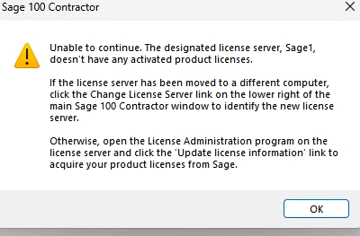

Use this procedure when Sage 100 Contractor displays the following message:

> **Unable to continue. The designated license server, [server name], doesn't have any activated product licenses.**

## Cause

This error usually means the Sage 100 Contractor license server has lost, cannot read, or cannot validate its local licensing information. It does not mean the client workstations need to be reinstalled.

In the common recovery scenario, the designated license server no longer has the correct Sage account information. Re-entering the **Account ID (Sage client ID)** and **Registration name**, then updating license information, retrieves the activated product licenses from Sage and restores access.

If the designated license server was intentionally moved to another computer, follow the separate server-migration process instead of treating this as a lost-information issue.

## Before You Begin

- Record the exact error, affected workstation, designated license server name, and time of failure.
- Confirm the designated server is online and reachable from the workstation.
- Obtain the Sage **Account ID / client ID** and **Registration name** from the client's approved records or Sage account information.
- Use a Windows account that can open License Administration and update licensing on the Sage license server.
- Do not change the license server from a workstation unless the server was intentionally moved.

The Account ID / Sage client ID and Registration name must match Sage's records exactly. Registration-name capitalization and spacing can matter.

## Confirm the Designated License Server

1. Note the server name in the error message, such as `Sage1`.
2. Confirm that this is the current Sage 100 Contractor license server.
3. If the server has **not** moved, continue with [Restore License Information](#restore-license-information).
4. If the license server **has** moved, use the **Change License Server** link in the lower-right corner of the Sage 100 Contractor main window on the workstation to identify the new server.

Do not point workstations to a new server until the new server has been properly licensed and the client has approved the migration.

## Restore License Information

Perform these steps on the designated Sage license server, not on a normal Sage workstation.

1. Sign in to the license server with the approved administrative account.
2. Open **License Administration for Sage 100 Contractor**.
3. On the **License Information** tab, check whether the registration information is blank or incorrect.
4. Select **Edit registration information**.
5. Enter the Sage **Account ID / client ID** and **Registration name** exactly as recorded with Sage.
6. Save the registration information.
7. On the right side of the License Information tab, select **Update license information**.
8. Wait for Sage 100 Contractor to connect to Sage and retrieve the current product licenses.
9. Review **Licensed modules** and verify that the expected license uses are available.
10. Review the **Event log** and confirm the license-information update completed successfully.

When the update succeeds, activation occurs as Sage 100 Contractor retrieves the available licenses for that server.

## Verify Access

1. On the license server, confirm that the License Information tab shows a current **Last license information update** time.
2. Confirm the expected products and license counts appear under **Licensed modules**.
3. Start Sage 100 Contractor from one affected workstation.
4. Confirm the user can open the company and perform a normal function.
5. Document the Account ID source, registration-information update time, resulting license count, and technician in the service ticket.

## If the Update Fails

1. Do not guess at the Account ID / client ID or Registration name.
2. Compare both values with the client's approved Sage records and correct any mismatch.
3. Confirm the license server can reach Sage over the internet and is not blocked by a firewall, proxy, TLS inspection, or DNS issue.
4. Check the License Administration **Event log** for the exact update failure.
5. If the Account ID / client ID and Registration name are correct but the update still fails, contact **Sage Support**.

The licensing folder on the Sage license server can become corrupted, including after a power interruption. Do not rename licensing folders, stop Hosting Framework services, deauthorize the server, or attempt a server migration without an approved maintenance window and a current Sage-supported procedure.

Provide Sage Support with the license server name, Sage 100 Contractor version, exact error, Event log details, Account ID / client ID, Registration name, and confirmation that the registration information matches the Sage account record.

## Related Resources

- [Sage: Activating product licenses in Sage 100 Contractor](https://us-kb.sage.com/portal/app/portlets/results/view2.jsp?k2dockey=222924350018206)
- [Sage: License Information tab in License Administration](https://sage100contractorhelp.sagecre.com/help/licenseadministration/20_1/Content/License%20Administration/tab_License_Information.htm)
- [Sage: Installation and License Administration Guide](https://docs.sage.com/docs/en/customer/100contractor/25_2US/open/InstallationAndLicenseAdminGuide.pdf)

## Need Help

Svetek can help organizations in Vancouver WA, Portland OR, and Seattle WA recover Sage 100 Contractor licensing, validate the designated license server, and coordinate with Sage Support when the registration information is correct but license activation still fails.
