## Before You Start
To install Active Backup for Microsoft 365, please visit here to see if your Synology NAS is compatible with Active Backup for Microsoft 365 and make sure that it is running on DSM 6.2 or above.

Each backup task uses a different application to prevent Microsoft throttling from affecting backup speed. Please take the following steps each time you create a task:
  
### Generate your application and certificate by running a PowerShell script.

Execution environment
Windows 10/Windows Server 2016 or later as the operating system
Run a PowerShell script

### Change the PowerShell execution policy
1. Type Windows PowerShell in the search bar.
2. Right-click Windows PowerShell (not Windows PowerShell (x86)) and select Run as Administrator.

3. To authorize the script provided by Synology, change the execution policy by entering the following command line. This command line changes the execution policy only once.
Set-ExecutionPolicy -ExecutionPolicy RemoteSigned -Scope Process
```aidl
Set-ExecutionPolicy -ExecutionPolicy RemoteSigned -Scope Process
```
Enter Y to confirm.

### Download and run the PowerShell script

Click here to download the PowerShell script, AppGenerator.ps1.
Right-click the script, AppGenerator.ps1. Select Properties and copy the file path in the Location field.
Type the location into PowerShell using the following format: cd filepath
```
cd C:\Users\username\Downloads
```
Specify the script file using the following format: .\filename
```.
\AppGenerator.ps1
```
Enter R to run the script. If your PowerShell version is not up-to-date, you might need to enter Y to install and import the NuGet provider first and then enter Y again to install the modules from 'PSGallery'.

You need copy Tenant ID and Application ID. Copy URL and open on Web browser for provide access.   
  
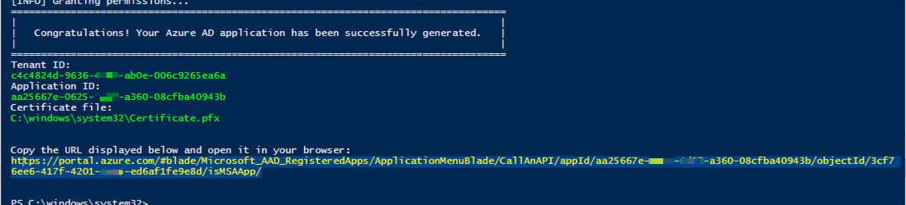  
  
Press "Grant admin consent for ...." button
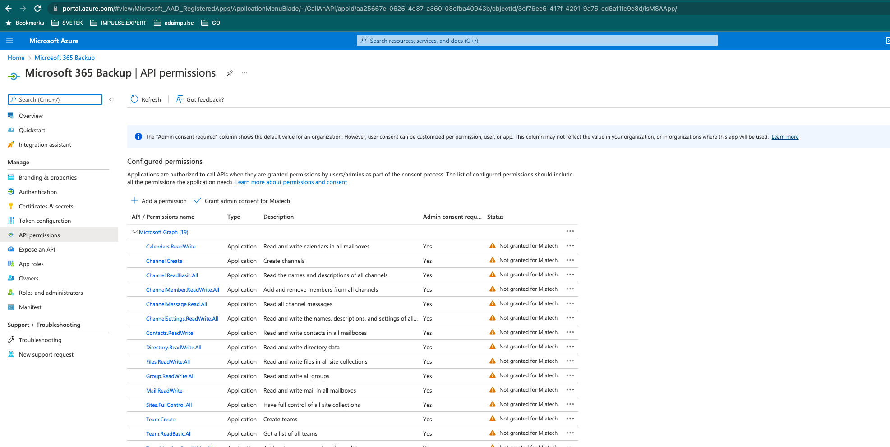  
  
### Launch Active Backup for Microsoft 365.
Go to Task List and click Create to launch the Task Creation Wizard.
Select Create a backup task and following screen bellow.

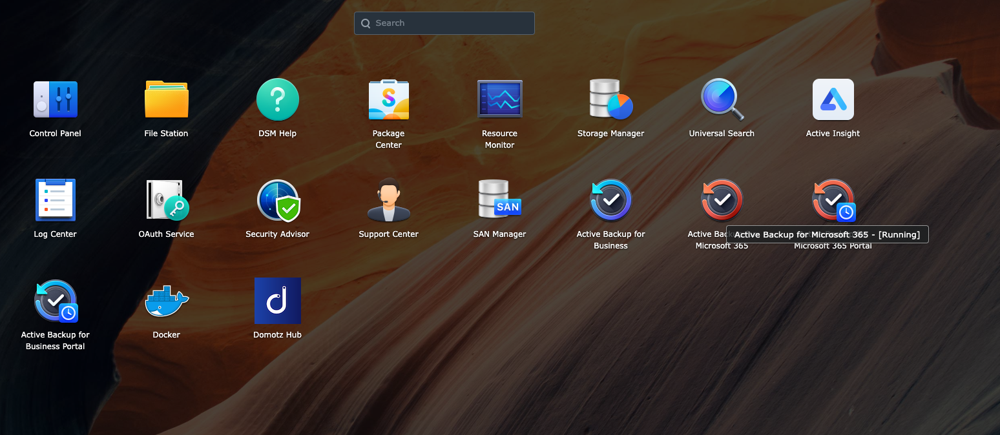  
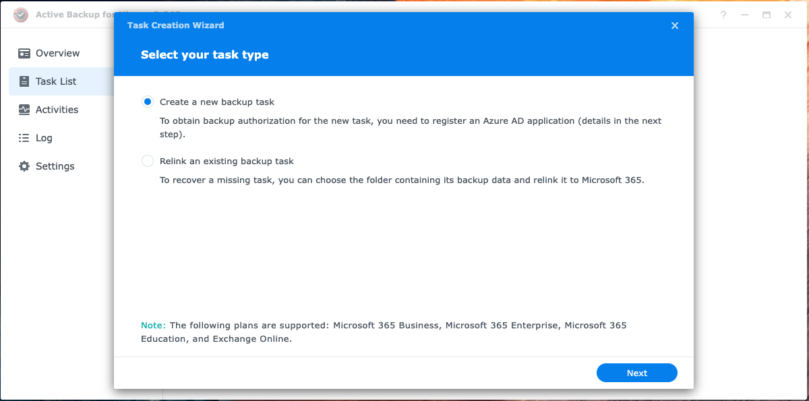
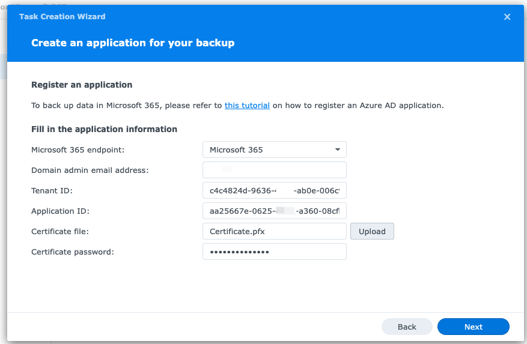  
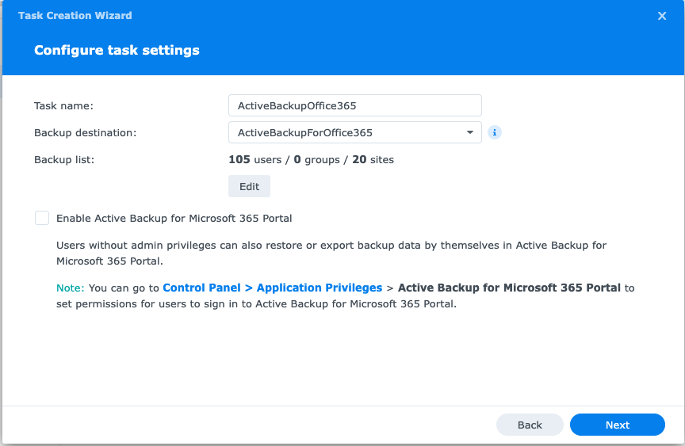  
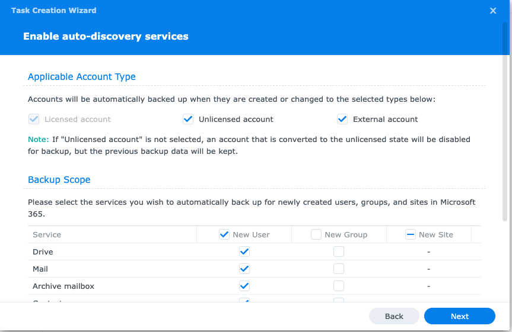  
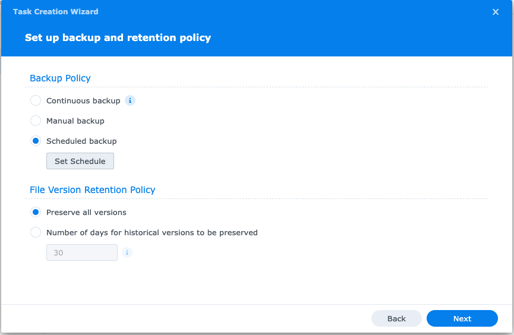  
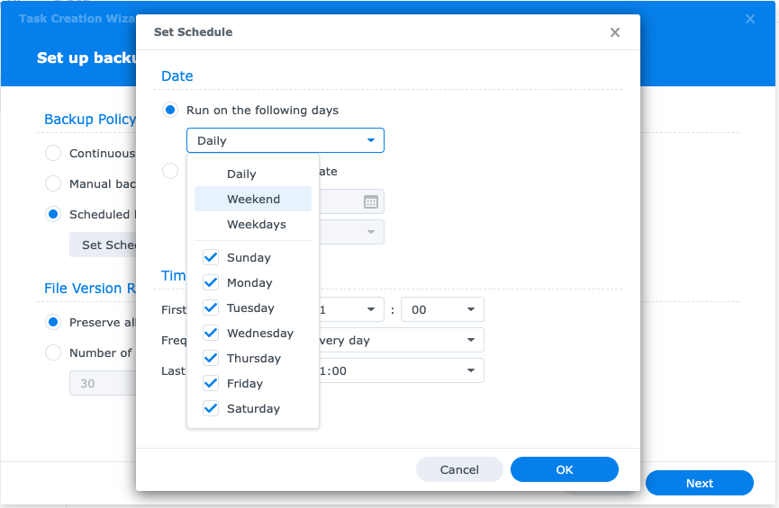  
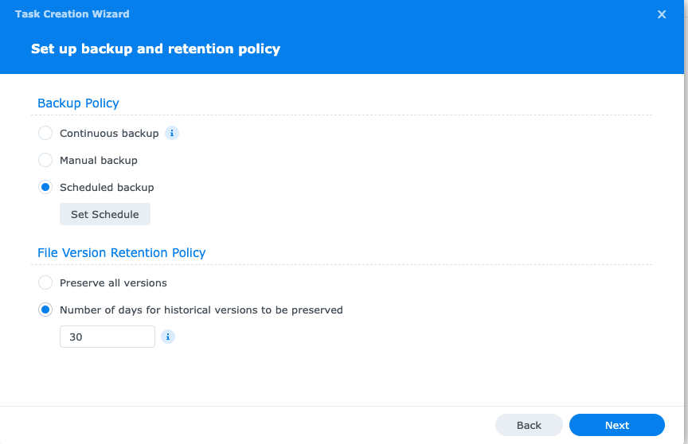  
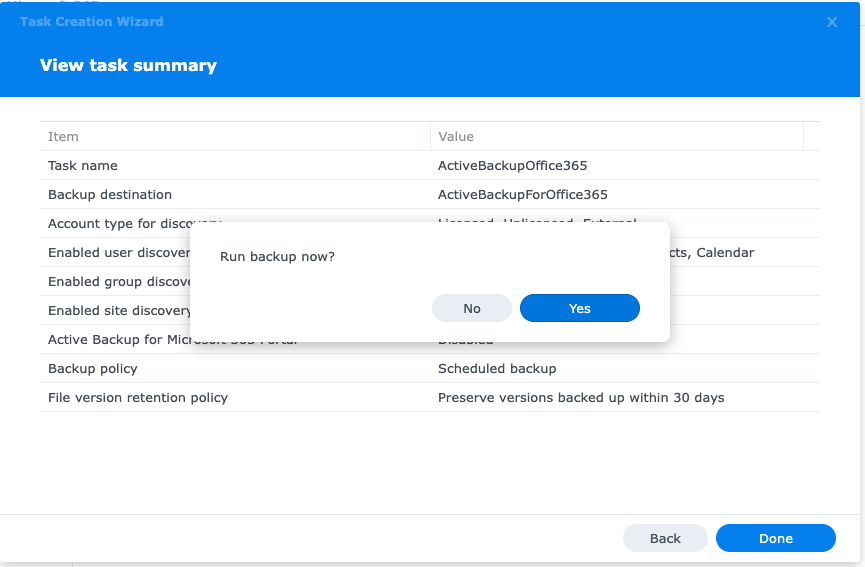  
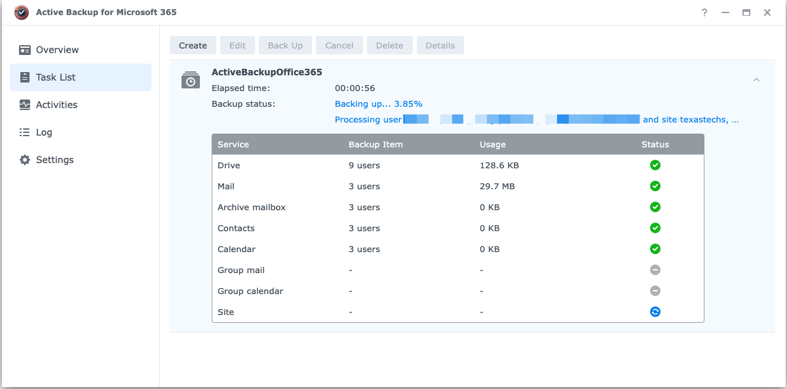  


## References 
https://www.youtube.com/watch?v=36brJmfFty4
https://kb.synology.com/en-uk/DSM/tutorial/How_to_register_an_Azure_AD_app_M365#x_anchor_idf54510ba62
https://kb.synology.com/en-uk/DSM/help/ActiveBackup-Office365/activebackup_office365?version=7