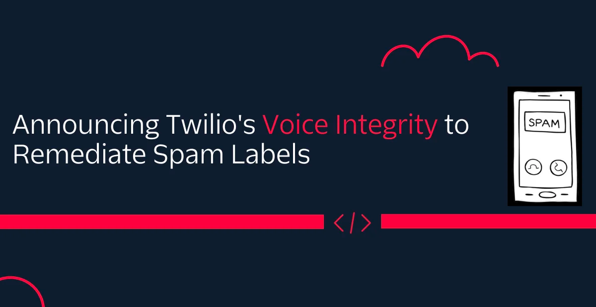
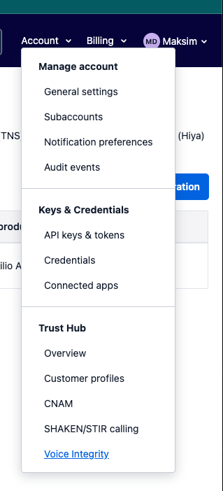
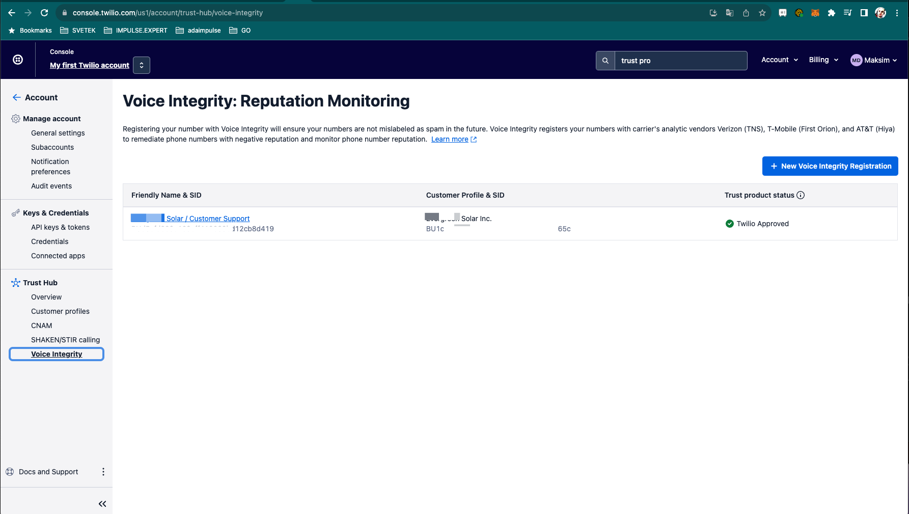
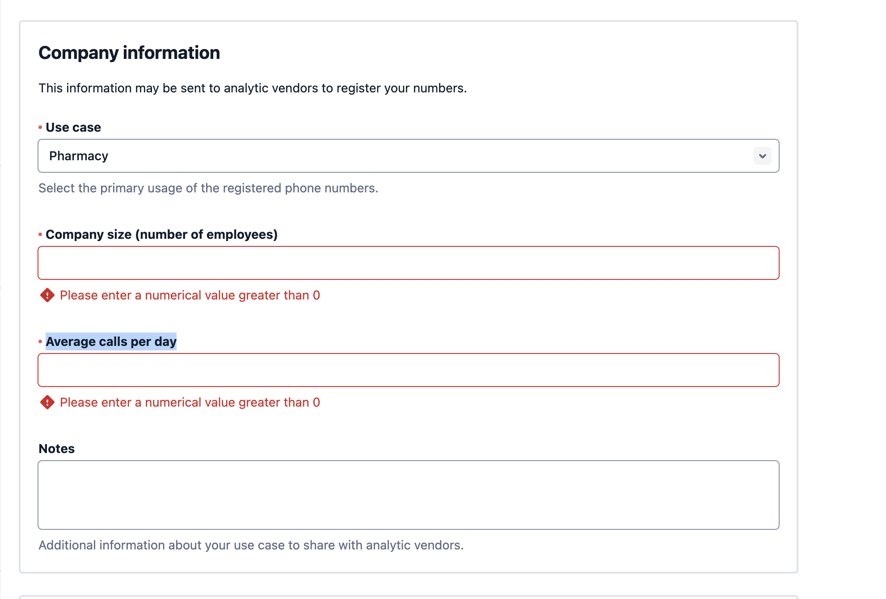
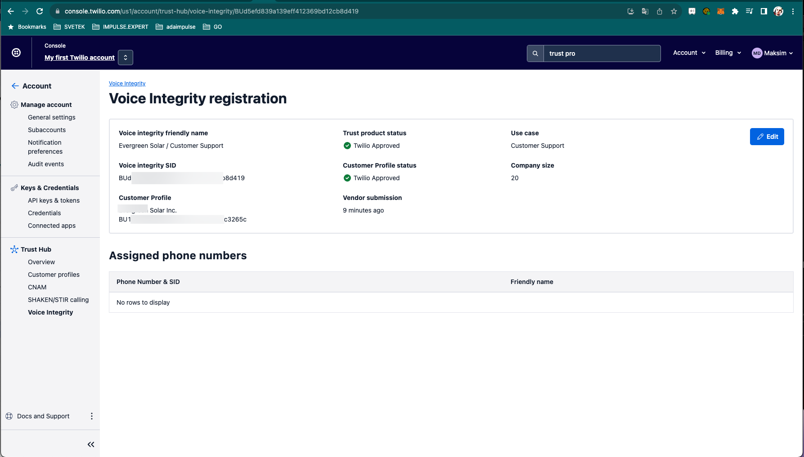
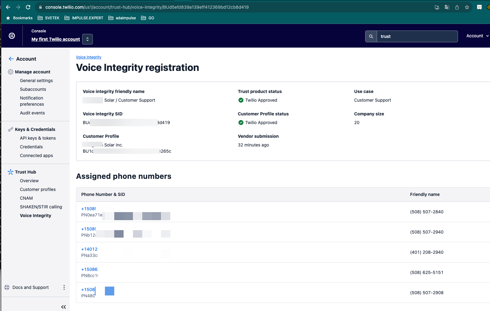

# Voice Integrity to Remediate Spam Labels


The phone rings, and the called party doesn't answer because they see “Potential Spam” calling instead of your phone number on their cell phone. This has become an increasingly common complaint amongst legitimate callers. It can be frustrating and harmful to your business.

That's why we're excited to introduce our new product called Voice Integrity, designed to help you improve your call answer rates and reduce blocked calls due to negative reputation by remediating spam labels on your phone numbers.

# What is Voice Integrity?
Voice Integrity is a new offering alongside the SHAKEN/STIR and CNAM Trust products that will let you register your phone numbers in order to make sure they are not mislabeled as spam.

As part of Public Beta, you can register your Twilio phone numbers via Trust Hub which will then register them with the analytic engines responsible for running spam labeling algorithms on AT&T and T-Mobile.

## Prerequisites:
* Must have Business Profile(s) vetted and approved.
* ISVs must have Secondary Business profiles for all their tenants.

# What do you need to do?

* Create a Customer Profile on your Parent Account(s) in the Trust Hub part of the Console and submit for vetting. Optionally create Secondary Customer Profile(s) if needed (ie ISVs or Direct customers with subsidiaries)
* Assign phone numbers in your account to the Business Profile
* Create a Voice Integrity Trust Product  

  

  
  Go to create Trust Hub -> Voice Integrity -> press New Voice Integrity Registration 

  

  
  Fill all required fields: use case, company size, call per day
  
  

  Open Voice Integrity profile for check approve status
  
  
  

* Assign Phone Numbers to Voice Integrity Trust Product
  You need assign phone numbers, you need use command line and curl, use next template: 
```html
curl -X POST "https://trusthub.twilio.com/v1/TrustProducts/YOUR_TRUST_PRODUCT_SID/ChannelEndpointAssignments" \
--data-urlencode "ChannelEndpointType=phone-number" \
--data-urlencode "ChannelEndpointSid=YOUR_PHONE_NUMBER_SID" \
-u $TWILIO_ACCOUNT_SID:$TWILIO_AUTH_TOKEN
```
  Example: 
```html
curl -X POST "https://trusthub.twilio.com/v1/TrustProducts/BUd5efd839a139eff412369bd12cb8d419/ChannelEndpointAssignments" \
--data-urlencode "ChannelEndpointType=phone-number" \
--data-urlencode "ChannelEndpointSid=PN0ea71ef3024cc8adc8b299e8f7c022ad" \
-u AC4**************2b2:38a3******************124d4
```

* if success you will see phone numbers list on profile
  

# Reference 

* https://www.twilio.com/blog/public-beta-voice-integrity