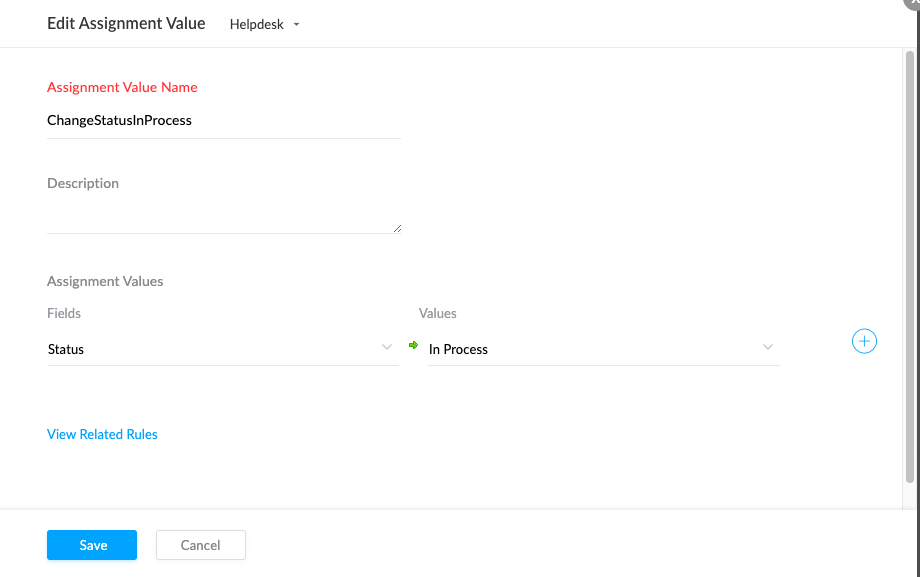

## Autoclose tickets
Go to Zoho Desk WebUI Setup -> Automation -> Workflows -> Rules 

Create new rule with name "CustomerReplySwitchToInProcess"   
Set Active   
  
Press Next button  

On Step 2 - Execute on  
  
- select triger "Customer Reply" and press next button
  

On Step 3 - Criteria  
  
- Press Next button  
  

On Step 4 - Actions  
  
- Press + button -> Filed Updates  
- Set Name ChangeStatusInProcess  
- Fields "Status" -> Values set "In Process"  
- Press "Save" button
  
  

Go to Zoho Desk WebUI Setup -> Automation -> Workflows -> Supervise -> Rules  
Press Create Rule button  
  
Step 1: Basic Information   
  
-  Set name: AutoCloseTickets  
-  Set Active: True 
  
Step 2: Criteria 
  
- Status contains "Client Approval" AND  
- Hours sinse status updated is Greater Than 48  
  

Step 3: Actions 
  
- Add new action press +, Filed Updates type 
- Name: CloseTheTicket  
- Assigment Values: Filed -  Status, Values: Closed   
  

Press Save button  

## References
[creating-time-based-automations](https://help.zoho.com/portal/en/kb/desk/for-administrators/help-desk-automation/articles/creating-time-based-automations)