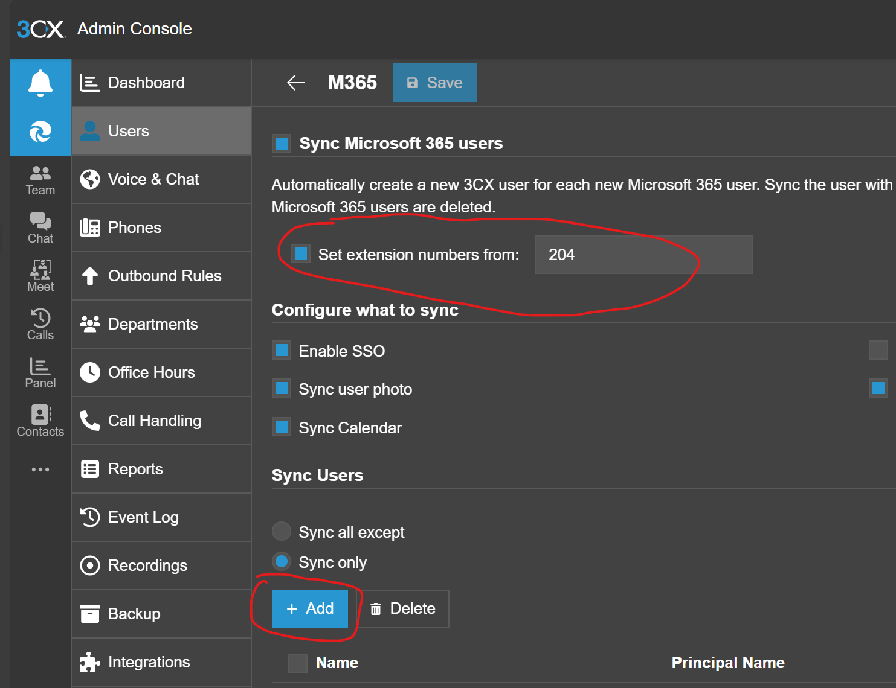

## Prerequisites
1. A user performing a change needs to be assigned the "Systems Administrator" role. 

## NOTES
1. If you are replacing a user, note the phone model and its MAC address assigned to the user being removed. 
2. When deleting a user, remove it from the Users list and from M365 list. 

## Provisiong M365 User

1.  Navigate to Admin/Users
2.  Click on "M365"  
   
3.  Be sure to set the requried extension number
4.  "Sync only" option needs to be enabled
5.  CLick on "Add," button, find the required user and select it
6.  CLick "OK" and "Save"
7.  Assing a phone if required (see the appropriate section)