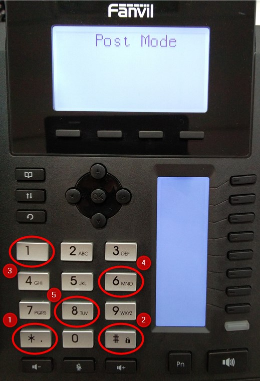

## Checking Physical Connection

1. If the phone is not registering or shows incorrect information, confirm the cable, connecting it to the network is plugged in to the right port in the back of the phone. It has to be connected to the "network" port. The second "computer" port should be either empty, or connected to a PC via a separate cable. 

## Confirm the Phone

1. Confirm you are troubleshooting the right phone by comparing the phone's MAC address to the one already registered in the system. 

## Reset the Phone (Fanvil X-Series and V-Series)

1. The easiest method is to hold down the "OK" button for approximately 10 seconds.
   
Sometimes the "OK" button method does not work. Try the following:

1. Turn off your device
2. Repetitively tap the "#" key whilst the device is turning on.
3. The "Post Mode" message will appear on the screen. You must dial *#168.
4. Wait 5 seconds until "Conf Reset" is shown.
5. Your phone will be successfully reset after restarting the device.
6. One reset, check the connection and wait for the 3CX configuration to apply. 

## Checking VLAN (Advanced)

1. Make sure the phone is configured for the right MAC address. 

## Resetting via a Browser Connection (Advanced)

1. If an IP address is known, try logging in to the admin portal via a browser. Use either a default password or the one listed in the 3CX admin portal. 