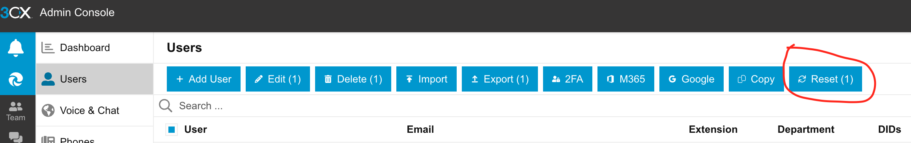

## Reseting a Password

A user must hold a role with appropriate permissions (i.e., a manager role) to reset another user password. 
Navigate to admin settings, users tab, pur a checkmark next to account needing a password reset and click the "Reset" button.
The user will get an email with a password reset link. 