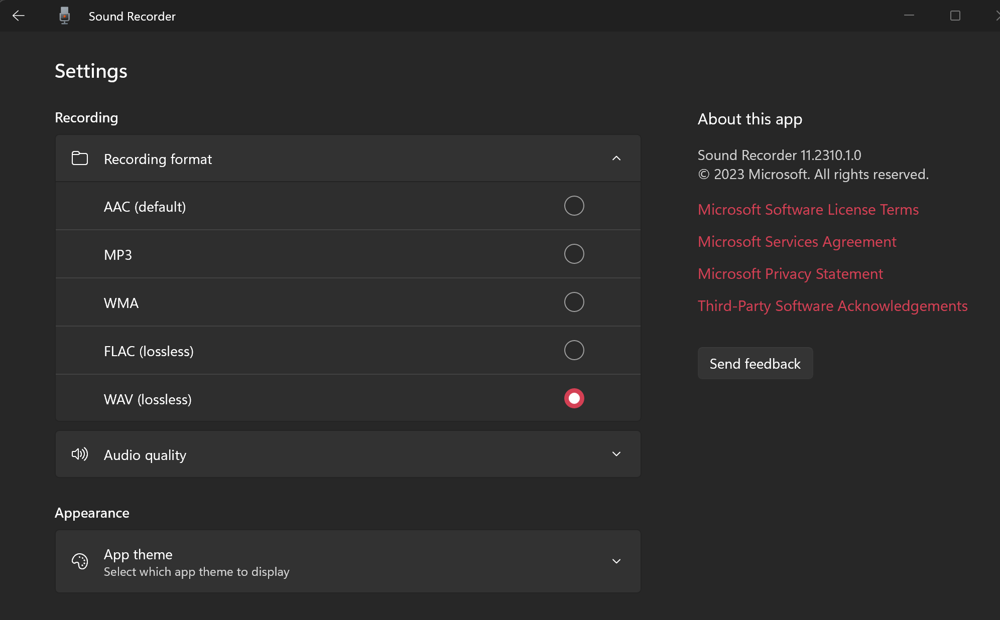
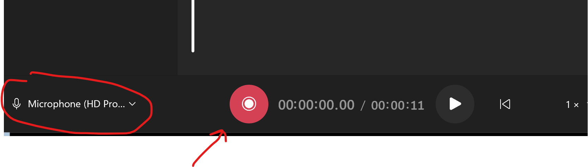

## Open Sound Recorder in Windows

1.  In the search window, type "Sound Recorder" and look for "Best Match" section.
2.  Click on "Sound Recorder."  
   
3.  Adjust the audio format to WAV in settings.
   

## Record an Audio Prompt

1.  Connect the highest-quality microphone available, ensure its selection in the Sound Recorder, and click the red button to initiate audio recording.  
   
2.  Enunciate clearly into the microphone and press the "Stop" button once the recording is complete.  
3.  In the list on the left, the recording will initially be labeled as "Recording." Rename it to something more pertinent. For example, if you're recording a prompt for the sales department's digital receptionist at extension 700, name it "Sales_DR_700_Option" ("Sales" represents the department, "DR" indicates "digital receptionist," and 700 denotes the extension). Additional identifiers, such as "_2" for an option 2 in an upstream prompt, can be appended as needed.

## Format the Audio File

1. Utilize the 3CX Audio Converter available online for the final refinement of your audio file: [3CX Audio Converter](https://www.3cx.com/docs/converting-wav-file/).
2. Modify the name of the downloaded file accordingly.  

## Upload the File to Your 3CX Instance

1.  Access your 3CX portal.
2.  Locate the "Admin" section, typically situated in the lower left corner, contingent upon your assigned 3CX role.
3.  Within the "Admin" section, proceed to "Call Handling," and choose the specific entity needing an updated voice prompt, such as a Queue, Digital Receptionist, Ring Group, or Department.
4.  Upload the designated voice file.
    
5.  Verify the effectiveness of the newly uploaded voice prompts through testing.  
