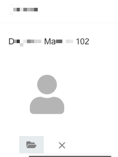
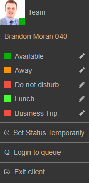
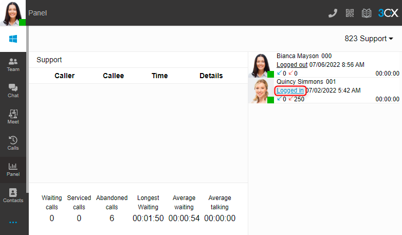

## To change your avatar (or profile picture) on your 3CX account

follow these steps:
1. Log into the 3CX Web Client using the credentials in your welcome email
2. Click on "Settings" (The wrench icon.)3CX Webclient Settings Button  
   
3. Upload a new avatar for your account
4. You will be prompted to resize your Avatar. Press OK to confirm

## Place an external call

To make a call outside of the organization, pick up the phone dial the 12, 11, 10 digit US only number you wish to call, then press Send. This can also be done by dialing the number first, then picking up the handset or pressing the speakerphone button. Dialing 1 first is optional, will work either way.

    Example:
        +18884564566
         18884564566
          8884564566

## Place an internal (desk to desk) call

To make a call inside of the organization, pick up the phone dial the 3 digit extension you wish to call, and press the “send” button. This can also be done by dialing the extension first, then picking up the handset or press the speakerphone button

## Get your voice mail

Press the Message button or Dial 999

## Enter your Voicemail PIN

Some have chosen to receive their voicemail via email attachment. If you have, you will get all voice messages in outlook.

## How to Setup & Make Changes to Your Voicemail

Your phone system is a software product from a vendor called 3cx. Here is a link to their website  www.3cx.com.  One of the first, important steps for all new users to do when they are added to the communication system is to setup their voicemail greeting and also create a simple recording of their name called a self ID.  This is needed for the “Dial by Name” function on the system for outside callers to locate your extension. If you don’t complete this step then outside callers will not be able to look you up in the Dial by Name directory.

Follow these steps:  

- Dial the voicemail extension listed on your welcome email. In most cases this will be 999. If you have a physical phone on your desktop, you can press the voicemail or message button.
- When prompted, enter your PIN followed by #.
- To set up voicemail and self ID, dial “9” then a new list of options will be announced.
- Press “5” to change your self-identification message that will list your name in the Dial by Name directory. Say your First Name and Last name when prompted.
- To record a new message for your voicemail dial 0, then follow the prompts and press # when done, then press 0 to save and exit. Press # to return to the voicemail menu.
- To record a new greeting press 8, then 0 to record new greeting followed by # 0 to save and a # to exit the menu.
- If you don’t like your PIN, you can change it by pressing 7 and follow the prompts to change it.
- When done, press # to return to the main menu or simply hang up.

## Parking a Call

To put a call into the park, press the SP1 or SP2 button at any time during the call (as long as the button is green). This will put the call in Shared Park. All Phones within the company will change from Green to Red to show that a call is waiting on SP1.
To pull a call from the park, press the SP1 or SP2 button.

## Transfer a call

Blind Transfer: To transfer the call without letting the person know, Press Transfer, dial the 3 digit extension Or their cell phone number, and press Transfer again.

Attended Transfer: To transfer the call and explain who the caller is, Press Transfer, dial the 3 digit extension Or their cell phone number and press send. You can explain who is on the phone, and then press transfer to complete the call transfer.   If the callee does not want to speak to the caller or is not at their desk, Press End Call, and then Press Resume to reconnect to the caller.

## To Transfer a call directly to someone’s Voicemail

Press Transfer, dial *4+the 3 digit extension (*4101 for example), and then press Transfer again.

## 3-Way Conference

Establish the first call.  Press Conference. Dial the 2nd number, Press send. Wait for the 2nd party to answer, then press Conference again to merge the 2 calls. (If you press conference again before the 2nd party answers, there is no way to drop the call if it was to go into voicemail. This is why you want to wait for the 2nd person to answer before merging the 2 calls.)

## Get started with the 3CX web client

<!-- blank line -->
<figure class="video_container">
    <iframe width="900" height="600" src="https://www.youtube.com/embed/5stWO6zAweU" title="YouTube video player" frameborder="0" allow="accelerometer; autoplay; clipboard-write; encrypted-media; gyroscope; picture-in-picture" allowfullscreen></iframe>
</figure>
<!-- blank line -->

## Manage live chat, Facebook & SMS from the 3CX Web Client

<!-- blank line -->
<figure class="video_container">
    <iframe width="900" height="600" src="https://www.youtube.com/embed/PRGJCKcx8p8" title="YouTube video player" frameborder="0" allow="accelerometer; autoplay; clipboard-write; encrypted-media; gyroscope; picture-in-picture" allowfullscreen></iframe>
</figure>
<!-- blank line -->

## 3CX Managing your queue status
### 3CX Web Client / Desktop App 
The user can select “Login to queue” and “Logout from queue” from the user profile photo. The option will be applied to all the queues the user is a member of.  
  

An agent can be a member of more than one queue and the agent can choose which queues they will be a member of. In this case, the panel can be used to select which individual queues an agent will be logged in to.  



Use the 3CX Web Client/ Desktop App to log in and out of individual queues:

1. Go to “**Panel**”.
2. Select one of the available queues.
3. Click on the “**Logged in / Logged out**” indicator below the agent's name to login or logout the agent from this queue.

**Queue managers  can login / logout On behalf of**
The explicit login and logout can also be done on behalf of the agent, by the assigned queue manager(s). Agents who are not queue managers can only log themselves in and out of queues.

### Dial codes  
Some IP Phones do not have BLF keys. In this case, agents will need to use dial codes, which are provided on the PBX to log in and out of queues. The dial codes are defined in the 3CX Management Console and configured by the PBX Administrator.  

> **LOGGING IN & LOGGING OUT OF THE QUEUE**
>
> By default, the dialing code to log IN to a queue is: *62  
> By default, the dialing code to log OUT of a queue is: *63  
{: .important}
 
These can be modified by the PBX Administrator, so it is best to verify the dial codes with the Administrator before using these.  
  
### 3CX Mobile app

Login and Logout from the Queue you can manage as Dial code (describe above) or switch avaliable statuses on 3CX app.

> **LOGGING IN & LOGGING OUT OF THE QUEUE**
>
> By default, the dialing code to log IN to a queue is: *62  
> By default, the dialing code to log OUT of a queue is: *63  
{: .important}

## 3CX Hot Desking

For use hot desking need User Number & Voicemail PIN to login (From Welcome Email)

### Login to device 

```
To log in to device press: *77*EXT*  
```

### Logout 

```
To log out press *77*5*  
  1st BLF provisioned as Logout Button  
```
  
<!-- blank line -->
<figure class="video_container">
    <iframe width="900" height="600" src="https://www.youtube.com/embed/d2NBDjFFQlU" title="YouTube video player" frameborder="0" allow="accelerometer; autoplay; clipboard-write; encrypted-media; gyroscope; picture-in-picture" allowfullscreen></iframe>
</figure>
<!-- blank line -->