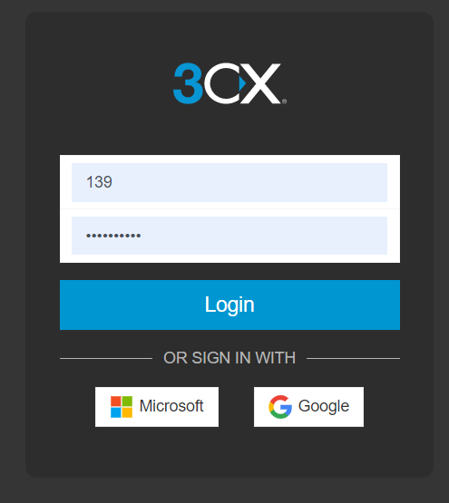
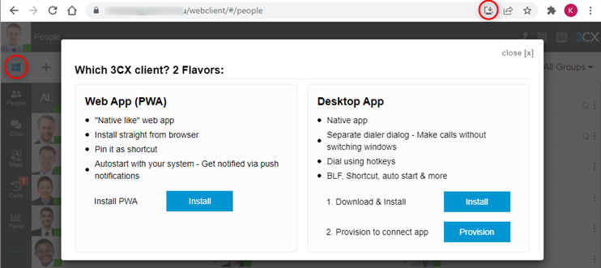
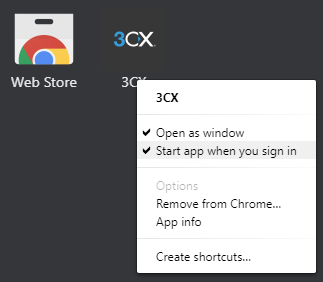
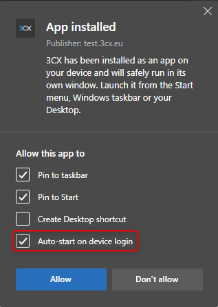
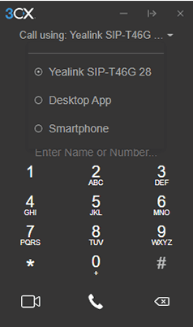
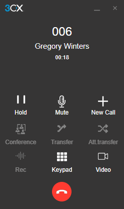
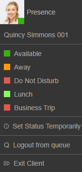
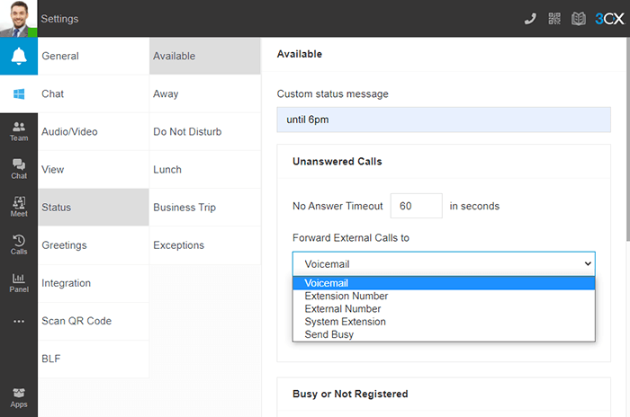
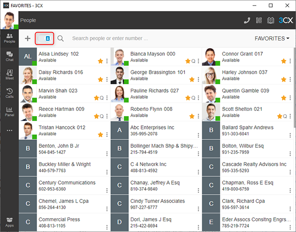

The 3CX Web Client is easy to use and combines all the features you need to efficiently communicate, collaborate and connect with colleagues, partners and customers, straight from your browser or from the native Windows and macOS desktop app. From this one interface, you can easily make calls, view the status of colleagues, hold a video conference, and communicate with customers via voice, live chat, Facebook messaging and SMS/ MMS.

<!-- blank line -->
<figure class="video_container">
    <iframe width="900" height="600" src="https://www.youtube.com/embed/0bvpLLDb5xE" title="YouTube video player" frameborder="0" allow="accelerometer; autoplay; clipboard-write; encrypted-media; gyroscope; picture-in-picture" allowfullscreen></iframe>
</figure>
<!-- blank line -->

## Let’s get started: Logging on

1. Go to the **“Your User Account on your New 3CX System”** email.
2. Click on your web client URL, e.g. https://mycompany.3cx.com/webclient/
3. Log in using the credentials in your email or with your Google or Microsoft 365 account.

_If you’ve lost your Welcome Email you can have it re-sent via the smartphone app (iOS or Android)._

### Install the App-like Web Client (PWA)

If you do not want to download the 3CX Desktop App, install the Progressive Web App (PWA) which offers an app-like experience, enabling the web client to remain active.

Available on all operating systems (Windows, MacOS, ChromeOS and Linux). Installation can be completed in either of 2 ways when logged into the Web Client:

* Click on the OS icon below the user avatar and select “Install” from the pop-up.
* Click on the Install button (circled red) located in the address bar and then confirm.

#### Set the app to auto start

On Google Chrome

1. Open your Chrome browser and type ‘chrome://apps’ into the address bar
2. Right click on “3CX” and enable “Start app when you sign in”

Note: ChromeOS does not support this feature yet.

On Microsoft Edge

On Edge, select to Auto-start in the dialog that appears after installation.

## Download the Desktop App

<!-- blank line -->
<figure class="video_container">
    <iframe width="900" height="600" src="https://www.youtube.com/embed/D6iBlL2plkU" title="YouTube video player" frameborder="0" allow="accelerometer; autoplay; clipboard-write; encrypted-media; gyroscope; picture-in-picture" allowfullscreen></iframe>
</figure>
<!-- blank line -->

The Desktop app for Windows and macOS includes all of the features of the web client but provides a more native experience. To download the app:

1. Click on the Windows or macOS icon at the top of the side menu in the web client.
2. Follow the steps to install and provision the app.

**Note: You can also use the old** [3CX Windows Client](https://www.3cx.com/user-manual/installation-windows/).

## Start a call

To call, click on the dial pad in the top right menu or click on the search icon. Enter the phone number or search by name, extension number or email address.

## Choose your device to place a call

You can seamlessly place calls from your IP phone, the iOS or Android app, web client or the desktop app - wherever you have provisioned your extension. From the phone selector in the web client’s dialer, you can select your preferred device and control calls from the web client interface.

### In-call functions

Once you’re in a call, you can perform a number of actions with just a few mouse clicks.

#### Transferring a call

Click on **“Transfer”** and enter the name or number of the person you want to transfer the call to. The call is transferred without you speaking to the receiver on the other end - this is known as a blind transfer.

To speak to the receiver and get permission to transfer a call, click **“Att.transfer”**. This will allow you to put the caller on hold and speak to the receiver before passing the call through.

#### Creating a conference call

Click the **“Conference”** button and enter the name or number of the person/s you would like to add to the call. They will be dialled and upon answering, will be added to the existing call.

#### Recording a call

At any time during a call you may record the conversation. Simply click **“Record”** to begin and click again to end the recording. Recordings can be accessed in the Web Client > **“Recordings”**.

**Note:** The ability to record and to view/edit recordings depends on the permissions given to you by your administrator.

#### Initiating a new call

During an ongoing call, you may initiate a new call on a separate line without hanging up on the current call. To do this, click “New Call” and enter the name or number of the callee.

#### Switch to video call

During an ongoing call, you may elevate to a video call by clicking the **“Video”** icon in the dialpad, without hanging up on the current call.

## Manage your status & queues

The **“Status”** feature allows you to see which colleagues are available to take calls. Avoid distractions and set your own status to let others know when you’re away or you don’t want to be disturbed.

* Click your avatar in the top left and choose from Available, Away, Do Not Disturb, Lunch, Business Trip.
* Your status changes to yellow when your line is busy.
* Click on your avatar to select “Set status temporarily” to time-limit your status.
* From this menu you can also login and out of queues.

Customize status message and behaviour by clicking on **“Avatar > Your Name > Status”**.

Here you can:

* Set a custom message
* Enable/disable Push notifications for each status
* Rename “Lunch” and “Business Trip” profiles
* Set the number of seconds to activate forwarding of unanswered calls for “Available” and “Lunch” profiles
* Choose to forward unanswered calls to options such as: Voicemail, mobile etc
* Override forwarding rules based on Caller ID and time of the call

## Choose your People view

By default, the **“People”** view will show all the members of the groups you are part of. To make it more manageable, you can choose a different **“View”** from the top right drop down list. Choose between the **“Groups”** available (e.g. marketing or sales) or assign team members to your own **“Favorite”** list by pressing the star icon on the desired contact.

The contacts toggle allows you to show your personal contacts in this same view. They will be displayed after your team members.

## Chat with colleagues and customers

In the **“Web Client > Chat”** section, you can send and receive instant messages with colleagues as well as live chat, SMS/MMS and Facebook messages from customers.

Find out more about composing chats and SMS, and the various chat functions available in [the business chat manual](https://www.3cx.com/docs/business-chat/).

## Start a video conference  

In the **“Web Client > Meet”**, you can start a video conference or schedule a conference. Find out more about video conferencing and its features in the [Video Conferencing manual](https://www.3cx.com/user-manual/video-conferencing/).

## Set up Hotkeys

Hotkeys enable you to set up a bespoke combination of keystrokes to execute a number of supported operations on calls, such as opening the dialer, answering an incoming call, initiating a blind transfer, and so on.

1. Open the 3CX Desktop Application.
2. Click “More”  on the left side navigation panel and select “Settings”.
3. From the dropdown menu in the top right of the screen, select “Hotkeys”.
4. On each line, click the pencil icon which then allows you to simply press the key combination desired.

**Note:** Configured keys will be kept as part of Local Storage and will be used only by the Desktop App. Do not use Hot Key combinations that are used for your operating system. Combinations set on 3CX Desktop App will overwrite whatever shortcuts the apps/OS is using and it will be applied globally.

## Click2Call Browser Extension

The 3CX Click2Call Browser extensions for [Google Chrome](https://chrome.google.com/webstore/detail/3cx-click2call/baipgmmeifmofkcilhccccoipmjccehn) and [Microsoft Edge](https://microsoftedge.microsoft.com/addons/detail/3cx-click2call/kcijpkomlnpfpjmkbghnnmflfebimpfg) enables calls to be initiated from any website or CRM system. Telephone numbers appear as being “hyperlinked”, for you to simply click to ‘send’ the number to the 3CX Web Client or Desktop App to make the call.

Once installed go to **“Configuration Settings”** and choose between Desktop App and the Web Client for the browser extension to use by default when placing the call.
Note: Users on Chrome OS will need to set the extension to use the Web Client as the Desktop client is not available on this platform.

From the **“Configuration Settings”** you can also set specific website URLs that should not have their numbers **“hyperlinked”**. For example, you can exclude a website with accounting information, in order to prevent it from creating clickable numbers.
