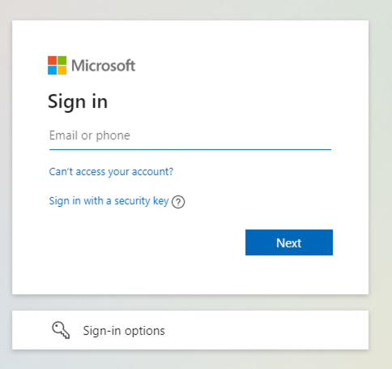
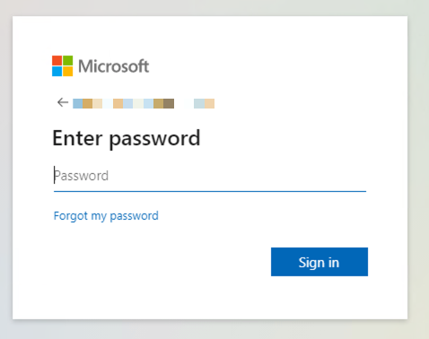
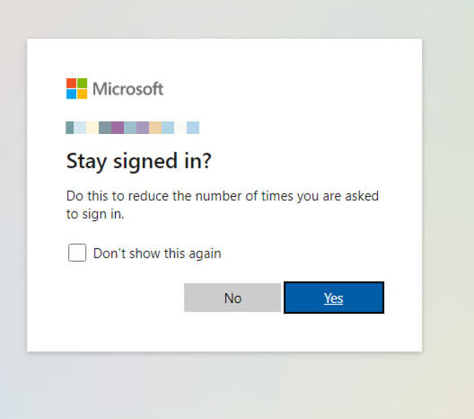
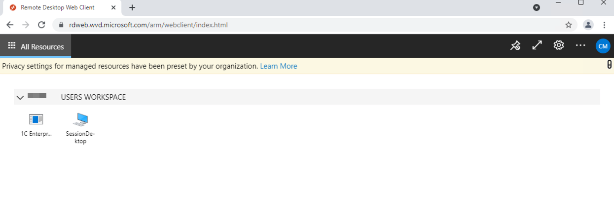
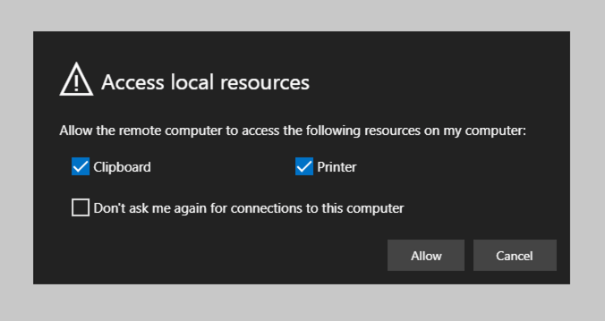
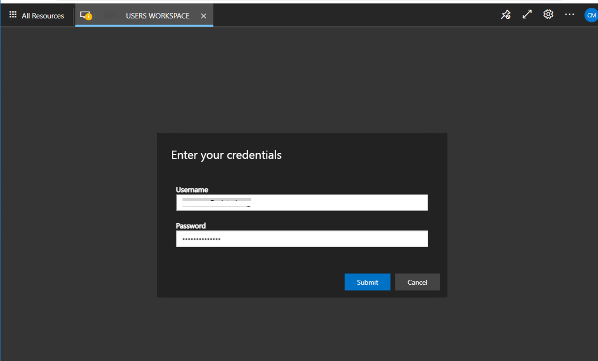
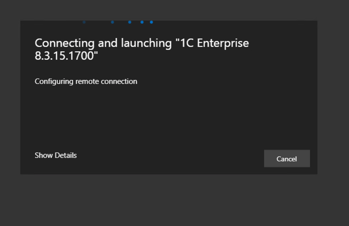
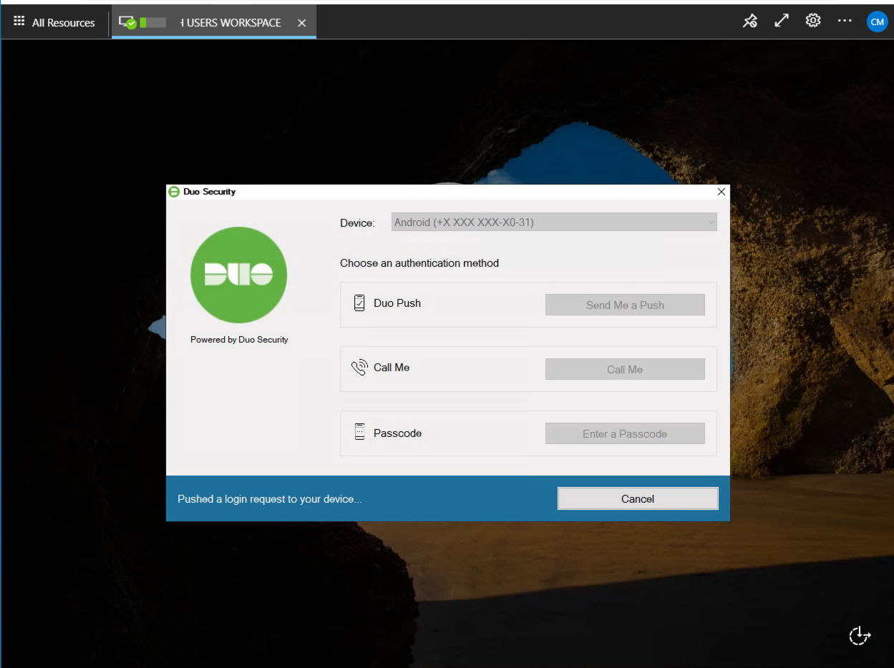
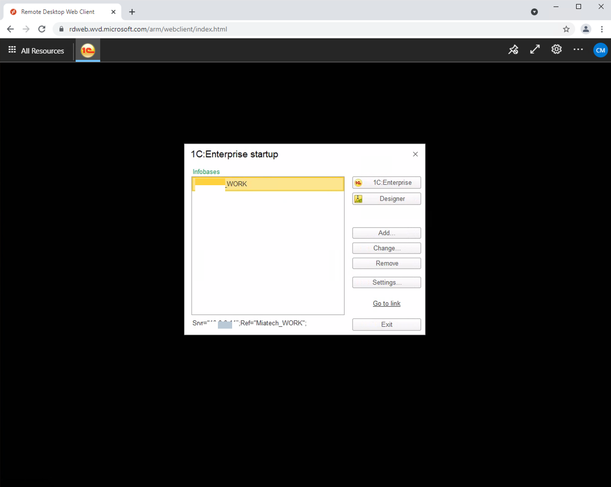

## Azure Virtual Desktop WEB Client

In a browser, navigate to the Azure Resource Manager-integrated version of the Azure Virtual Desktop web client at [rdweb.wvd.microsoft.com/arm/webclient](https://rdweb.wvd.microsoft.com/arm/webclient) and sign in with your user account.

Enter your work username  

Enter your password  

Press yes if you use personal PC  

You logged in to your workspace, and here you can see remote Apps wich you have access.
For run remote app just double click on app name.  

On this step you can allow Clipboard and Printer forward from your PC, press "Allow"  

Enter your work username and password and press "Submit"  

On this step, if your organization uses MFA ACCESS, you will receive a push notification on your mobile phone to approve the login. You can also press Show Details to change MFA settings or select another way to approve your login.  

If you press “Show Details” on the previous step, you can change the approval method here.  

Your app is running.
  
