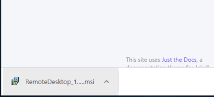
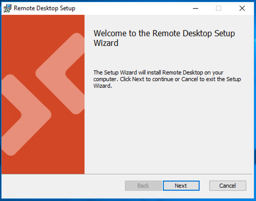
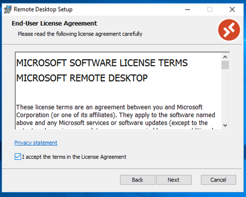
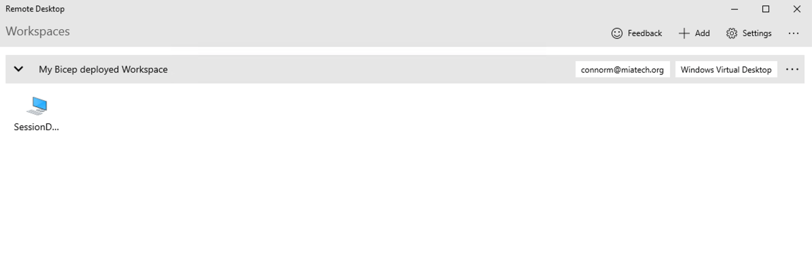
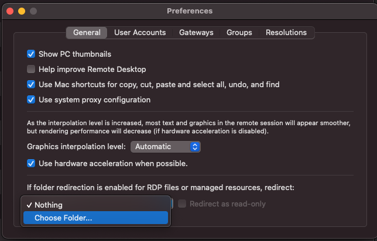

## Install Microsoft Remote Desktop Windows 10 (RDP Client) from an MSI package (Recommended!!!)

Download MSI on your PC use that URL:  
[Windows 64-bit](https://go.microsoft.com/fwlink/?linkid=2068602)  
[Windows 32-bit](https://go.microsoft.com/fwlink/?linkid=2098960)  
[Windows ARM64](https://go.microsoft.com/fwlink/?linkid=2098961)

When downloading is done, run the installation MSI by double-clicking on the file:  
  
Press "Run"  
  
On the "Welcome" screen press "Next"  
  
Click on the checkbox "I accept ...." and press "Next"  
  
Click on "Install for all users" and press "Next"  
  
Press "Yes"  

Installation is done. Press "Finish" for close the window and run the app.  

The installation is done. Go to “ADD WORKSPACE” for configuring Microsoft Remote Desktop.

## Install Microsoft Remote Desktop Windows 10 (RDP Client) from Microsoft store

If you use Windows 10 run Microsoft Store just type in search "store" and press on Microsoft Store  
  
On new windows Microsoft Store in search input type "Remote Desktop" and select "Microsoft Remote Desktop"  
  
Next step we need press "Get" button for for start downloading app  
  
On popup window "Use across your devices" press "No, thanks" button  
  
You will see starting process download and Install app  
  
When installation process done, you will press "Launch" button  
  

Installation is done.  Go to [ADD WORKSPACE ACCESS](#add-workspace-access) for configuring Microsoft Remote Desktop.

## ADD WORKSPACE ACCESS

Now you need add User Workspace. Press "ADD" -> "Workspaces"  
  
For "Email or Workspace URL" type: [https://rdweb.wvd.microsoft.com/api/arm/feeddiscovery](https://rdweb.wvd.microsoft.com/api/arm/feeddiscovery)  and press "Subscribe" button  
  
Type your work or school account username / password  
  
Press "Work or school account"  
  
Done. Now you can try connecting to the SessionDesktop or WVD APP.  

## Configure redirection folders

### OS X

Open Microsoft Remote Desktop app and go to "Preferences...".  

Open drop-down "If folder redirection is enabled for RDP..." and select "Choose folder..." option  

Select a local folder for RDP folder redirection.  

Connect and check the redirection folder  
  
