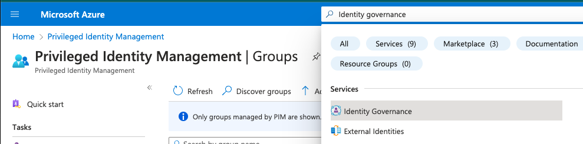

## PIM

Privileged Identity Management provides time-based and approval-based role activation to mitigate the risks of excessive, unnecessary, or misused access permissions on resources that you care about. Here are some of the key features of Privileged Identity Management:

* Provide just-in-time privileged access to Microsoft Entra ID and Azure resources
* Assign time-bound access to resources using start and end dates
* Require approval to activate privileged roles
* Enforce multi-factor authentication to activate any role
* Use justification to understand why users activate
* Get notifications when privileged roles are activated
* Conduct access reviews to ensure users still need roles
* Download audit history for internal or external audit
* Prevents removal of the last active Global Administrator and Privileged Role Administrator role assignments

## Activate your group membership or ownership in Privileged Identity Management

You can use Privileged Identity Management (PIM) In Microsoft Entra ID to have just-in-time membership in the group or just-in-time ownership of the group.

This article is for eligible members or owners who want to activate their group membership or ownership in PIM.

When a group membership or ownership is activated, Microsoft Entra PIM temporarily adds an active assignment. Microsoft Entra PIM creates an active assignment (adds user as member or owner of the group) within seconds. When deactivation (manual or through activation time expiration) happens, Microsoft Entra PIM removes user’s group membership or ownership within seconds as well.

> **Installation requirements**
>
> Application may provide access to users based on their group membership. In some situations, application access may not immediately reflect the fact that user was added to the group or removed from it. If application previously cached the fact that user is not member of the group – when user tries to access application again, access may not be provided. Similarly, if application previously cached the fact that user is member of the group – when group membership is deactivated, user may still get access. Specific situation depends on the application’s architecture. For some applications, signing out and signing back in may help to get access added or removed.
{: .important}

## Activate a role

1.  Sign in to the [Microsoft Entra admin center](https://entra.microsoft.com/) or use this [short link](https://aka.ms/pim) to open the My roles page directly.

2.  Browse to Identity governance > Privileged Identity Management > Groups.

3.  Using Eligible assignments blade, review the list of groups that you have eligible membership or ownership for.

4.  Select Activate for the eligible assignment you want to activate.

5.  Depending on the group’s setting, you may be asked to provide multi-factor authentication or another form of credential.

6.  If necessary, specify a custom activation start time. The membership or ownership is to be activated only after the selected time.

7.  Depending on the group’s setting, justification for activation may be required. If needed, provide the justification in the Reason box.

## View active assigments

1.  Sign in use this [short link](https://aka.ms/pim) to open the My roles page directly.
2.  Browse to Groups > Active assignments tab.

## References  

- [PIM/group-activate-roles](https://learn.microsoft.com/en-us/entra/id-governance/privileged-identity-management/groups-activate-roles)
