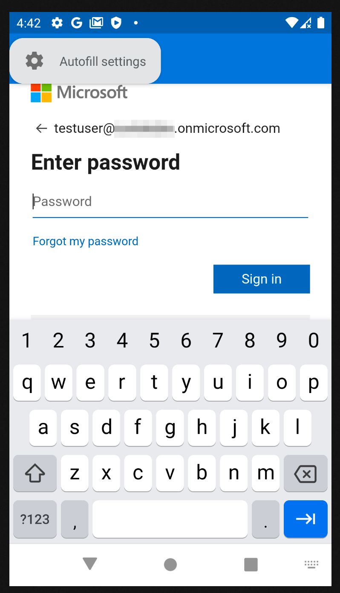

<ul class="nav nav-tabs">
  <li class="active"><a data-toggle="tab" href="#kubeosx">Mac OS X</a></li>
  <li><a data-toggle="tab" href="#androidtab">Android</a></li>
</ul>

  



## Install Company Portal app

> **Install info**
>
> Go to [Enroll My Mac](https://go.microsoft.com/fwlink/?linkid=853070)  
The Company Portal installer .pkg file will download. Open the installer and continue through the steps     
Agree to the software license agreement   

  
  

> **Install info**
>
> Enter your device password or registered fingerprint to install the software  
  
  

> **Install info**
>
> Open Company Portal  
  
  

> **Install info**
>
> Sign in to Company Portal with your work or school account  
  
  

> **Install info**
>
> Enter corporate email  

  

> **Install info**
>
> Press "Begin" button for next    
  
  

> **Install info**
>
> Press "Continue" button    
  
  

> **Install info**
>
> Press "Download profile" for next    
  
  

> **Install info**
>
> Press "Install" button    
  

> **Install info**
>
> Press "Install" button

> **Install info**
>
> You can close that windows   
  
  

  

> **Install info**
>
> Press "Done" for finish setup and you can close all windows
  
  

> **Install info**
>
> Now, you PC connected to company portal 


{{ local-content | markdownify }}



## Install Intune Portal
{:height="600px" width="400px"}  
Open Play Market on your own Android Devices

{:height="600px" width="400px"}  
Type in search field "Microsoft Portal" and select "Intune Company Portal" app

{:height="600px" width="400px"}  
Press "Install"

{:height="600px" width="400px"}  
When install is done, press "Open"

{:height="600px" width="400px"}  
When Microsoft Portal is up, press "Sign in" button

{:height="600px" width="400px"}  
Enter you corporate user name and password

{:height="600px" width="400px"}  
Tap "Skip for now"

{:height="600px" width="400px"}  
Tap "Begin" button

{:height="600px" width="400px"}  
Tap "Continue"

{:height="600px" width="400px"}  
Tap "Accept & Continue"

{:height="600px" width="400px"}  
Tap "Continue"

{:height="600px" width="400px"}  
Tap "Done"

{:height="600px" width="400px"}  
Tap "Got it"

{:height="600px" width="400px"}  
After all steps, your own devices will be install on work profile all apps

Now, you can use corporate apps for secure work communications.

To be continued....


{{ localwin-content | markdownify }}

