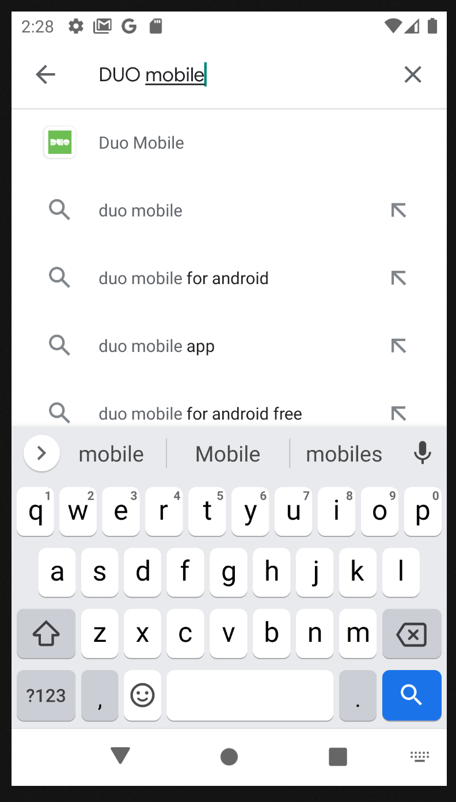

## INSTALL DUO MOBILE ON YOUR ANDROID DEVICE

Open Google Play on your Android device, and type DUO mobile.  
You will select DUO Mobile app.  
{:height="600px" width="400px"}  
Press install to start installation process  
{:height="600px" width="400px"}  
When installation is done, press open button to start DUO mobile app.  
{:height="600px" width="400px"}  
For a new device press "GET Started", If you have an account, press "Get my account back"  
{:height="600px" width="400px"}  
Grant permission to take pictures "Only this time"  
{:height="600px" width="400px"}  
Scan QR code in the next step  
{:height="600px" width="400px"}

## GENERATE QR CODE FOR A DEVICE

You will recived email from Administrator with URL enrollment link:  

  
Open URL link and press Start Setup  
  
Select Tabled (iPad, Nexus, etc.) option, for generate QR code.  
  
Select type of enrolment device (Android or iOS).  
  
Press I have DUO mobile installed.  
  
Now you need run DUO mobile and scan QR code for done enrolment device  
  
