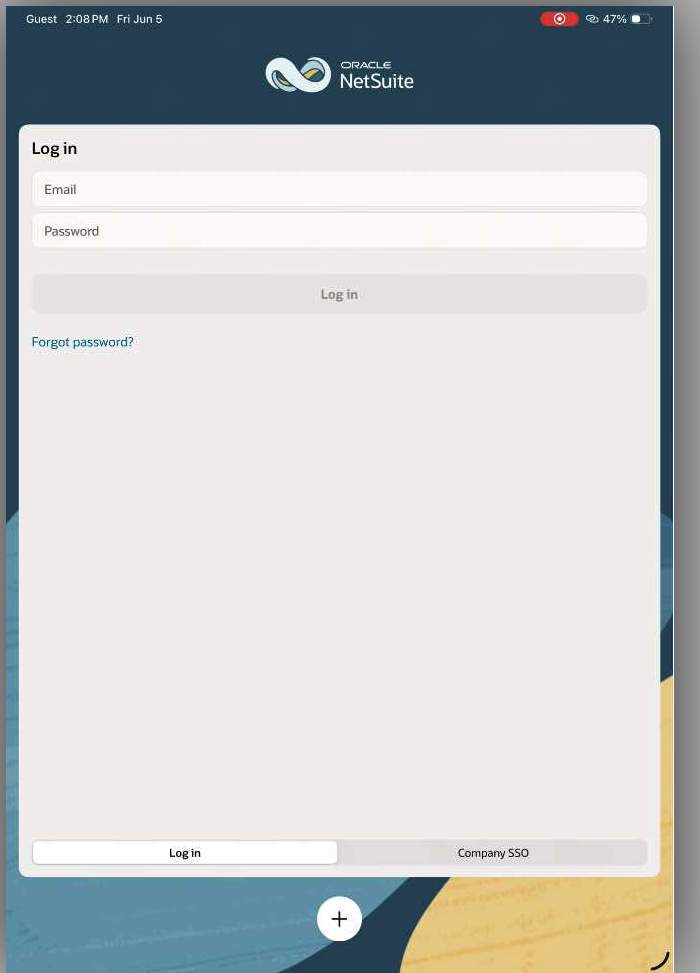

NetSuite is configured to use **Microsoft Entra ID Single Sign-On (SSO)**, which means you
sign in with your existing Microsoft work or school account — no separate NetSuite password
required.

There are two ways to access NetSuite:

- [From a web browser](#browser-access-via-my-apps) using the Microsoft My Apps portal
- [From the NetSuite mobile app](#mobile-app-access--iphone--ipad) on iPhone or iPad

---

## Browser Access via My Apps

The Microsoft My Apps portal is a central launcher for all cloud applications your
organization has assigned to you, including NetSuite.

1. Open a browser and go to
   **[https://myapplications.microsoft.com](https://myapplications.microsoft.com)**

2. If you are not already signed in, you will be prompted to authenticate.
   **Use your work or school account** (e.g. `yourname@yourcompany.com`) — not a personal
   Microsoft account.

3. Locate the **NetSuite** tile in your app list and click it.

4. You will be signed in to NetSuite automatically. No separate NetSuite password is needed.

> **Note:** If you do not see a NetSuite tile, your account may not have been assigned access
> yet. Contact your IT administrator or Svetek support.

---

## Mobile App Access — iPhone & iPad

The NetSuite app for iOS and iPadOS supports SSO via the **Company SSO** option on the
login screen.

**Before you begin:** Confirm the NetSuite app is installed from the App Store.

1. Open the **NetSuite** app on your iPhone or iPad.

2. On the login screen, tap **Company SSO** (next to the standard **Log In** button).

   

3. You will be prompted to enter your **Organization ID** — a short identifier unique to
   your company's NetSuite account.

   > **Don't know your Organization ID?** Ask your manager or IT administrator.

4. Tap **Continue**.

5. You will be redirected to the Microsoft sign-in screen. Sign in with your
   **work or school account** (e.g. `yourname@yourcompany.com`). Do not use a personal
   Microsoft account.

6. If your organization requires multi-factor authentication (MFA), approve the sign-in
   request in **Microsoft Authenticator** or via your configured MFA method.

7. You will be signed in to NetSuite automatically.

---

## Troubleshooting

| Symptom | What to do |
|---|---|
| No NetSuite tile in My Apps | Contact IT — your account may not be assigned to the NetSuite app in Entra ID |
| "Company SSO" not visible in the mobile app | Update the NetSuite app to the latest version from the App Store |
| Organization ID not accepted | Confirm the ID with your manager |
| Prompted for a NetSuite password instead of Microsoft | You tapped **Log In** instead of **Company SSO** — go back and tap **Company SSO** |
| MFA prompt not arriving | Check Microsoft Authenticator is set up on your device; contact IT if needed |
