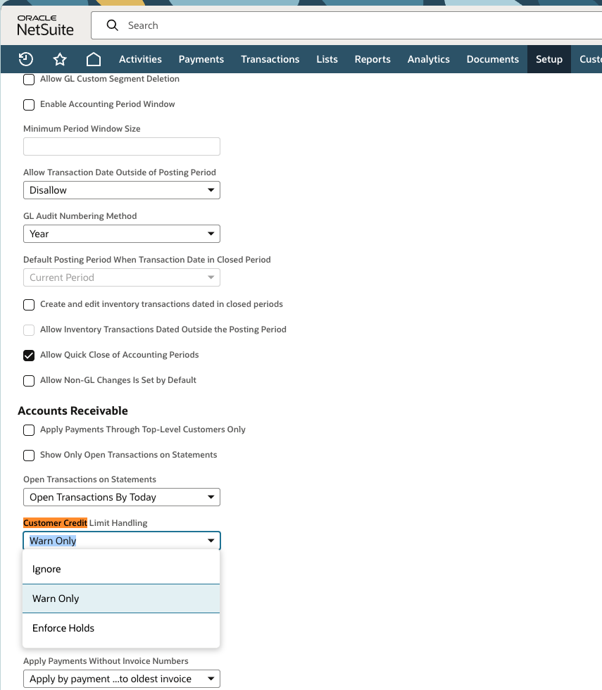

Use NetSuite credit holds to stop new credit sales for customers who are delinquent or have reached their approved credit limit.

This guide covers the built-in control for **sales orders and invoices on credit**. It does not block estimates, opportunities, or cash sales. Use a separate, approved workflow if the client also needs to block cash sales or requires approval before any transaction can proceed.

## Before You Begin

- Confirm the client's delinquency threshold, credit-limit policy, and who can release a hold.
- Confirm that the user changing Accounting Preferences has the required permission.
- Confirm whether unbilled sales orders should consume the customer's available credit.
- Do not give sales users permission to override the credit-limit handling policy unless the client explicitly approves that exception process.

## Configure Company-Wide Credit Holds

This setting controls how NetSuite handles every customer unless a customer-specific setting overrides it.

1. Go to **Setup > Accounting > Preferences > Accounting Preferences**.
2. On the **General** tab, scroll to **Accounts Receivable**.
3. Set **Customer Credit Limit Handling** to **Enforce Holds**.
4. Set **Days Overdue for Warning/Hold** to the client's approved grace period after an invoice due date.
5. Enable **Customer Credit Limit Includes Orders** if entered but unbilled sales orders should count toward available credit.
6. Select **Save**.

### Choose the Correct Handling Option

| Option | Result |
| --- | --- |
| **Ignore** | NetSuite does not enforce the customer's credit limit. |
| **Warn Only** | NetSuite warns the user, who can choose to continue or cancel. |
| **Enforce Holds** | NetSuite blocks a new sales order or invoice that would put the customer at or above the limit or is subject to an overdue hold. |

Use **Enforce Holds** for a client that wants NetSuite to decline new credit sales automatically.

## Place One Delinquent Customer on Hold Immediately

Use a manual hold when a customer must not receive any additional credit, regardless of current balance or credit limit.

1. Go to **Lists > Relationships > Customers**.
2. Select **Edit** next to the customer.
3. Open the **Financial** subtab.
4. In **Hold**, select **On**.
5. Add a user note or follow the client's documented collections process with the reason, date, and approver.
6. Select **Save**.

The customer cannot buy on credit while **Hold** is set to **On**. This is the recommended immediate action for a delinquent account that needs a manual stop.

### Customer Hold Options

| Setting | Use |
| --- | --- |
| **Auto** | Apply the company's credit-limit and overdue-hold rules. This is the default for new customers. |
| **On** | Place a manual credit hold on the customer, regardless of their balance or credit limit. |
| **Off** | Disable credit-limit and credit-hold enforcement for that customer. Use only with client approval. |

## Release a Hold

Release a hold only after the client-approved condition is met, such as cleared payment, a documented payment arrangement, or written approval from the collections owner.

1. Open the customer record and select **Edit**.
2. On the **Financial** subtab, change **Hold** from **On** to **Auto** to resume normal company rules, or leave it **On** if the account remains restricted.
3. Select **Save**.
4. Document who approved the release and why.

When a customer is using **Auto**, NetSuite can release an automatic credit hold after the appropriate payments reduce the balance or resolve the overdue condition.

## Verify the Control

After enabling the policy or placing a manual hold:

1. Attempt to create a test sales order or invoice on credit for the held customer in a non-production environment, when available.
2. Confirm NetSuite blocks the transaction rather than only displaying a warning.
3. Confirm a customer using **Hold = Off** is not inadvertently exempt from the policy.
4. Confirm users cannot change their personal credit-limit handling preference to bypass the company's policy.

## Limitations and Escalation

- Built-in credit holds do not block cash sales, estimates, or opportunities.
- Customer holds do not automatically apply to subcustomers; review those records separately.
- If the client needs every sale type blocked or wants a manager approval path, use a tested SuiteFlow or custom workflow designed for that requirement.

## Need Help

Oracle documents [customer credit limits and holds](https://docs.oracle.com/en/cloud/saas/netsuite/ns-online-help/section_N1080144.html) and [credit-limit preferences](https://docs.oracle.com/en/cloud/saas/netsuite/ns-online-help/bridgehead_4490498729.html).

Contact the client's accounting or collections owner, NetSuite administrator, or Svetek support before changing company-wide credit rules or releasing a delinquent customer hold.
