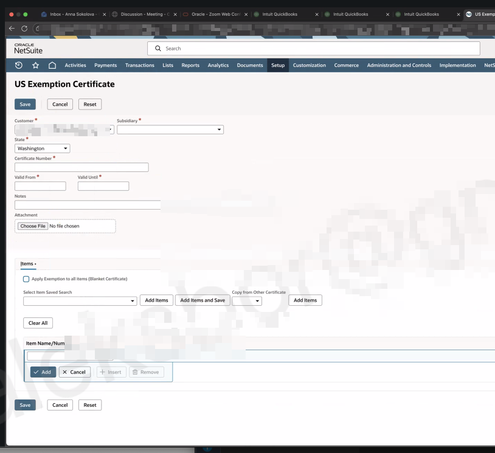
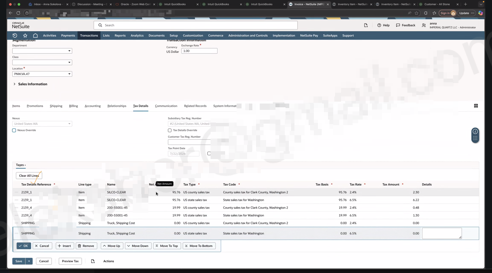

Use this guide to set up a valid resale or reseller exemption certificate so NetSuite can issue invoices without collecting sales tax when the customer's purchase qualifies for exemption.

This procedure applies to U.S. customers using SuiteTax and the SuiteTax Engine. It is not tax advice. Confirm the resale certificate, jurisdiction, exemption scope, and retention requirements with the client's tax or accounting owner before creating or renewing a certificate.

## Before You Begin

- Confirm the customer has provided a valid resale or exemption certificate for the state and transaction.
- Confirm the customer is active and has at least one U.S. tax registration in NetSuite.
- Confirm the subsidiary, state, items, and date range the certificate covers.
- Save a copy of the certificate before making the NetSuite record.
- Do not use a tax override to bypass sales tax when a valid exemption certificate is missing.

## Create the US Exemption Certificate

1. Go to **Setup > SuiteTax Engine > US Exemption Certificates**.
2. Select **New Certificate**.
3. Complete the required fields:
   - **Customer**: Select the reseller customer.
   - **Subsidiary**: Select the invoicing subsidiary in OneWorld accounts.
   - **State**: Select the state that issued or applies to the certificate.
   - **Certificate Number**: Enter the certificate or resale number exactly as provided.
   - **Valid From**: Enter the certificate's start date.
   - **Valid Until**: Enter the certificate's expiration date. Set a review reminder before this date.
4. In **Notes**, record relevant details, such as the exemption type, renewal instructions, or the client approver.
5. Under **Attachment**, select **Choose File** and attach the signed reseller or exemption certificate.

## Set the Certificate Scope

In the **Items** section, choose the scope that matches the certificate.

- Keep **Apply Exemption to all items (Blanket Certificate)** selected only when the certificate covers all applicable items.
- Clear it when the certificate applies only to specific items, then add the approved items.

You must either use the blanket-certificate option or add at least one item before saving. Select **Save** when the scope, dates, attachment, and certificate number have been reviewed.

After a currently valid certificate is created, NetSuite automatically marks the customer record as exempt for the applicable tax determination.

## Verify the Reseller Invoice

1. Create or edit the customer's invoice.
2. Confirm the transaction date falls between the certificate's **Valid From** and **Valid Until** dates.
3. Confirm the invoice subsidiary, tax nexus, customer, ship-to address, and items match the certificate's scope.
4. Review the **Tax Details** subtab.
5. Preview or save the invoice according to the client's invoice process, then confirm that NetSuite has not collected sales tax for the exempt portion of the transaction.

If NetSuite still calculates tax, stop and review the certificate's validity, state, item scope, customer tax registration, transaction date, and tax nexus. Escalate to the client's accounting or tax owner before issuing the invoice.

## Tax Details Override: Use Only for Approved Exceptions

NetSuite labels the transaction control **Tax Details Override**. It is not the normal way to make a reseller invoice tax-exempt. A current, correctly scoped exemption certificate is the standard method because SuiteTax can apply it during tax determination.

When **Tax Details Override** is selected, NetSuite retains the transaction's tax lines instead of recalculating them after tax-related changes. It also prevents tax preview. Use it only for a documented exception approved by the client's accounting or tax owner, and only if your role has permission to edit Tax Details.

1. Open the invoice in edit mode.
2. Select the **Tax Details** subtab.
3. Review the calculated nexus, registration numbers, tax point date, and tax lines before making any change.
4. Select **Tax Details Override** only when you have written direction for the exact manual tax treatment.
5. Update tax lines only as directed, save the invoice, and document the reason, approver, and resulting tax amount in the transaction or ticket.

Do not clear tax lines or manually enter a zero tax amount merely because a customer says they are a reseller. Obtain and record the valid exemption certificate first.

## Renew or Expire a Certificate

Review certificates before their **Valid Until** date. Request a renewed certificate from the customer before issuing exempt invoices after the current certificate expires.

For a renewed certificate:

1. Create a new certificate record or follow the client's approved renewal procedure.
2. Attach the new signed document.
3. Enter its certificate number and new validity dates.
4. Reconfirm its item scope and applicable state.
5. Retain the prior certificate record and its attachment for audit history unless the client's retention policy directs otherwise.

## Need Help

Oracle documents the [US exemption certificate workflow](https://docs.oracle.com/en/cloud/saas/netsuite/ns-online-help/article_0823123959.html) and [SuiteTax tax-detail override behavior](https://docs.oracle.com/en/cloud/saas/netsuite/ns-online-help/section_1513063654.html).

Contact the client's accounting or tax owner, NetSuite administrator, or Svetek support if the certificate is missing, expired, outside its scope, or NetSuite calculates tax unexpectedly.
