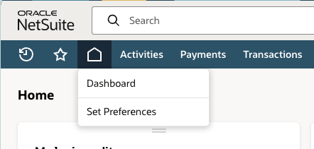
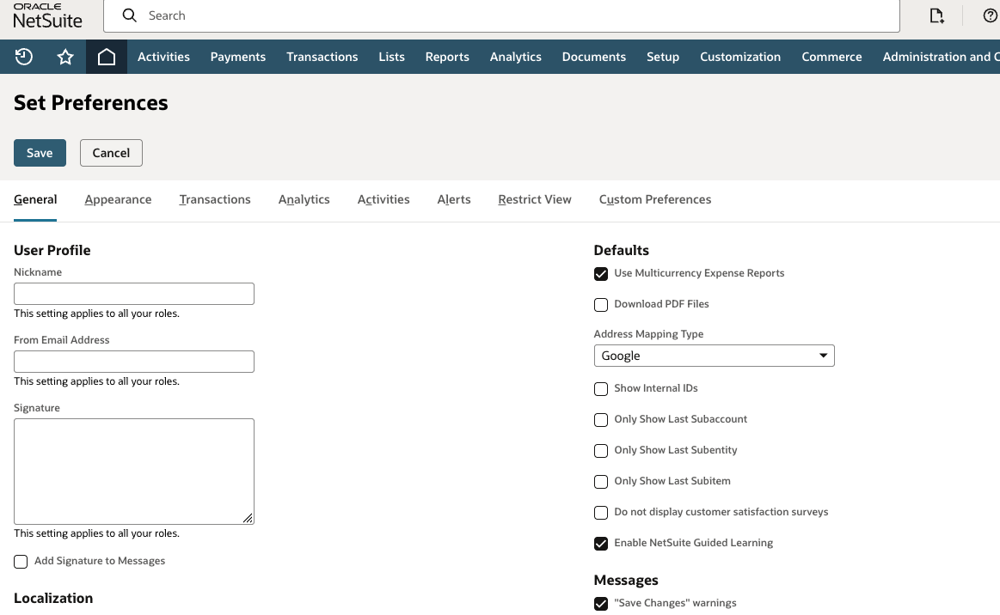

Use this guide to update a personal preference in NetSuite. The example below enables **Show Internal IDs**, which displays internal record and field identifiers where NetSuite supports them.

This preference affects only the currently signed-in user. It does not change other users' NetSuite views.

## Open Set Preferences

1. In NetSuite, select the **Home** icon in the navigation bar.
2. Select **Set Preferences**.

## Enable Show Internal IDs

The **General** tab opens by default.

1. Under **Defaults**, select **Show Internal IDs**.
2. Select **Save**.

After you save, NetSuite shows an **Internal ID** column in supported lists and search results. You can also view supported field IDs through field-level help.

## Change Other Preferences

Use the same **Home > Set Preferences** page to update other personal settings. Select the applicable tab, change only the setting you need, and select **Save**.

Avoid changing unfamiliar settings. Some preferences affect the current user's forms, defaults, alerts, or transaction behavior.

## If Show Internal IDs Is Missing

The **Show Internal IDs** checkbox is available only when the NetSuite account has a supported feature enabled, such as SuiteScript, SuiteFlow, or Web Services.

If you do not see the checkbox, contact your NetSuite administrator. Do not attempt to enable account features unless you are authorized to manage NetSuite configuration.

## Need Help

For more detail, see Oracle's [Show Internal IDs preference documentation](https://docs.oracle.com/en/cloud/saas/netsuite/ns-online-help/article_0402065629.html).

Contact your NetSuite administrator or Svetek support if you need the setting enabled for a workflow or integration and do not have access to it.
