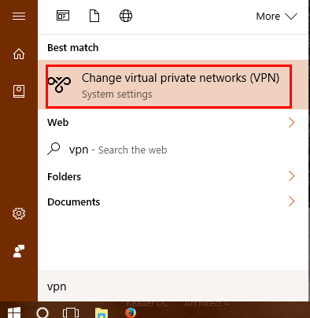
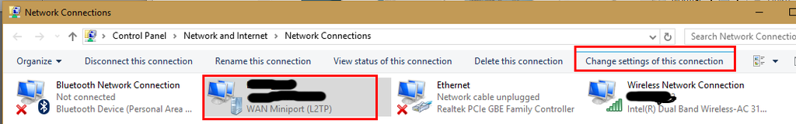

## Before start VPN configuration
You will request from your IT team next information: 

> **VPN configuration settings you will get from IT**
>
> Server address: vpn.consto.com  
>  Shared secret: testSharedKey$   
>  Username: Your username from AD   
>  Password: Your password from AD  
>  MFA is supported? Yes / No  

## Meraki VPN setup

<ul class="nav nav-tabs">
  <li class="active"><a data-toggle="tab" href="#kubeosx">Mac OS X</a></li>
  <li><a data-toggle="tab" href="#kubewin">Windows</a></li>
</ul>

  



#### Mac OS X
Open System Preferences -> Network  
  

Press + button for add new VPN configuration

> **VPN configuration settings**
>
>  Interface: VPN  
>  VPN Type: L2TP over IPSec  
>  Service Name: Some name vpn connection  
{: .important}
  
Example:  
  
  
Type server address and username  
Press Authentication Settings... button   
  
  
Type User Authentication: Password: Your AD password  
Type Machine Authentication: Shared secret: Shared secret  
Check box: Show VPN status in menu bar  
  
  
Press Ok for save changes  

> **VPN configuration settings you will get from IT**
>
> Configuration is done. You can now press connect button.   
> If VPN server requered MFA, you will get MFA request on your phone.  
  

{{ local-content | markdownify }}



#### Windows
Cisco Meraki uses the integrated Windows client for VPN connection (no Cisco client at this time).
  
To be able to connect with simple AD user account credentials, along with a simple pre-shared key, the steps are very simple.
  
Click on Start and type in VPN, click on Change Virtual Private Networks (VPN)
  

Click on Add a VPN connection
  
  
Pick VPN provider as Windows Name the connection Put in server name or IP Switch VPN type to L2TP/IPsec with pre-shared key Switch Type of sign in to User name and password Enter the username and password if you want to save it, or leave blank and user will have to enter it on connection Hit Save  
  
  
Once you hit Save, it will bring you back to the connection page Click on Change Adapter Options  
  
  
In the adapter window, click on the adapter with the name you created in the VPN window Click on Change settings of this connection  
  
  
Click on Security tab Make sure Type of VPN is still Layer 2 Tunneling Protocol with IPsec Set Data encryption to Require encryption (disconnect if server declines) Set Allow these protocols Check Unencrypted password (PAP) - will still be, so don't worry Click Advanced settings  
  
   
In the Advanced settings, click on Use preshared key Type in the key you want to use Hit OK to go back to the adapter settings Click OK to close the adapter settings and save. Close all other windows at this point.  
  
  
Connect ... Click on the network icon in the system tray Click on the VPN network connection name Click on Connect  
  
  
Verify you are connected Click on the network system tray icon again if the window closed or minimized You should now see the VPN network name listed and Connected underneath it (If you are done with your connection, click on it and click Disconnect)  
  

> **VPN configuration settings you will get from IT**
>
> Configuration is done. You can now press connect button.   
> If VPN server requered MFA, you will get MFA request on your phone.


{{ localwin-content | markdownify }}

