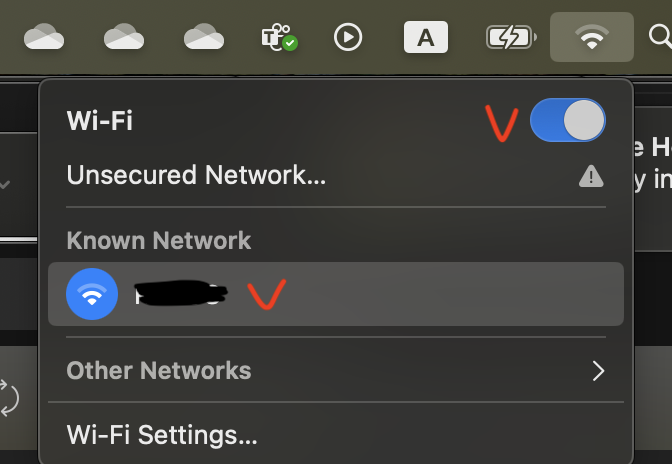
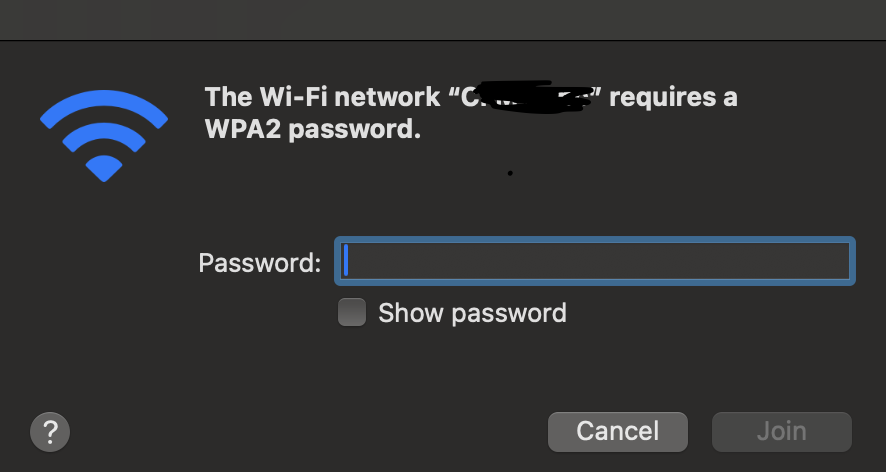

Learn how to connect your personal device to Wi-Fi provided by your property or office management.  

## Prerequisites  

Before connecting a personal device to Wi-Fi, contact the property or office manager to obtain:  

- The correct Wi-Fi network name (SSID)  
- The Wi-Fi password  

## Connecting to Wi-Fi

1. Open your device’s network settings.  
2. Ensure Wi-Fi is turned on.  
3. Find the SSID provided by management and select it.  
   
     

4. Enter the provided password.  

     

## Additional Notes  

- Depending on the network configuration (e.g., "Guest Wi-Fi mode"), you may not be able to see other devices on the network.  
- If you need to reset your password or experience connection issues, contact the office or IT management.  