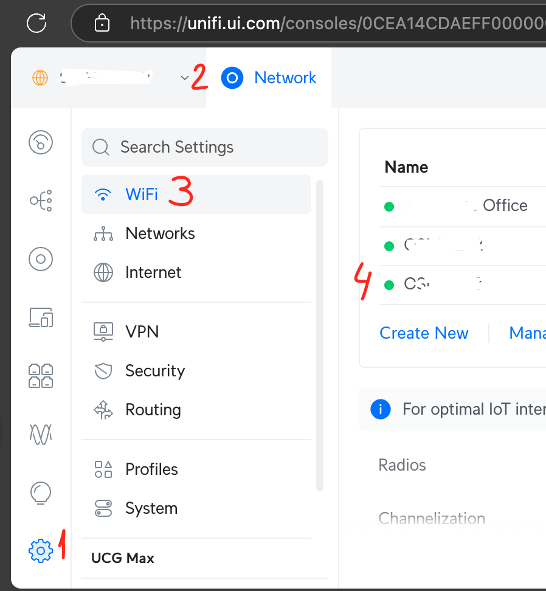
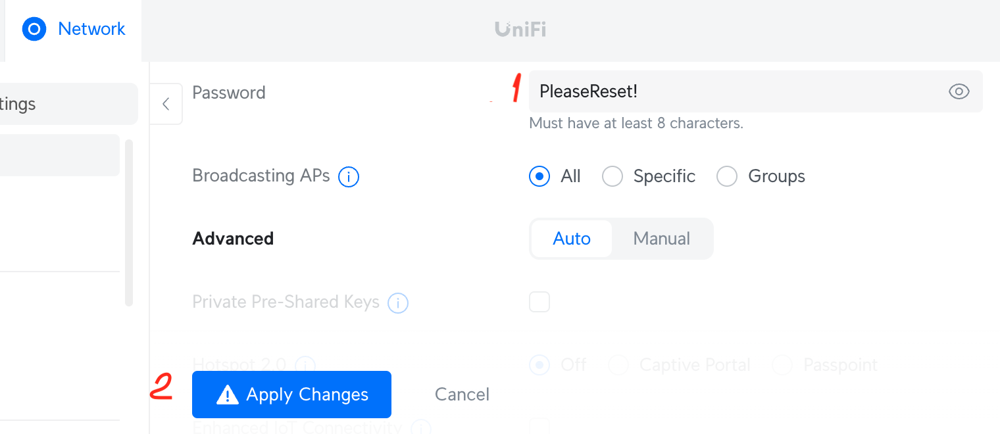

## Prerequisites

1. An admin performing a change needs to be assigned the "Hotspot Operator" role or above. 

## Resetting Wi-Fi Password

1.  Navigate to the [Unifi Console](https://unifi.ui.com)
2. Select "Settings", "Network", then "WiFi" and SSID name you plant to reset the password for: 
3.  Enter new password and clieck "Apply Changes": 
