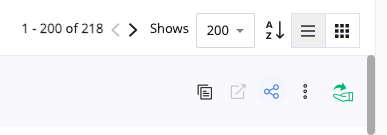
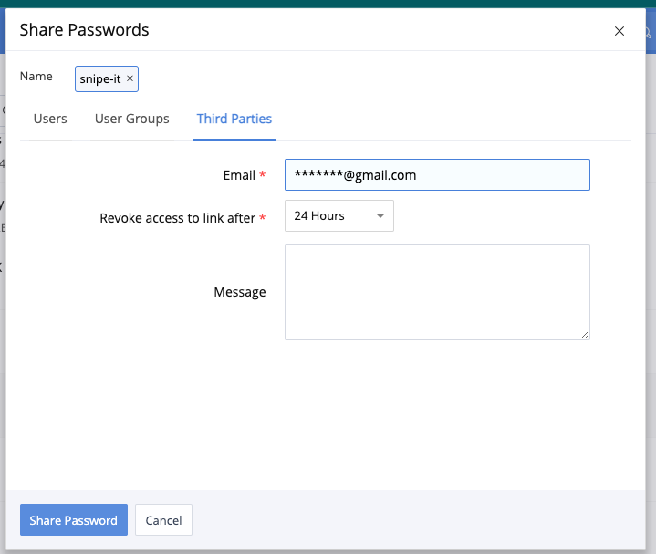
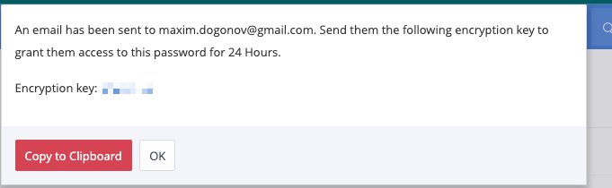
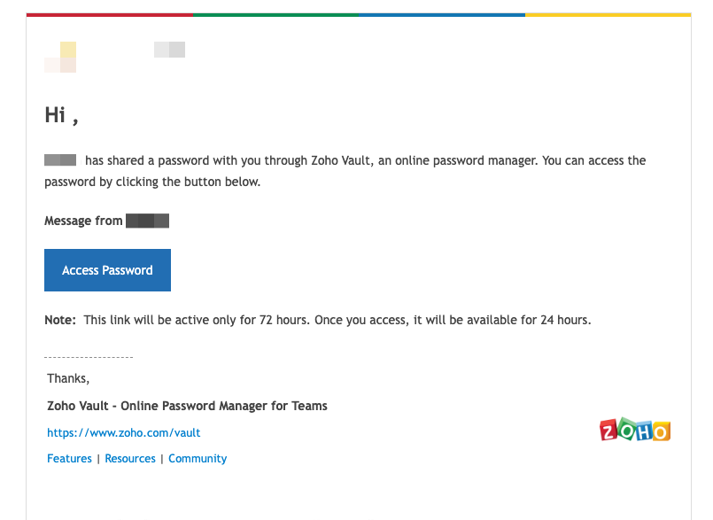
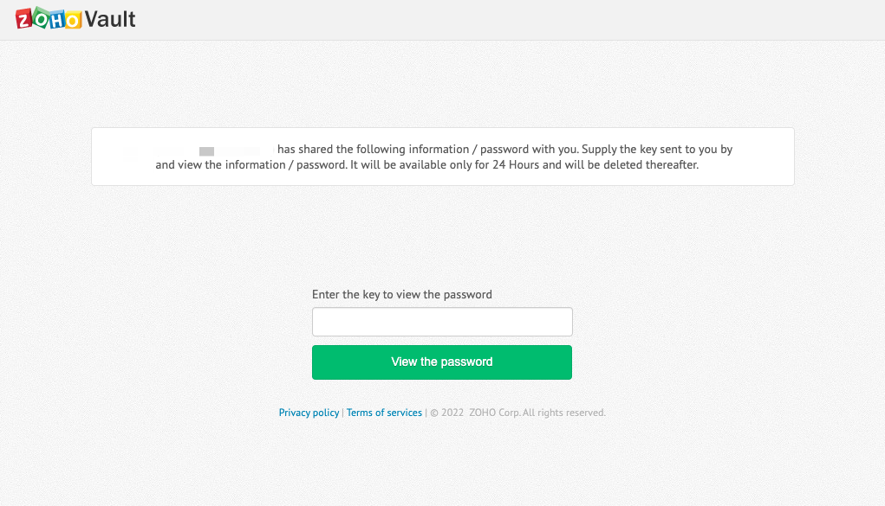
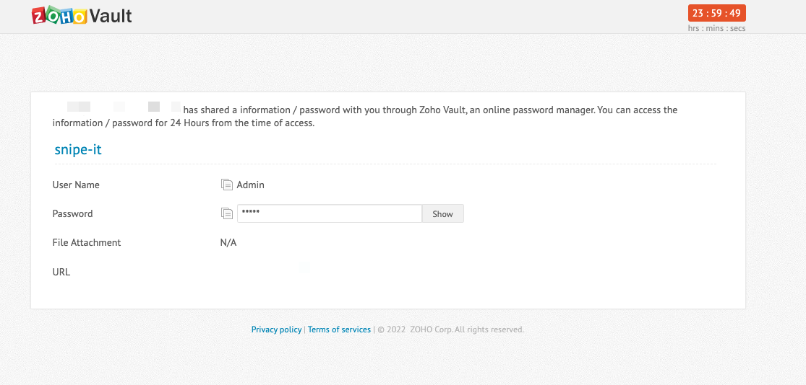

## How to share passwords with thirg parties client 
Go to Zoho vault [https://vault.zoho.com/](https://vault.zoho.com/) passwords 

On selected password row press share button  
  
  
  
On popup window switch to Third Parties tab, enter email, Share expire time, message and press Share Password button.   
After that you will get Encryption key, that key you will send by additional email for user.     

   
  
   

## How to get shared password  

You will get email with Access Password button like this and second email with Encryption key:   
Press Access Password button  
  
  

Enter Encryption key to the next step and press View the password  
  
  

You will see Password page and see Username / Password / Additional info
  
  

